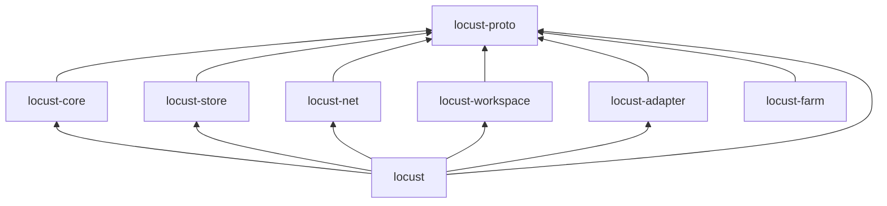

# Crates

Status: current. The dependency rule is a convention; no automated check enforces
it.

The Rust workspace has eight crates, listed in the root
[Cargo.toml](../Cargo.toml). All use the compiler pinned in
[rust-toolchain.toml](../rust-toolchain.toml).

| Crate | Kind | Purpose |
| --- | --- | --- |
| [locust](../crates/locust/Cargo.toml) | Binary | The daemon, the command-line client and the stdio MCP server |
| [locust-adapter](../crates/locust-adapter/Cargo.toml) | Library | Configuration, launch and session records for Codex, Claude Code, Droid and pi |
| [locust-core](../crates/locust-core/Cargo.toml) | Library | The state machine: event checks, roles and local levels, goal and task state, and what a peer is missing. No I/O, clock or randomness |
| [locust-farm](../crates/locust-farm/Cargo.toml) | Binary and library | The farm HTTP service: receives signed public snapshots, stores them in SQLite and serves them to the website |
| [locust-net](../crates/locust-net/Cargo.toml) | Library | Peer transport over iroh: endpoints, authenticated connections and framed sync messages |
| [locust-proto](../crates/locust-proto/Cargo.toml) | Library | The contract: identifiers, signed events, the local API, sync frames, limits and the storage interface |
| [locust-store](../crates/locust-store/Cargo.toml) | Library | The SQLite implementation of the storage interface |
| [locust-workspace](../crates/locust-workspace/Cargo.toml) | Library | Canonical trees, capture/composition, copies into new folders, recoverable local updates, and optional Git import. Runs in the CLI, never in the daemon |

## Dependency rule

- Every library crate depends on `locust-proto` and on no other workspace crate.
- Only the `locust` binary links the library crates together.
- `locust-farm` follows the same rule. The `locust` binary does not link it.

With this rule, unfinished code in one library breaks only that crate and the
`locust` binary. The Cargo manifests linked in the table keep the rule. Check any
change to them by hand.

`locust-proto` has a `testkit` feature with fixed test keys, event builders and the
store conformance suite. Other crates enable it only in `[dev-dependencies]`.
`locust-net` has its own `testkit` feature for an in-memory connection pair.

Tests in [vectors.rs](../crates/locust-proto/src/vectors.rs) freeze the byte
encoding of signed events. Before the first release of version 7, signed
bytes may change inside 7 if the vectors change in the same commit
([master plan](master-plan.md) 353-363). After a release, a change raises
`PROTOCOL_VERSION`. Until the release gate exists, this is a convention.

## Adding a dependency

1. Add the dependency only when the current task needs it.
2. Declare its version once, in the root `Cargo.toml` under
   `[workspace.dependencies]`.
3. In the crate's `Cargo.toml`, write `NAME.workspace = true`.
4. Commit the updated `Cargo.lock`. It stays tracked.

The root `Cargo.toml` also builds the hashing, signing, encryption and SQLite
crates with optimization in debug builds, so tests stay fast.
