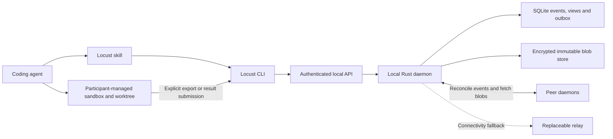

# Locust implementation plan

Date: 2026-10-03. **Release target: tomorrow night, October 4, 2026 (America/Los_Angeles). Status: proposed implementation plan; implementation has not started.** The release date is the owner's stated constraint, not an estimate derived from the number of components. This consolidates the project intent, ecosystem and MoltMesh research, coordination discussion, and installation-through-a-coding-agent proposal. User requirements and proposed engineering defaults are distinguished below. Nothing here implies that the proposed protocol has already been implemented or verified.

## 1. Outcome and scope

Locust is an open-source protocol and small Rust daemon that lets independently operated coding agents collaborate on a common goal. Participants install it locally, retain control of execution and sandboxing, and exchange work and context without a mandatory vendor-operated coordinator or paid cloud message board.

The first complete experience:

1. A person pastes an installation prompt into a supported coding agent.
2. The agent installs a verified Locust release and its operating skill, starts the daemon, and checks that it can use it.
3. The person creates a goal or accepts an invitation, explicitly choosing which workspace content to share.
4. Two agents on different machines synchronize the goal's board and context. A designated coordinator assigns a task against a specific input snapshot.
5. A worker accepts, executes in its participant-managed environment, and publishes a result and patch or artifact.
6. The coordinator reviews and accepts the contribution. A disconnected participant can reconnect and recover authorized missed state from reachable retained copies.

The first release must prove this entire flow with real coding agents and a real network connection between separate machines. Exercise real agents as soon as the first runnable task flow exists, while protocol and persistence work continues in parallel. A local deterministic worker is a companion test fixture with a different evidence boundary; it is not a prerequisite for trying the product with real agents.

### User requirements

- A protocol and open-source tool, with a small daemon written in Rust.
- Distributed agent orchestration and collaboration without a mandatory central service.
- Shared goal context, notes and files; participants can run on independently managed machines.
- Participants remain responsible for their execution sandbox and local credentials.
- Installation starts from a prompt pasted into a coding agent and includes an operating skill.
- Learn from MoltMesh and other projects without copying their implementation wholesale.

### Proposed defaults for the first release

| Area | Default for this plan | Rationale |
|---|---|---|
| Collaboration | Invitation-only goals | Makes authority and admission explicit before public discovery |
| Coordination | One designated coordinator authority per goal | Gives assignments and accepted results an unambiguous owner |
| Shared board | Durable signed events, replicated peer to peer | Supports offline work, replay and attributable history |
| Scratchpad | Versioned documents and revisions on the same event system | Preserves concurrent contributions without silent overwrites |
| Workspace | Immutable snapshots and patches; one local working copy per participant | Keeps synchronization separate from integration and execution |
| Transport | Evaluate Iroh first; rust-libp2p is the alternative | Decide through connectivity and persistence experiments |
| Local persistence | SQLite for events, projections and transactional outbox; separate immutable blob files | Keeps state transitions and notification intent atomic |
| Agent integration | CLI with structured output plus a portable skill | Works through the shell capabilities coding agents already have |
| Initial execution | Active coding-agent sessions explicitly join and wait for work | Avoids claiming universal idle/closed-session activation |
| Initial release targets | macOS arm64 and Linux x86_64; Codex and Claude Code local clients | A proposed, bounded qualification matrix, not a current support claim |

Resolve these defaults in the opening implementation pass so parallel work has stable interfaces. Windows, more architectures and Cursor are later qualification targets unless a concrete early deployment requires them. The current scaffold has no existing users or wire format to migrate.

### Deferred scope

Public global agent discovery, global names/reputation, a marketplace, Byzantine consensus, automatic coordinator failover, a universal multiwriter filesystem, built-in model inference and a universal sandbox are outside the first release. Unattended agent runners, optional retention peers, MCP and A2A adapters are explicit follow-on capabilities. Relay configuration remains part of the initial connectivity work.

## 2. Current repository and evidence

The repository currently contains a Rust workspace with one binary that prints `locust`, documentation checks and a separate SvelteKit website scaffold. There is no daemon, network protocol, local API or task engine yet. The implementation should extend the existing application crate and introduce new crates only when a concrete boundary needs them. [Application](../crates/locust/src/main.rs), [workspace](../Cargo.toml), [toolchain](../rust-toolchain.toml).

The [landscape survey](../research/landscape.md) evaluates Iroh, rust-libp2p, OpenDHT, p2panda, Willow, Radicle, A2A and MCP. The MoltMesh review provides concrete lessons from its [architecture/consensus](../research/moltmesh-architecture-and-consensus.md), [network/storage](../research/moltmesh-networking-and-storage.md), [task/SDK](../research/moltmesh-tasks-and-sdk.md) and [security](../research/moltmesh-security.md) paths. The [validation report](../research/moltmesh-validation.md) separates executed tests from source review.

Useful MoltMesh ideas are the daemon/API boundary, durable queues, explicit task records and immutable artifact references. Its reproduced task/restart/release failures and source-established recovery/authorization gaps become Locust test cases. Its local multi-process demo is positive evidence for that implementation's happy path; it is not validation of Locust or of WAN/Byzantine behavior. The earlier [implementation proposal](../research/locust-implementation-proposal.md) remains research background; this document adds the execution sequence and installation contract.

## 3. System shape



The peer-to-peer layer moves durable records and blobs between machines. The coordination board is a local queryable view of those records. The shared scratchpad is another view. They share replication infrastructure but have different state-transition rules.

The agent plans, negotiates and reviews. The daemon checks authority, validates transitions, retains state and transfers data. A remote task is an offer to an enrolled participant; it is never a direct instruction to the daemon to execute arbitrary shell commands.

Use one installed `locust` executable initially, with daemon and CLI subcommands. Keep protocol, storage, transport, task and artifact modules inside the existing crate until splitting them has a demonstrated benefit. Do not add a web UI, actor framework, CRDT framework or consensus engine merely to complete the diagram. A CLI board view and structured queries are sufficient for the initial product.

## 4. Protocol and coordination contract

### Identity, invitation and admission

A goal has an immutable signed genesis record, whose digest identifies it and pins its initial owner/coordinator authority. Transport keys identify endpoints. Agent identities identify enrolled principals; friendly names are labels and cannot reassign key ownership.

For the initial local trust model, the daemon is a trusted signing delegate for its enrolled agents. It holds signing keys outside shared workspaces and issues scoped local credentials to agent clients. An event identifies the agent and its delegation. This proves the authorized signer/delegate, not that a particular model or human generated the text. Independently held agent keys can be added later if required.

Owner administration and agent operations use distinct credentials and permissions. A missing agent credential must never select an administrator or global namespace. Every local API operation and event-ingress path goes through the same authorization rules. Strong isolation from another process running as the same OS user still depends on the participant's sandbox and filesystem permissions; the daemon cannot manufacture that isolation on its own.

An invitation binds the goal/genesis, expected recipient or redeemable admission capability, assigned rights, expiry/replay policy and contact hints. Receipt alone does not enroll a machine, share files or start work. After acceptance, the coordinator records membership in its decision chain and distributes the appropriate encrypted content keys. Possessing a peer address, topic name or artifact hash is insufficient authorization.

### Two kinds of durable history

**Contribution events** include messages, observations, scratchpad proposals, progress and result submissions. They are signed, deduplicated, attributable and causally linked. They can be created while disconnected and reconciled later. Their arrival order is not a global order.

**Coordinator decisions** include membership changes, assignments/reassignments, accepted results and accepted document/workspace heads. They form one signed hash-linked sequence per goal, with a previous-decision reference and explicit preconditions. Only the current coordinator authority can advance it. Enforce a single writer locally and detect conflicting signed successors; conflicting authority histories halt authoritative projection and require explicit resolution rather than choosing the newest timestamp.

The coordinator agent proposes decisions through its scoped API; deterministic daemon rules validate them. The authority can live on any participating machine. Initial operation uses one coordinator key with no automatic leader election or timeout-based takeover. Losing it pauses authoritative changes; participants retain and can export their histories. A new goal fork must be identified as a new goal, not represented as recovered continuity. Planned handoff/key recovery requires a later explicit protocol and tests.

| While coordinator is unavailable | Allowed behavior |
|---|---|
| Messages, notes, drafts and results | Retain and exchange authorized contributions |
| Previously assigned work | Continue within its known authorization and host policy; report uncertain/expired authority |
| New authoritative assignment, result acceptance, membership or accepted-head change | Remain pending until coordinator is available |
| Peer observes a timeout | Report it; do not create a new coordinator or final assignment |

### Event envelope and replay

Specify a versioned envelope containing goal ID, event type, author/delegation, per-author sequence and prior hash, causal parents, referenced coordinator decision/membership epoch, payload or ciphertext hash, artifact references and signature. Wall-clock time is diagnostic metadata, not an authorization or conflict-resolution oracle.

Before implementation, select a canonical encoding, hash/signature scheme and authenticated-encryption composition using maintained libraries. Publish canonical byte/signature test vectors and document algorithm/version negotiation. Do not handwrite cryptographic primitives. Detect duplicate events by their authenticated identifier and detect author equivocation instead of silently replacing records with the same author/sequence.

Reconciliation exchanges known frontiers/heads, retrieves missing ancestors and objects, validates them, and rebuilds deterministic local views. Unknown dependencies stay pending; invalid records do not enter accepted projections. Gossip is an optional wakeup hint. Missed gossip must not lose history. Snapshots/checkpoints are authenticated optimizations with sufficient ancestry and authority proofs; they cannot replace validation with an unsigned advertised height.

### Revocation and offline membership

Revocation is a coordinator decision and rotates future content access as required. A stale membership epoch or claimed creation timestamp does not prove an offline event predates revocation. Validate the referenced authorization chain, not just an epoch number. The initial rule should record the revoked author's last accepted frontier in the revocation decision. Contributions beyond that frontier remain unaccepted after revocation; any intentional recovery of legitimate offline work requires a current authorized decision rather than retroactive timestamp trust. Member removal supersedes its outstanding attempts' rights to finalize and emits cancellation requests; it does not assert their processes have stopped.

Disconnected peers may temporarily display stale membership and cannot instantly withdraw plaintext or stop a disconnected worker. Surface the last known decision head and synchronize before new authoritative acceptance. Already received plaintext cannot be recalled; future key distribution and finalization authority can be withdrawn. Test this policy before representing a goal as private and revocable.

## 5. Tasks, scratchpad and workspace

### Task lifecycle

The board must distinguish task intent, an execution attempt, and acceptance of a result. Suggested visible flow:

```text
offered → assigned → worker_accepted → running → result_submitted → result_accepted
                         ↘ rejected / failed / cancel_requested → cancel_acknowledged
```

This is an explanatory flow, not the final state machine. Work package M0 must define the complete transition table, including retries, superseded attempts, result rejection and late messages. Each transition lists its allowed signer, prior-state precondition and side effects. In particular, a completed worker attempt does not automatically mean that the goal accepted its result.

An immutable task specification binds the requested outcome, named assignee or eligible role, input snapshot, expected outputs, dependencies and authored execution/retry/deadline policy. Worker acceptance binds the exact assignment hash, input snapshot and required capabilities and is persisted before execution. Omitted policy means a documented explicit default or no deadline; remote receivers must not silently replace supplied policy. Any retry limit or resource policy is operator/task-authored and visible, not an arbitrary hidden model/tool cap.

Use separate task, assignment, attempt, worker-instance and claim-request IDs. A daemon atomically grants a local execution lease to one instance for an authorized attempt. Retrying the same acquisition can recover its own token; another process sharing the agent identity cannot obtain that token merely by using the same DID. Restart must recover either pending work or a valid claim before advancing its delivery cursor.

Local lease expiry revokes the old acquisition token. Recovery may acquire a new claim generation under the same authorized attempt if its recorded policy permits; the old claim cannot renew or complete after that recovery. Persisted terminal results are not invalidated merely by later lease expiry. Expiry does not independently authorize another daemon to assign the same task. Reassignment requires a new coordinator decision and attempt ID that supersedes the old assignment. Results from coordinator-superseded attempts remain inspectable but cannot advance accepted state. Enforce retry budgets across local restarts and remote reassignments at their defined scope. Ordinary snapshot-based computation must not require continuous coordinator renewal if it is permitted to continue offline. Specify clock ownership separately for scheduling/acceptance cutoffs (coordinator), execution duration (executor) and local lease expiry (worker daemon); handle restarts conservatively without treating unsynchronized clocks as proof of global exclusivity.

Cancellation is a durable request followed by an executor acknowledgment. While the worker is offline, report `cancel_requested`; do not claim execution stopped. Proposed race rule: a coordinator cancellation/supersession decision removes future finalization rights; a result accepted earlier in the decision chain remains accepted. Late results remain attributable, unaccepted contributions. An executor reports stopped, already completed or outcome uncertain. Expose cancellation durably through worker wait/status operations and revoke the corresponding daemon completion authority. The skill checks that state between operations. Delivering an immediate process stop signal depends on a supported client/runner integration; a generic skill cannot necessarily interrupt a coding agent's ongoing tool invocation. Completion of an external effect may remain uncertain.

Leases protect daemon state; they cannot guarantee exactly-once arbitrary external effects. Use destination-supported idempotency/fencing or a separate explicitly authorized effect step. When the outcome is unknown and safe retry cannot be established, retain an uncertain outcome requiring reconciliation. The v1 demo should use inspectable code/artifact production rather than irreversible external actions.

### Shared scratchpad and useful context

Provide goal summary, plan, decisions, findings and per-task notes as addressable documents/views. A revision names its base revision and content hash. Concurrent edits remain separate proposals; the coordinator advances the accepted shared revision with an expected-base precondition. No last-writer-wins overwrite of an accepted plan based on clock time.

Agents query relevant tasks and documents, subscribe to relevant events and retrieve referenced artifacts. They should not need to load the full conversation history for every action. Summaries are derived, versioned artifacts that link back to their supporting events; they do not erase source evidence or confer authority. Text in a scratchpad such as “I claim task X” has no scheduling effect without the typed task transition.

### Artifact and workspace handling

Blobs are immutable and encrypted before peer publication when confidential. Manifests refer directly to immutable parents and content objects; historical traversal cannot depend on a fresh DHT record for every revision. Use a verified, resumable transfer implementation and test its actual persistence semantics.

The storage sequence is receive → verify → persist → durable acknowledgment. Blob files are durably installed before a database transaction publishes a retained reference. A crash can leave collectable unreferenced blobs; it must not leave an acknowledged reference pointing to bytes that were never durable. Pin objects while accepted history, pending submissions or explicit retention promises reference them.

Start workspace support with explicit Git-based snapshots and patch contributions. Each participant selects the files to export and works against an immutable base in its own checkout/worktree. Uncommitted files require explicit inclusion; ignore rules alone are not a secrecy boundary. No daemon operation executes received hooks, plugins, build scripts or repository instruction files merely because they arrived through synchronization.

Manifest materialization must contain paths and symlinks within the chosen destination. Validate collisions, file types, executable bits and platform differences. Integration uses an expected accepted-head/base check and produces an inspectable diff. A conflict preserves both contributions and requires an explicit resolution; accepted protocol state does not automatically overwrite someone's dirty working copy.

Expose artifact states separately: available locally, verified/retained, requested from peers, and acknowledged by a named retention peer. A successful fetch must remain available after its source disconnects according to the local retention policy. If every holder is offline, report unavailability. A receipt represents a peer's retention assertion and policy, not permanent guaranteed storage.

## 6. Local API, CLI and operating skill

Use an authenticated local IPC endpoint, with a Unix socket as the initial platform default. Keep it independent of the P2P transport. Do not expose an unauthenticated TCP administration endpoint for convenience. CLI, future SDKs and MCP must call the same authorization/state-transition implementation.

Proposed command surface; these commands are **not implemented yet**:

| Area | Proposed operations |
|---|---|
| Lifecycle | `locust daemon start`, `status`, `stop`; `locust doctor` |
| Identity and client enrollment | Inspect identity; enroll/revoke an agent; inspect granted scope |
| Goals | Create, invite, join, inspect, leave, and inspect synchronization status |
| Board | List/read tasks and decisions; read events; wait from a durable cursor |
| Tasks | Offer, assign, accept/claim, renew, report progress, submit/accept result, request/acknowledge cancellation |
| Scratchpad | Read document, submit revision, inspect conflicts, accept revision |
| Artifacts/workspace | Export snapshot, put/get/retain artifact, inspect contribution, materialize/apply explicitly |

Provide human-readable output plus versioned `--json` responses, stable error codes, request IDs and semantic result states. Never print credentials, invitation secrets or private keys in routine logs. A wait operation should return relevant durable events and a resumable cursor; the client must acknowledge/recover work safely before checkpointing past it. Distinguish waiting, disconnected, denied, unsupported-version and corrupted-state outcomes.

The skill teaches enrollment and goal joining, context inspection, typed coordination operations, attempt recovery, progress reporting, patch/result submission and the distinction between completion and acceptance. Ship coordinator and worker playbooks with goal/task templates: the coordinator decomposes work and names review criteria; the worker claims the exact assignment, executes against its input and submits evidence; the coordinator reviews that evidence before acceptance. Exercise these playbooks in the first real-agent run. The skill can include small invocation helpers and protocol examples. It must treat peer content as untrusted task data and use the host's existing permission/sandbox controls. Skill prose does not enforce security; the daemon does.

The [Agent Skills specification](https://agentskills.io/specification) supports instructions and optional scripts. The CLI supplies executable operations; the skill teaches their use. An optional local MCP adapter can expose the same operations as named tools later, without creating a second task protocol or bypassing permissions.

## 7. One-prompt installation

Make the pasteable prompt the primary onboarding entry point. It should direct a shell-capable coding agent to a versioned installation manifest and deterministic installer, with a clear supported-environment check. Pin the resulting installation transaction to one release; do not let the model invent build/download/configuration steps from scratch.

The initial prompt/release page is obtained from the official configured HTTPS origin and supplies the versioned bootstrap location and expected digest. Verify the downloaded installer before executing it. The initial distribution key is trusted through that publisher/origin, then pinned for artifact checks and subsequent updates; document key rotation separately. This does not claim independence from a compromised initial publisher. Never bootstrap from a URL or replacement verification key supplied by an untrusted peer.

The installer must:

1. Detect OS/architecture, whether the environment is local or a remote/ephemeral workspace, and the invoking supported client. Explain where the daemon will actually live.
2. Resolve a compatible release and verify signed release metadata and artifact digests using an explicit distribution trust root. Fetch installation content from the configured trusted release source, not peer-supplied board instructions.
3. Install the user-owned binary, create restrictive state directories, and establish or reuse identity without silently replacing it.
4. Install the Locust skill for the invoking client while preserving unrelated skills and configuration. Client-specific directories and reload behavior belong in adapters, not the P2P protocol.
5. Start the daemon using a supported user-session service mechanism, or explicitly report a session-only mode. Avoid duplicate processes and unnecessary administrator privileges.
6. Run `doctor` and a harmless real CLI/API roundtrip from the invoking agent. Check binary/API/skill compatibility and actual tool usability.
7. Report separately: binary installed, daemon running, skill discoverable in this/new session, and participation ready. Installation alone neither enrolls in a remote goal nor exports local files.

The prompt should be short and stable; the installer implements the actual work. Publish a manual installation path using the same artifacts. Support repeat installation, interrupted-install recovery, upgrade and uninstall. Preserve identity and goal data across normal upgrades; uninstall distinguishes removing software from an explicit data purge. Schema migrations require a recoverable pre-migration state; rollback must not reuse an older binary against an incompatible migrated database.

Test client reload requirements instead of claiming they are uniform. Current references include [Claude Code skill loading](https://code.claude.com/docs/en/skills#edit-a-skill-during-a-session) and [Cursor skills](https://cursor.com/docs/skills). Verify each supported client's exact version and paths during implementation. A newly installed CLI can be usable immediately even if native skill/tool discovery requires a reload.

### Installation does not establish an unattended worker

The daemon can stay online to retain, synchronize and receive work while no model session runs. The first release requires an active coding agent to join a goal and enter its wait/work loop. Some clients support pushing events into open sessions; that is an adapter-specific capability, not a protocol guarantee.

A later opt-in runner may launch/resume a supported headless client under operator-selected credentials, workspace, sandbox and spending policy. It must persist its mapping from attempt to process/session, avoid duplicate launches after restart, deliver cancellation and report uncertain outcomes. Closed-session activation, cross-client session resume and model execution are separate qualification gates. [Claude Code headless interface](https://code.claude.com/docs/en/headless), [Cursor headless interface](https://cursor.com/docs/cli/headless).

## 8. Execution through October 4

The [independent review](implementation-plan-review.md) correctly identifies the risk of leaving the first real-agent workflow until the end. Its multi-quarter estimate is unsupported and is not a planning input. The release target is October 4 at night; no exact hour has been specified. Keep the core daemon, P2P board and context, workspace contributions, CLI and one-prompt skill installation in scope. The deferred capabilities in section 1 remain deferred.

M0–M6 below identify work packages and their acceptance evidence, not seven sequential phases. Begin independent work once the relevant interface fixtures exist; integrate running slices throughout. Tests, skill writing and packaging proceed alongside implementation. All completion criteria are **future gates**, not existing test results. Land small reviewed commits and link retained evidence and resulting decisions from `docs/`.

### Parallel workstreams

| Stream | Work and initial handoff | Integration responsibility |
|---|---|---|
| Daemon and coordination | M1/M3: local IPC, SQLite event/outbox transactions, authority validation, tasks/claims and scratchpad projections; publish command/event fixtures first | One state-transition implementation used by local commands and incoming peer events |
| P2P and artifacts | M0/M2 plus blob handling in M4: stack selection, identity/invites, authorized replication, encryption and retained transfers | Consume the shared event/authority contract; exercise two-machine connectivity immediately |
| Agent workflow and workspace | M3/M4/M6: CLI task flow, coordinator/worker playbooks, wait/resume behavior, snapshots, patches and review | Run real Codex and Claude Code sessions as soon as the executable task path exists; feed failures directly back to the other streams |
| Installation and release | M5: build artifacts, installer, skill adapters, service lifecycle and clean-machine checks | Start from development artifacts; replace them with the exact release candidate and verify every claimed platform/client |

Module/file ownership should be explicit before concurrent edits. Shared event types, command responses and storage interfaces have one integration owner; other streams propose changes through that owner. Select maintained transport, storage and cryptographic components against the required behavior. Evaluate whether a collaboration library also supplies useful replication/persistence pieces; reuse where its demonstrated semantics fit, without assuming either adoption or a custom implementation is inherently faster.

### Calendar checkpoints

| When | Required integrated result | Evidence to retain |
|---|---|---|
| October 3, opening pass | Agree versioned event/decision, local API and task fixtures; choose compatible dependencies; start all four streams | Minimal protocol/permission contract and runnable transport probe, with unresolved choices assigned to an owner |
| October 3, first runnable slice | Two active real coding-agent sessions use the CLI to assign, claim, execute, submit and review a small code task; test wait, interruption and explicit resume on both clients | Actual commands, task/result identities and patch; mark any local-only transport, fixtures or missing persistence explicitly |
| October 4, integration | Run the same workflow through two actual daemons on separate machines with invitation, private replication, notes, input snapshot and retained result; integrate restart/reconnect and authority checks | Event/artifact identities, route information and failure-test results; no remaining test stand-ins in the release path |
| October 4, release candidate | Produce signed candidate artifacts and install through the prompt; run the packaged end-to-end scenario and claimed support matrix | Exact artifact hashes/versions, install and runtime checks, real-agent/network results and outstanding failures |
| October 4, night | Release the verified candidate and matching prompt/skill/docs | Published-artifact verification against the tested candidate and an accurate support/limitation record |

These are execution targets, not claims that a checkpoint has passed. Start deterministic fault tests alongside the first implementation; start real-agent tests alongside the first executable workflow. The final run repeats the early scenario against the packaged candidate. A failed required check is a concrete issue to fix and report against the deadline. Record any proposed scope change explicitly rather than silently removing a requirement or presenting an unverified behavior as supported.

### M0 — Protocol contract and transport proof

**Deliverables:** a short versioned protocol specification, transition/permission matrix, canonical event and invitation fixtures, and a disposable two-peer Rust connectivity experiment. Decide the exact initial identity/delegation, encoding/crypto composition, membership cutoff, task policy and CLI error contract. Publish each settled interface immediately so dependent work can begin; completing every experiment is not a prerequisite for starting the daemon, skill or packaging. Evaluate a compatible Iroh transport/blob stack first; use the same requirements to compare rust-libp2p if it fails a gate or adds unacceptable constraints. Include collaboration-layer reuse in that decision against offline reconciliation, authorization and restart requirements. Do not select unrelated latest crate versions independently.

**Exit evidence:** two machines on separate home/mobile networks connect using invitations; direct and forced relay paths are visible; an alternate independently operated relay works; known peers reconnect when a discovery/bootstrap service is unavailable where the configured routes permit it. Document any remaining relay dependency rather than promising every pair connects directly. Record binary size, idle memory/CPU/network use, startup latency and transfer memory as initial measurements. Select dependency versions and record the rationale.

**Also required:** review the task/coordinator state tables with examples of duplicate, delayed, reordered, revoked and conflicting input. Publish test vectors before implementing multiple independent serializers. No formal BFT claim is needed or intended.

### M1 — Durable local daemon and CLI

**Interface dependency:** M0 event/API contracts. **Deliverables:** daemon lifecycle, local authenticated IPC, identity/client enrollment, SQLite migrations, durable event append, deterministic projections, transactional outbox and CLI query/doctor operations. Expose a runnable command path early for the agent-workflow stream. Start an installer/skill skeleton against local development artifacts without representing it as a public release.

**Exit evidence:** local roundtrip works; unauthorized/missing credentials are rejected; event identity and request-digest idempotency work; state and outbound intent commit together; restart rebuilds the same projection without duplicate application; cursors cannot skip unacknowledged work; process shutdown and concurrent startup behave correctly. Crash-inject immediately before/after durable acknowledgments. Keep event and outbox changes within one local transaction boundary.

### M2 — Private peer replication and retained artifacts

**Interface dependencies:** M0 transport/event selection and M1 append/projection interface; develop concurrently with M1. **Deliverables:** signed genesis/invites, the generic coordinator decision chain with membership/revocation validation, accepted membership, encrypted content/key distribution, peer session authorization, missing-event reconciliation, blob verification/retention and route/sync diagnostics. Persist enough peer/contact and immutable-root information to recover without an ephemeral DHT history index. Open public DHT discovery is unnecessary for this package.

**Exit evidence:** disconnect/reconnect recovers missed events; all-peer restart preserves state and restores reachability from configured contacts; duplicate/reordered events and missing ancestors converge; bogus author, genesis, descriptor replacement and invalid signature are rejected; revoked future access and stale-epoch cases follow the declared policy. Fetch a blob, disconnect its original source, then fetch it from the retained replica. Resume an interrupted transfer; detect corruption and failed disk writes before acknowledging durability.

### M3 — Board, coordinator and active workers

**Interface dependencies:** M0 transition contract and M1 local API/projection interface; private remote operation integrates with M2. **Deliverables:** task and accepted-head decisions on the shared coordinator chain, typed task lifecycle, worker leases/attempts, result acceptance, durable cancellation, board/event queries and scratchpad revisions. Build a deterministic worker harness alongside the first real-agent workflow so protocol failures can be isolated from model behavior without postponing product testing.

**Exit evidence:** one coordinator and two worker identities complete a synthetic goal; another process sharing an identity cannot acquire the active claim; retried acquisitions are recoverable and expired tokens cannot finish after a new claim generation; conflicting idempotency payloads fail; authored deadlines/retry policy survive transfer; cancellation reaches the executor; stale attempts cannot finalize; result delivery survives an acknowledgment loss. A disconnected coordinator permits contribution exchange while authoritative changes remain pending. Concurrent scratchpad edits remain inspectable; a conflicting decision chain halts acceptance rather than selecting a winner.

### M4 — Coding workspace contributions

**Interface dependencies:** M3 task/result types and M2 blob interface; local snapshot/patch operations can develop concurrently. **Deliverables:** explicit snapshot export, base-bound task input, per-participant worktree materialization, patch/artifact result submission, reviewable integration and accepted workspace-head updates. Define data retention/garbage collection with pinned roots and active-transfer protection.

**Exit evidence:** two workers modify the same base without overwriting each other; a stale patch cannot silently advance the accepted head; conflicts preserve both outputs; dirty local work remains intact. Test unsafe paths/symlinks, executable content, case collisions, interrupted materialization and missing input objects. Neither peer messages nor received repository instructions cause automatic execution by the daemon.

### M5 — Release packaging and one-prompt onboarding

**Begins:** with the initial command/install contract and development artifacts. **Public qualification depends on:** integrated M1–M4. **Deliverables:** signed release artifacts, versioned installer, user-session service adapters, operating skill, compatibility manifest, installation prompt, upgrade/uninstall behavior and concise troubleshooting. Verify the release location, signing-key custody and repository license as release prerequisites. Website work should expose the reviewed install prompt and release information only when the artifacts actually exist.

**Exit evidence:** clean installs on every claimed OS/architecture using every claimed client; repeat install preserves identity/configuration and does not duplicate services; the invoking agent performs a real CLI/API operation; a new session discovers the skill. Exercise an active wait/work loop across event arrival, host timeout/interruption, task execution, cancellation checks and durable-cursor resume. If the client ends its turn or cannot remain waiting, accurately report that it requires an explicit resume; file placement alone cannot establish continuous worker readiness. Test explicit reload cases, unsupported/ephemeral environments, denied installation permissions, interrupted download, failed service start, upgrade migration and uninstall preservation. Start each packaged binary with a fresh database and exercise write/read/restart; `--version` is insufficient, as the MoltMesh release test demonstrated.

Do not advertise “any coding agent” from one successful install. Publish a tested matrix of OS/architecture, client/version, active-session behavior and reload requirements. Generic shell agents may use the CLI with explicit instructions but are not automatically native-skill-compatible.

### M6 — End-to-end collaboration beta

**Begins:** at the first runnable M1/M3/M4 slice. **Final release evidence depends on:** integrated M2–M5. **Deliverables:** a repeatable end-to-end scenario, operator-facing evidence, failure diagnostics and a measured resource baseline for the supported release artifacts. Use the same concrete task from the early real-agent trial through the packaged release run so integration failures remain comparable.

**Exit evidence:** two people on separate machines paste the installation prompt into supported real coding agents, join one goal, delegate a concrete code task, share notes, submit a patch, accept it, and recover after a disconnect and daemon restart. Repeat with mixed clients and relay fallback. Confirm the task used the declared base and accepted contribution, not merely a reassuring model response. Preserve event IDs, artifact hashes, versions, route information and test results without credentials or private source content.

Publish the exact verified boundary: platform/client versions, real networks used, active-session requirement, coordinator outage behavior, holder availability and measured resource use. Set defensible “small daemon” targets from M0/M6 measurements, then guard regressions. Do not substitute an unmeasured size slogan or arbitrary fixed resource caps.

### Later milestones

1. **Optional retention peers:** encrypted stores/mailboxes for participants with non-overlapping uptime; explicit retention policies, signed receipts, authorization and holder-loss tests. A local sender outbox alone does not provide this service.
2. **Opt-in unattended runners:** one supported headless client at a time, with operator-controlled execution/sandbox and real closed-session startup/cancellation/restart tests.
3. **MCP/A2A and additional clients:** adapters over the same contracts, verified against selected standards/client versions; identical authorization and task conformance tests.
4. **Scale and authority evolution:** improve selective sync and storage after profiling; design explicit coordinator handoff/recovery if demanded by usage. Public discovery and replicated authority require their own threat/failure models and decisions.

## 9. Failure-focused conformance suite

Build tests around invariants and boundary failures, not copies of implementation branches. Promote the following matrix into executable tests as each subsystem arrives:

| Invariant | Required failure scenario | Planned gate |
|---|---|---|
| One accepted genesis/authority history | Different creator for same goal; conflicting coordinator successors | M2/M3 |
| Authorization is independent of active session count | Missing credentials, session expiry, revocation during a stream | M1/M2 |
| Receipt/acknowledgment matches durability | Crash around event, blob, task and outbox commits; disk-full/write error | M1–M3 |
| Replay has one semantic effect | Duplicate event/result; crash after application but before checkpoint | M1/M3 |
| Claims separate identity from process | Two worker instances using the same agent; lost claim response | M3 |
| Checkpoints cannot lose unclaimed work | Crash after delivery before claim; transient claim failure | M1/M3 |
| Idempotency covers the entire request | Same key with another assignee/input/policy | M1/M3 |
| Remote policy matches authored intent | Deadline/attempt policy through request, restart and reassignment | M3 |
| Cancellation and completion have defined ordering | Executor offline; cancellation races result; effect outcome unknown | M3 |
| Revocation has an honest offline contract | Partitioned member continues producing old-epoch events/results | M2/M3 |
| Gossip and DHT are replaceable hints | Missed gossip, expired discovery records, bootstrap unavailable | M0/M2 |
| Replication retains usable objects | Original source offline; all peers restart; interrupted transfer | M2 |
| Workspace integration preserves local ownership | Conflicting edits, path escapes and dirty target checkout | M4 |
| Packaged runtime actually works | Fresh install/database, repeat install, migration and service restart | M5 |
| Agent integration actually works | Current-client CLI roundtrip, new-session skill discovery, interrupted wait/work loop and cursor resume | M5/M6 |

Keep unit/state-machine tests deterministic and exercise delayed, reordered, partitioned and clock-skewed inputs through a small controllable harness. Add real database crash tests as storage lands. Run multiprocess local tests, separate-network tests and actual coding-agent tests as soon as their respective paths exist, in parallel with further implementation. A new simulation framework is not a prerequisite for the first useful failure tests. Label each evidence level explicitly. Intermittent failures remain failures to investigate; a successful rerun does not erase the original result.

## 10. Implementation workflow and immediate next steps

1. Assign module ownership across the four streams and record the October 4 release checklist. Resolve the initial support matrix and single-coordinator/offline contract in the opening pass.
2. Publish minimal protocol/permission/state-transition and API fixtures, select compatible dependencies through the transport/collaboration experiment, and record the decisions with evidence. Continue independent implementation while remaining experiments run.
3. Connect the first executable daemon/CLI task path to coordinator and worker playbooks. Run real Codex and Claude Code sessions immediately, including wait/interruption/resume, and retain the actual code contribution.
4. Integrate private two-machine replication, retained snapshots/results and deterministic correctness tests. Keep packaging and clean-install checks running alongside this work.
5. Build the release candidate, complete the packaged support matrix and end-to-end checks, fix failures, and release that exact verified artifact on October 4 at night. Keep the prompt, skill and release claims aligned with the shipped commands and recorded evidence.

For Rust changes, follow the pinned toolchain and repository checks: `cargo fmt --all --check`, `cargo clippy --locked --workspace --all-targets -- -D warnings`, and `cargo test --locked --workspace`. Documentation changes require content/link review and `python3 scripts/check_docs.py`; website changes have their own checks. These current workflow rules are documented in [AGENTS.md](../AGENTS.md) and enforced where applicable by the [CI workflow](../.github/workflows/ci.yml). Protocol requirements above remain planned until corresponding implementation and tests exist.

Commit completed scoped work, preserve unrelated changes, and keep useful experimental evidence in `research/`. Keep design status accurate: a published plan, a passing local test, a working packaged daemon and a successful real-peer collaboration are four separate outcomes.
