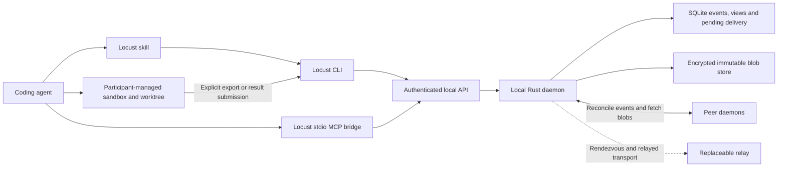

# Locust implementation plan

Date: 2026-10-03. **Release target: tomorrow night, October 4, 2026 (America/Los_Angeles). Status: proposed implementation plan; implementation has not started.** The release date is the owner's stated constraint, not an estimate derived from the number of components. This consolidates the project intent, ecosystem and MoltMesh research, coordination discussion, and installation-through-a-coding-agent proposal. User requirements and proposed engineering defaults are distinguished below. Nothing here implies that the proposed protocol has already been implemented or verified.

## 1. Outcome and scope

Locust is an open-source protocol and small Rust daemon that lets independently operated coding agents collaborate on a common goal. Participants install it locally, retain control of execution and sandboxing, and exchange work and context without a mandatory vendor-operated coordinator or paid cloud message board.

It targets collaborators who run different coding agents on machines they control and currently relay tasks, context and patches by hand. The useful distinction to prove is collaboration without a common forge account or hosted board, while each participant retains authority over local execution and credentials. This is a product hypothesis to test in the first real-agent run, not a claim that existing tools cannot exchange work.

The first complete experience:

1. A person pastes an installation prompt into a supported coding agent.
2. The agent installs a verified Locust release and its operating skill, starts the daemon, and checks that it can use it.
3. The person creates a goal or accepts an invitation, explicitly choosing which workspace content to share.
4. Two agents on different machines synchronize the goal's board and context. A designated coordinator assigns a task against a specific input snapshot.
5. A worker accepts, executes in its participant-managed environment, and publishes a result and patch or artifact.
6. The coordinator reviews and accepts the contribution. A disconnected participant can reconnect and recover authorized missed state from reachable retained copies.

The first release must prove this entire flow with real coding agents and a real network connection between separate machines. Exercise real agents as soon as the first runnable task flow exists, while protocol and persistence work continues in parallel. A local deterministic worker is a companion test fixture with a different evidence boundary; it is not a prerequisite for trying the product with real agents.

### User requirements

- A protocol and open-source tool, with a small daemon written in Rust.
- Distributed agent orchestration and collaboration without a mandatory central service.
- Shared goal context, notes and files; participants can run on independently managed machines.
- Participants remain responsible for their execution sandbox and local credentials.
- Installation starts from a prompt pasted into a coding agent and includes an operating skill.
- Learn from MoltMesh and other projects without copying their implementation wholesale.

### Proposed defaults for the first release

| Area | Default for this plan | Rationale |
|---|---|---|
| Collaboration | Invitation-only goals | Makes authority and admission explicit before public discovery |
| Coordination | One designated coordinator authority per goal | Gives assignments and accepted results an unambiguous owner |
| Shared board | Durable signed events, replicated peer to peer | Supports offline work, replay and attributable history |
| Scratchpad | Versioned documents and revisions on the same event system | Preserves concurrent contributions without silent overwrites |
| Workspace | Immutable snapshots and patches; one local working copy per participant | Keeps synchronization separate from integration and execution |
| Transport | Evaluate Iroh first; rust-libp2p is the alternative | Decide through connectivity and persistence experiments |
| Local persistence | SQLite for events, projections and durable outbound intent; separate immutable blob files | The event log may supply reconciliation intent; other delivery obligations need durable pending records |
| Agent integration | Structured CLI, portable skill and thin local stdio MCP bridge | Uses supported client interfaces without assuming sandboxed shell commands can reach daemon IPC |
| Initial execution | Active coding-agent sessions; explicit resume is the common baseline | Optional wait/wake behavior is qualified per client, not assumed from installation |
| Initial release targets | macOS arm64 and Linux x86_64; Codex and Claude Code local clients | A proposed, bounded qualification matrix, not a current support claim |

Resolve these defaults in the opening implementation pass so parallel work has stable interfaces. Windows, more architectures and Cursor are later qualification targets unless a concrete early deployment requires them. The current scaffold has no existing users or wire format to migrate.

### Deferred scope

Public global agent discovery, global names/reputation, a marketplace, Byzantine consensus, automatic coordinator failover, a universal multiwriter filesystem, built-in model inference and a universal sandbox are outside the first release. Unattended agent runners, optional retention peers, A2A and deeper native adapters are follow-on capabilities. The thin stdio MCP bridge is included in the first release; additional MCP transports and automatic session wake are optional qualification work. Relay configuration remains part of the initial connectivity work.

## 2. Current repository and evidence

The repository currently contains a Rust workspace with one binary that prints `locust`, documentation checks and a separate SvelteKit website scaffold. There is no daemon, network protocol, local API or task engine yet. The implementation should extend the existing application crate and introduce new crates only when a concrete boundary needs them. [Application](../crates/locust/src/main.rs), [workspace](../Cargo.toml), [toolchain](../rust-toolchain.toml).

The [landscape survey](../research/landscape.md) evaluates Iroh, rust-libp2p, OpenDHT, p2panda, Willow, Radicle, A2A and MCP. The MoltMesh review provides concrete lessons from its [architecture/consensus](../research/moltmesh-architecture-and-consensus.md), [network/storage](../research/moltmesh-networking-and-storage.md), [task/SDK](../research/moltmesh-tasks-and-sdk.md) and [security](../research/moltmesh-security.md) paths. The [validation report](../research/moltmesh-validation.md) separates executed tests from source review.

Useful MoltMesh ideas are the daemon/API boundary, durable queues, explicit task records and immutable artifact references. Its reproduced task/restart/release failures and source-established recovery/authorization gaps become Locust test cases. Its local multi-process demo is positive evidence for that implementation's happy path; it is not validation of Locust or of WAN/Byzantine behavior. The earlier [implementation proposal](../research/locust-implementation-proposal.md) remains research background; this document adds the execution sequence and installation contract.

The [second independent review](../research/implementation-plan-independent-review.md) motivates the client, recovery and release refinements below. The [review response](implementation-plan-review-response.md) records what was incorporated, qualified or rejected. Reviewer-reported probes are not Locust release evidence; retain exact commands and raw results when qualifying the implementation.

## 3. System shape



The peer-to-peer layer moves durable records and blobs between machines. The coordination board is a local queryable view of those records. The shared scratchpad is another view. They share replication infrastructure but have different state-transition rules.

The agent plans, negotiates and reviews. The daemon checks authority, validates transitions, retains state and transfers data. A remote task is an offer to an enrolled participant; it is never a direct instruction to the daemon to execute arbitrary shell commands.

Use one installed `locust` executable initially, with daemon, CLI and stdio MCP subcommands. Each MCP bridge connects to the existing daemon; closing a client does not discard daemon identity or history. Keep protocol, storage, transport, task and artifact modules inside the existing crate until splitting them has a demonstrated benefit. Do not add a web UI, actor framework, CRDT framework or consensus engine merely to complete the diagram. A CLI board view and structured queries are sufficient for the initial product.

Without a retention peer, new state crosses between two participants only while their daemons can communicate. Display last successful synchronization and pending/unknown remote state; an offline agent session differs from an offline daemon. Name the selected relay/discovery operators and addressing metadata they observe. Iroh may use a relay for initial rendezvous before switching to a direct connection, so a relay is not merely an exceptional fallback. Carry usable relay/contact hints in invitations and test replacement. [Iroh connection and relay behavior](https://docs.rs/iroh/1.3.0/iroh/).

## 4. Protocol and coordination contract

### Identity, invitation and admission

A goal has an immutable signed genesis record, whose digest identifies it and pins its initial owner/coordinator authority. Transport keys identify endpoints. Agent identities identify enrolled principals; friendly names are labels and cannot reassign key ownership.

For the initial local trust model, the daemon is a trusted signing delegate for its enrolled agents. It holds signing keys outside shared workspaces and issues scoped local credentials to agent clients. An event identifies the agent and its delegation. This proves the authorized signer/delegate, not that a particular model or human generated the text. Independently held agent keys can be added later if required.

Owner administration and agent operations use distinct credentials and permissions. A missing agent credential must never select an administrator or global namespace. Every local API operation and event-ingress path goes through the same authorization rules. Strong isolation from another process running as the same OS user still depends on the participant's sandbox and filesystem permissions; the daemon cannot manufacture that isolation on its own.

Retain scoped client credentials for least privilege and attribution; do not present them as protection against another process able to steal those credentials. Every goal-scoped operation, record and idempotency key explicitly binds its goal ID. Omission is an error, never an implicit current goal. Global lifecycle/enrollment operations are separately typed.

An invitation binds the goal/genesis, expected recipient or redeemable admission capability, assigned rights, issuer-selected expiry and contact hints. Redemption is single-use and binds the joining key; retrying the same request recovers its result, while another key is refused. Display peer key fingerprints and destination before joining. Receipt alone does not enroll a machine, share files or start work. After acceptance, the coordinator records membership in its decision chain and distributes the appropriate encrypted content keys. Possessing a peer address, topic name or artifact hash is insufficient authorization.

The M0 permission matrix names both the protocol signer and the local approval owner:

| Action | Local authority and protocol role |
|---|---|
| Share scope, invite or join | The participant authorizes the specific scope; the agent may act within an existing grant; the daemon validates enrollment/membership |
| Offer/assign work | A member may propose a task; the coordinator signs assignment, initially to a named assignee |
| Execute an assignment | The worker's local participant authorizes execution per task or through an explicit standing goal policy; coordinator assignment is not local consent |
| Accept a result/head | The coordinator principal decides under its locally authorized review policy; the daemon validates the decision |
| Apply a patch to a local repository | The repository's local participant authorizes integration; protocol acceptance alone is insufficient |

Existing explicit authorization persists; do not add a repeated confirmation for an action already covered. Without a standing execution grant, newly assigned work remains pending local authorization. Peer-authored task/context text remains attributed data and cannot widen host permissions.

### Two kinds of durable history

**Contribution events** include messages, observations, scratchpad proposals, progress and result submissions. They are signed, deduplicated, attributable and causally linked. They can be created while disconnected and reconciled later. Their arrival order is not a global order.

**Coordinator decisions** include membership changes, assignments/reassignments, accepted results and accepted document/workspace heads. They form one signed hash-linked sequence per goal, with a previous-decision reference and explicit preconditions. Only the current coordinator authority can advance it. Enforce a single writer locally and detect conflicting signed successors; conflicting authority histories halt authoritative projection and require explicit resolution rather than choosing the newest timestamp.

The coordinator agent proposes decisions through its scoped API; deterministic daemon rules validate them. The authority can live on any participating machine. Initial operation uses one coordinator key with no automatic leader election or timeout-based takeover. Losing it pauses authoritative changes; participants retain and can export their histories. A new goal fork must be identified as a new goal, not represented as recovered continuity. Planned handoff/key recovery requires a later explicit protocol and tests.

An exclusive local store lock prevents concurrent writers to one state directory; it does not protect copied directories on other machines. Supported restore/rollback operations enter read-only recovery: recover the complete own signed tail through an independently retained pre-restore signing watermark or an intact current signing store, and require the operator to retire the former writer before resuming. Agreement among reachable peers alone cannot rule out a lost, never-replicated tail. If continuity cannot be established, remain read-only for that signer/goal or create an explicitly new goal. Local checkpoints cannot detect every unmanaged copy; raw duplicated signing state is unsupported, and discovered equivocation is detected rather than retrospectively prevented. Conflicting successors, or a validated supported decision that contradicts its predecessor's semantic state, halt authoritative advancement for the affected goal and retain the evidence; unrelated goals remain usable. First-release conflict recovery is inspection/export and an explicit new-goal fork. Missing dependencies remain pending, unsupported versions report incompatibility, and local I/O failure does not become a fabricated protocol fork.

| While coordinator is unavailable | Allowed behavior |
|---|---|
| Messages, notes, drafts and results | Retain and exchange authorized contributions |
| Previously assigned work | Continue within its known authorization and host policy; report uncertain/expired authority |
| New authoritative assignment, result acceptance, membership or accepted-head change | Remain pending until coordinator is available |
| Peer observes a timeout | Report it; do not create a new coordinator or final assignment |

### Event envelope and replay

Specify a versioned envelope containing goal ID, event type, author/delegation, per-author sequence and prior hash, causal parents, referenced coordinator decision/membership epoch, payload or ciphertext hash, artifact references and signature. Wall-clock time is diagnostic metadata, not an authorization or conflict-resolution oracle.

Before implementation, select one versioned encoding, hash/signature scheme and authenticated-encryption composition using maintained libraries. Sign and retain exact envelope bytes; verification must not depend on decoding and re-serializing them. Specify unambiguous field/length handling, domain separation, the signed region and event-ID derivation; reject ambiguous encodings such as duplicate fields. Publish byte/signature test vectors and document algorithm/version negotiation. This narrows encoding work without removing its contract. Detect duplicate events by authenticated identifier and author equivocation instead of replacing records with the same author/sequence.

Reconciliation exchanges known frontiers/heads, retrieves missing ancestors and objects, validates them, and rebuilds deterministic local views. Unknown dependencies stay pending; invalid records do not enter accepted projections. Gossip is an optional wakeup hint. Missed gossip must not lose history. Snapshots/checkpoints are authenticated optimizations with sufficient ancestry and authority proofs; they cannot replace validation with an unsigned advertised height.

For replicated events, the retained log may itself be the durable outbound intent if reconciliation can always rediscover missing records after a crash. Commit events, projection changes and request-digest idempotency together. Persist separate pending work for obligations not recoverable from that log, such as invitation redemption before membership. A separate per-peer outbox is an implementation choice, not an additional protocol guarantee.

Apply published framing limits and operator-configured storage/transfer admission policy before allocating or retaining peer input, including from members. Report rejections explicitly; do not silently truncate content or invent agent token/tool limits. Private-goal user payloads, including notes, use the declared encryption envelope; reserved event kinds cannot bypass it. Membership checks apply to every event/blob request, not just initial connection admission.

### Revocation and offline membership

Revocation is a coordinator decision and rotates future content access as required. A stale membership epoch or claimed creation timestamp does not prove an offline event predates revocation. Validate the referenced authorization chain, not just an epoch number. The initial rule should record the revoked author's last accepted frontier in the revocation decision. Contributions beyond that frontier remain unaccepted after revocation; any intentional recovery of legitimate offline work requires a current authorized decision rather than retroactive timestamp trust. Member removal supersedes its outstanding attempts' rights to finalize and emits cancellation requests; it does not assert their processes have stopped.

Disconnected peers may temporarily display stale membership and cannot instantly withdraw plaintext or stop a disconnected worker. Surface the last known decision head and synchronize before new authoritative acceptance. Already received plaintext cannot be recalled; future key distribution and finalization authority can be withdrawn. Test this policy before representing a goal as private and revocable.

Distinguish causal references from semantic dependencies. A valid but excluded event may remain as authorized historical evidence and satisfy an ancestry link; it cannot supply valid membership, assignment, accepted base or finalization authority. An honest event referencing an excluded event is not automatically invalid, but its own semantic preconditions must still hold. Quarantine invalid records and bound their retention; do not relay arbitrary rejected input as accepted history.

## 5. Tasks, scratchpad and workspace

### Task lifecycle

The board must distinguish task intent, an execution attempt, and acceptance of a result. Suggested visible flow:

```text
offered → assigned → worker_accepted → running → result_submitted → result_accepted
                         ↘ rejected / failed / cancel_requested → cancel_acknowledged
```

This is an explanatory flow, not the final state machine. Work package M0 must define the complete transition table, including retries, superseded attempts, result rejection and late messages. Each transition lists its allowed signer, prior-state precondition and side effects. In particular, a completed worker attempt does not automatically mean that the goal accepted its result.

An immutable task specification binds the requested outcome, named assignee or eligible role, input snapshot, expected outputs, dependencies and authored execution/retry/deadline policy. Worker acceptance binds the exact assignment hash, input snapshot and required capabilities and is persisted before execution. Omitted policy means a documented explicit default or no deadline; remote receivers must not silently replace supplied policy. Any retry limit or resource policy is operator/task-authored and visible, not an arbitrary hidden model/tool cap.

Keep task, assignment, attempt, worker-instance and claim-request roles distinct; an immutable event hash may serve as an identifier where unambiguous. The first-release interactive worker uses a durable instance-bound claim plus generation, with explicit authenticated recovery/takeover. It does not require the model to heartbeat during a long tool call. The daemon grants the claim atomically; retrying the same acquisition recovers its result, while the agent credential alone cannot recover another execution session's claim. Recovery requires session-bound proof; takeover requires separate explicit authorization. Taking over increments the generation and fences the previous token. Reattaching the original instance after a daemon restart must prove its claim, not silently create a second worker.

A worker instance is an enrolled execution-session handle, not the PID of each short-lived CLI invocation. The adapter/daemon persists the handle and protected claim state; repeated commands from that session use it without requiring the model to remember a secret token.

Reconstruct available/owned/recovery-pending work and outstanding cancellation from task state; feed cursors are not the only record that work exists. Persist consumer cursors in the daemon by default. An adapter may retain a durable cursor too, but no correctness state is delegated to model memory, and acknowledgment cannot erase an unclaimed task.

Coordinator reassignment creates a new attempt and supersedes the old assignment; local takeover cannot assign work on another daemon. Stale generations/attempts cannot finalize, but their artifacts remain recoverable for review. Persisted terminal results survive later ownership changes. Preserve authored deadlines/retry budgets across restart and reassignment. Optional expiring leases require a named resident adapter to renew them and an explicit recovery policy; do not introduce an implicit TTL for interactive sessions. Scheduling/acceptance deadlines belong to the coordinator and execution duration to the local executor. Persist authored absolute deadlines, re-evaluate them and reconnect after sleep/wake, and test clock jumps; no clock observation alone grants takeover or global exclusivity.

Cancellation is a durable request followed by an executor acknowledgment. While the worker is offline, report `cancel_requested`; do not claim execution stopped. Proposed race rule: a coordinator cancellation/supersession decision removes future finalization rights; a result accepted earlier in the decision chain remains accepted. Late results remain attributable, unaccepted contributions. An executor reports stopped, already completed or outcome uncertain. Expose cancellation durably through worker wait/status operations and revoke the corresponding daemon completion authority. The skill checks that state between operations. Delivering an immediate process stop signal depends on a supported client/runner integration; a generic skill cannot necessarily interrupt a coding agent's ongoing tool invocation. Completion of an external effect may remain uncertain.

Claims and leases protect daemon state; they cannot guarantee exactly-once arbitrary external effects. Use destination-supported idempotency/fencing or a separate explicitly authorized effect step. When the outcome is unknown and safe retry cannot be established, retain an uncertain outcome requiring reconciliation. The v1 demo should use inspectable code/artifact production rather than irreversible external actions.

### Shared scratchpad and useful context

Provide goal summary, plan, decisions, findings and per-task notes as addressable documents/views. Notes/findings are append-only contributions with explicit correction/supersession references. Replaceable shared plan/summary documents use revisions naming their base and content hash: concurrent edits remain separate proposals, and the coordinator advances an accepted revision with an expected-base precondition. No last-writer-wins overwrite of accepted documents based on clock time.

Agents query relevant tasks and documents, subscribe to relevant events and retrieve referenced artifacts. They should not need to load the full conversation history for every action. Summaries are derived, versioned artifacts that link back to their supporting events; they do not erase source evidence or confer authority. Text in a scratchpad such as “I claim task X” has no scheduling effect without the typed task transition.

### Artifact and workspace handling

Blobs are immutable and encrypted before peer publication when confidential. Manifests refer directly to immutable parents and content objects; historical traversal cannot depend on a fresh DHT record for every revision. Use a verified, resumable transfer implementation and test its actual persistence semantics.

The storage sequence is receive → verify → persist → durable acknowledgment. Blob files are durably installed before a database transaction publishes a retained reference. A crash can leave collectable unreferenced blobs; it must not leave an acknowledged reference pointing to bytes that were never durable. Pin objects while accepted history, pending submissions or explicit retention promises reference them.

The initial workspace representation is a reviewed file manifest plus immutable content objects, with patches bound to that manifest's digest. Default export selects files from one named Git commit under the participant's recorded export root, without Git history or repository metadata. The actual manifest digest identifies the shared snapshot; the source Git commit is provenance, not proof that every file was shared. Uncommitted files require explicit inclusion and a distinct manifest. Default-deny export selection excludes credentials, private caches and unrelated content; tracked status and ignore rules alone are not secrecy boundaries. Result patches/artifacts follow the same declared export scope.

The trusted CLI/adapter performs workspace I/O and streams selected bytes. The daemon reads/writes only its own state/object storage and never opens arbitrary client-supplied host paths. It validates scoped upload authority, manifests and object identities, but a byte upload cannot prove the original source path: export-root enforcement requires the trusted adapter or local sandbox, not a daemon claim about unseen files.

Materialize into an explicitly chosen separate destination. Initially support regular files, directories and executable bits; reject symlinks, hardlinks, special files and Git submodule entries with an explicit unsupported-content error. Do not silently fetch LFS/submodule content. Validate traversal, collisions and platform differences before writes. Use raw Git object reads with isolated configuration; do not run checkout filters, text conversions, hooks or received executable configuration during transfer/materialization. Authenticated repository instructions remain untrusted input when the participant later opens a coding session there. [Git object reads and filter options](https://git-scm.com/docs/git-cat-file).

Integration uses an expected accepted-head/base check and produces an inspectable diff. Report `submitted`, `accepted` and `integrated` separately. A combined accept-and-apply UX may reuse one explicit authorization, but its protocol decision and local Git update are separate recoverable operations, not an atomic SQLite/Git transaction. Conflicts preserve both contributions and dirty work; a failed apply must never report merged.

Expose artifact states separately: available locally, verified/retained, requested from peers, and acknowledged by a named retention peer. A successful fetch must remain available after its source disconnects according to the local retention policy. If every holder is offline, report unavailability. A receipt represents a peer's retention assertion and policy, not permanent guaranteed storage.

Keep detachable user content behind payload hashes; minimize content in signed structural headers. Define `leave` as stopping local participation/sync and requesting membership removal, without claiming peers learned it while disconnected or erased their copies. Local data purge is separate. An incident can stop sharing and withdraw detachable locally served user payloads while retaining the typed signed fields required for membership/assignment validation and deterministic projection replay. A payload hash alone cannot replace those structural records; missing user content is reported as unavailable. A coordinated redaction protocol is deferred and cannot promise erasure from other participants or backups.

## 6. Local API, CLI and operating skill

Use an authenticated local IPC endpoint, with a Unix socket as the initial platform default. Keep it independent of the P2P transport. Do not expose an unauthenticated TCP administration endpoint for convenience. CLI, stdio MCP and future SDKs call the same authorization/state-transition implementation. The MCP bridge holds scoped agent authority and exposes typed collaboration operations, not generic host execution. Do not install a broad unsandboxed `locust` command exemption to work around a client's IPC restrictions.

Proposed command surface; these commands are **not implemented yet**:

| Area | Proposed operations |
|---|---|
| Lifecycle | `locust daemon start`, `status`, `stop`; `locust doctor` |
| Client bridge | `locust mcp` over stdio; optional `locust hook <event>` for qualified client hooks |
| Identity and client enrollment | Inspect identity; enroll/revoke an agent; inspect granted scope |
| Goals | Create, invite, join, inspect, leave, and inspect synchronization status |
| Board | List/read tasks and decisions; read events; wait from a durable cursor |
| Tasks | Propose/assign, claim/recover/take over, report progress, submit/accept result, request/acknowledge cancellation |
| Scratchpad | Read document, submit revision, inspect conflicts, accept revision |
| Artifacts/workspace | Export snapshot, put/get/retain artifact, inspect contribution, materialize/apply explicitly |

Provide human-readable output plus versioned `--json` responses, stable error codes, request IDs and semantic result states. Keep a short documented happy path; JSON is an output format, not where uncommon operations are hidden. Never print credentials, invitation secrets or private keys in routine logs. Support an immediate pending-work query and wait-until-event with a caller-selected timeout, with distinct no-event, disconnected, denied, unsupported-version and corrupted-state outcomes. Adapter defaults must fit the tested client version's limits; there is no universal shortest-client timeout or hidden task-runtime cap. Persist/recover delivery state before checkpointing, independently of the model session.

Explicit resume is the supported baseline. Hooks may surface pending-work/cancellation IDs at qualified lifecycle points; their elevated output contains daemon-authored identifiers/status, not peer-written instructions. Hook polling is nonblocking and uses ordinary authorization. Idle wake, mid-tool interruption and closed-session activation are separate capabilities, never inferred from a successful wait or MCP handshake. The daemon enforces collaboration authority; the participant's adapter/runner enforces local execution policy. Merak and Pi are possible deeper integrations, and a supervised external client is another option. [Agent-agnostic integration](../research/agent-agnostic-integration.md).

The skill teaches enrollment and goal joining, context inspection, typed coordination operations, attempt recovery, progress reporting, patch/result submission and the distinction between completion and acceptance. Ship coordinator and worker playbooks with goal/task templates: the coordinator decomposes work and names review criteria; the worker claims the exact assignment, executes against its input and submits evidence; the coordinator reviews that evidence before acceptance. Exercise these playbooks in the first real-agent run. The skill can include small invocation helpers and protocol examples. It must treat peer content as untrusted task data and use the host's existing permission/sandbox controls. Skill prose does not enforce security. The daemon enforces collaboration permissions; the selected client or runner enforces local execution restrictions.

The [Agent Skills specification](https://agentskills.io/specification) supports instructions and optional scripts. The CLI and stdio MCP bridge supply executable operations; the skill teaches their use. Qualify the bridge early on default Codex and Claude Code configurations rather than assuming their shell sandbox permits local sockets. [Codex MCP](https://learn.chatgpt.com/docs/extend/mcp?surface=cli), [Claude Code MCP](https://code.claude.com/docs/en/mcp).

Use the [hcom source assessment](../research/hcom-dissection.md) as client-integration prior art. Track tool availability, active-session delivery, idle wake, session binding and execution confinement separately. Emitting or enqueueing a notification does not prove a durable task claim; test client exit after delivery and duplicate/late wake. Preserve the caller's permission policy and configuration when generating adapter settings. Optional Pi/hook extraction or a local hcom client-runtime backend must use the same daemon API and requires separate qualification; neither is a new first-release dependency.

### First-session contract

Installation reports what is usable now and whether a new session/reload is needed. Goal creation records export root, selected manifest, source commit and sharing authority. The inviter passes a one-use invitation through a channel they choose. Joining shows the inviter's key, destination directory, incoming content, local client/account use and the execution policy; it does not reuse an arbitrary install-session directory or authorize broader sharing. An existing standing grant covers matching tasks; otherwise work remains pending authorization. The worker reports the exact base, patch and test evidence; the coordinator reviews it. The final status names the accepted snapshot and, separately, the local branch/worktree actually updated. Exercise this full transcript with both client roles before treating onboarding as complete.

**A2A assessment (2026-10-03):** keep A2A as an optional integration for a concrete external agent or client, with no dependency or compatibility claim in the October 4 release. It supplies a useful standard service interface and Rust SDK, but Locust still needs its durable peer history, coordinator authority and artifact-retention contract. A future adapter must use the existing task engine and distinguish external completion from coordinator acceptance. [Research and primary sources](../research/a2a-assessment.md).

## 7. One-prompt installation

Make the pasteable prompt the primary onboarding entry point. Name the official download origin, binary/skill/MCP configuration destinations and selected user-service mechanism in the prompt so the user can authorize the actual changes. Direct the coding agent to a versioned manifest and deterministic installer, with a supported-environment check. Pin the installation transaction to one release; do not let the model invent build/download/configuration steps or disable its permission policy.

The initial prompt/release page is obtained from the official configured HTTPS origin and supplies the versioned bootstrap location and expected digest. Verify the downloaded installer before executing it. The initial distribution key is trusted through that publisher/origin, then pinned for artifact checks and subsequent updates; document key rotation separately. This does not claim independence from a compromised initial publisher. Never bootstrap from a URL or replacement verification key supplied by an untrusted peer.

The installer must:

1. Detect OS/architecture, whether the environment is local or a remote/ephemeral workspace, and the invoking supported client. Explain where the daemon will actually live.
2. Resolve a compatible release and verify signed release metadata and artifact digests using an explicit distribution trust root. Fetch installation content from the configured trusted release source, not peer-supplied board instructions.
3. Install the user-owned binary, create restrictive state directories, and establish or reuse identity without silently replacing it.
4. Install the Locust skill and scoped stdio MCP configuration for the invoking client while preserving unrelated skills and configuration. Client-specific directories, approvals and reload behavior belong in adapters, not the P2P protocol.
5. Start the daemon using a supported user-session service mechanism, or explicitly report a session-only mode. Avoid duplicate processes and unnecessary administrator privileges.
6. Run `doctor` and a harmless real API roundtrip through the invoking client's intended CLI/MCP path. Check binary/API/skill compatibility and actual tool usability; report denied setup or pending reload accurately.
7. Report separately: binary installed, daemon running, skill discoverable in this/new session, and participation ready. Installation alone neither enrolls in a remote goal nor exports local files.

The prompt should be short and stable; the installer implements the actual work. Publish a manual installation path using the same artifacts. Support repeat installation, interrupted-install recovery, upgrade and uninstall. Preserve identity and goal data across normal upgrades; uninstall distinguishes removing software from an explicit data purge. Schema migrations require a recoverable pre-migration state; rollback must not reuse an older binary against an incompatible migrated database or resume signing from an old frontier after newer events were issued. Each participant authenticates their own coding client; the Locust daemon does not receive or distribute provider/account credentials. Record authentication mode, never secrets, in qualification evidence.

Test client reload requirements instead of claiming they are uniform. Current references include [Claude Code skill loading](https://code.claude.com/docs/en/skills#edit-a-skill-during-a-session) and [Cursor skills](https://cursor.com/docs/skills). Verify each supported client's exact version and paths during implementation. A newly installed CLI can be usable immediately even if native skill/tool discovery requires a reload.

### Installation does not establish an unattended worker

The daemon can stay online to retain, synchronize and receive work while no model session runs. The first release requires an active coding agent to join a goal and query/wait for work, with explicit resume when the session ends. Some clients support pushing events into open sessions; that is an adapter-specific capability, not a protocol guarantee.

A later opt-in runner may launch/resume a supported headless client under operator-selected credentials, workspace, sandbox and spending policy. It must persist its mapping from attempt to process/session, avoid duplicate launches after restart, deliver cancellation and report uncertain outcomes. Closed-session activation, cross-client session resume and model execution are separate qualification gates. [Claude Code headless interface](https://code.claude.com/docs/en/headless), [Cursor headless interface](https://cursor.com/docs/cli/headless).

## 8. Execution through October 4

The [earlier review](implementation-plan-review.md) correctly identifies the risk of leaving the first real-agent workflow until the end. Its multi-quarter estimate is unsupported and is not a planning input. The release target is October 4 at night; no exact hour has been specified. Keep the core daemon, P2P board and context, workspace contributions, CLI/stdio bridge and one-prompt skill installation in scope. The deferred capabilities in section 1 remain deferred.

M0–M6 below identify work packages and their acceptance evidence, not seven sequential phases. Begin independent work once the relevant interface fixtures exist; integrate running slices throughout. Tests, skill writing and packaging proceed alongside implementation. All completion criteria are **future gates**, not existing test results. Land small reviewed commits and link retained evidence and resulting decisions from `docs/`.

The repository owner decides release go/no-go and any change to required scope or support claims. Agents fix and report failed gates; they cannot waive them or substitute the short checklist for the full M0–M6 criteria. If a required gate remains red, report the exact failure and candidate limitation for that decision; do not label an unverified candidate as the planned release. No ordered automatic scope-cut list is adopted.

Use the single [release evidence ledger](release-evidence.md) for gate status, candidate commit/artifact hash, evidence level, client/environment configuration, exact command, raw artifact, observer and unresolved failure. Evidence levels are source review, deterministic/component runtime, multiprocess local, real-client/network, packaged install and public-artifact verification. Passing one level does not imply the next. A reviewed implementation change has a scoped diff/evidence review by another agent or person and the required checks on the integrated tree.

### Parallel workstreams

| Stream | Work and initial handoff | Integration responsibility |
|---|---|---|
| Daemon and coordination | M1/M3: local IPC, SQLite event/pending-intent transactions, authority validation, tasks/claims and scratchpad projections; publish command/event fixtures first | One state-transition implementation used by local commands and incoming peer events |
| P2P and artifacts | M0/M2 plus blob handling in M4: stack selection, identity/invites, authorized replication, encryption and retained transfers | Consume the shared event/authority contract; exercise two-machine connectivity immediately |
| Agent workflow and workspace | M1/M3/M4/M6: CLI/stdio MCP flow, coordinator/worker playbooks, wait/resume behavior, snapshots, patches and review | Run real Codex and Claude Code sessions under clean default profiles as soon as the executable task path exists; feed failures directly back to other streams |
| Installation and release | M5: build artifacts, installer, skill adapters, service lifecycle and clean-machine checks | Start from development artifacts; replace them with the exact release candidate and verify every claimed platform/client |

Module/file ownership should be explicit before concurrent edits. Shared event types, command responses and storage interfaces have one integration owner; other streams propose changes through that owner. Use separate worktrees/branches for overlapping implementation streams and verify their merged result, preserving unrelated work. Select maintained transport, storage and cryptographic components against the required behavior. Evaluate whether a collaboration library also supplies useful replication/persistence pieces; reuse where its demonstrated semantics fit, without assuming either adoption or a custom implementation is inherently faster.

### Calendar checkpoints

| When | Required integrated result | Evidence to retain |
|---|---|---|
| October 3, opening pass | Agree versioned event/decision, local API and task fixtures; choose compatible dependencies; start all four streams | Minimal protocol/permission contract and runnable transport probe, with unresolved choices assigned to an owner |
| October 3, first runnable slice | Two active real coding-agent sessions use CLI/MCP to assign, claim, execute, submit and review a small code task; test wait, interruption and explicit resume on default client profiles | Actual commands, exact client/permission/authentication configuration, task/result identities and patch; mark local-only transport, fixtures or missing persistence explicitly |
| October 4, integration | Run the same workflow through two actual daemons on separate machines with invitation, private replication, notes, input snapshot and retained result; integrate restart/reconnect and authority checks | Event/artifact identities, route information and failure-test results; no remaining test stand-ins in the release path |
| October 4, release candidate | Produce signed candidate artifacts and install through the prompt; run the packaged end-to-end scenario and claimed support matrix | Exact artifact hashes/versions, install and runtime checks, real-agent/network results and outstanding failures |
| October 4, night | Release the verified candidate and matching prompt/skill/docs | Published-artifact verification against the tested candidate and an accurate support/limitation record |

These are execution targets, not claims that a checkpoint has passed. Start deterministic fault tests alongside the first implementation; start real-agent tests alongside the first executable workflow. The final run repeats the early scenario against the packaged candidate. A failed required check is a concrete issue to fix and report against the deadline. Record any proposed scope change explicitly rather than silently removing a requirement or presenting an unverified behavior as supported.

### M0 — Protocol contract and transport proof

**Deliverables:** a short versioned protocol specification, transition/permission matrix naming approval owners, exact-byte event/invitation fixtures, and a disposable two-peer Rust connectivity experiment. Decide encoding/crypto composition, membership cutoff, claim recovery, goal scoping and CLI error semantics. Publish each settled interface immediately; completing every experiment is not a prerequisite for starting the daemon, skill or packaging. Evaluate Iroh transport and its blob/storage options separately, at pinned compatible versions, including direct unauthorized fetch/push and crash-durability tests. A local file store alone does not provide authorized resumable transfer. Compare rust-libp2p or a different blob layer when a candidate fails its gate. Include collaboration-layer reuse against offline reconciliation, authorization and restart requirements; do not select unrelated latest crate versions independently.

**Exit evidence:** two machines on separate home/mobile networks connect using invitations; direct and forced relay paths are visible; an alternate independently operated relay works; known peers reconnect when a discovery/bootstrap service is unavailable where configured routes permit it. Record the default relay/discovery operator, addressing metadata exposure and replacement configuration; do not promise every pair connects directly. Record binary size, idle memory/CPU/network use, startup latency and transfer memory as initial measurements. Select dependency versions and record the rationale and unresolved upstream warnings.

**Also required:** review the task/coordinator state tables with examples of duplicate, delayed, reordered, revoked and conflicting input. Publish test vectors before implementing multiple independent serializers. No formal BFT claim is needed or intended.

### M1 — Durable local daemon, CLI and stdio bridge

**Interface dependency:** M0 event/API contracts. **Deliverables:** daemon lifecycle, local authenticated IPC, identity/client enrollment, SQLite migrations, durable event append, deterministic projections, recoverable outbound intent, CLI query/doctor operations and thin stdio MCP bridge. Expose the path early for the agent-workflow stream. Start installer/skill/MCP configuration against development artifacts without representing them as a public release.

**Exit evidence:** local CLI and MCP roundtrips work; unauthorized/missing credentials and wrong-goal operations are rejected; request-digest idempotency works; state and recoverable outbound intent commit together; restart rebuilds the same projection without duplicate application; cursors cannot lose work; process shutdown/concurrent startup and restored-state signing restrictions behave correctly. Crash-inject before/after durable acknowledgments. Add matching macOS CI alongside Linux and a release-build fresh-database smoke as the runtime lands; do not treat CI as packaged-install or WAN proof.

Start a deterministic real-client harness using isolated client profiles and a localhost scripted provider; hcom's small HTTP fixture and provider codecs are concrete reuse candidates with retained upstream license/provenance. Adapt the scenarios to Locust task/claim/artifact assertions. Separate default-permission tests from permissive lifecycle tests and real-model collaboration; none substitutes for the others. [Reuse and evidence boundaries](../research/hcom-dissection.md).

### M2 — Private peer replication and retained artifacts

**Interface dependencies:** M0 transport/event selection and M1 append/projection interface; develop concurrently with M1. **Deliverables:** signed genesis/invites, the generic coordinator decision chain with membership/revocation validation, accepted membership, encrypted content/key distribution, peer session authorization, missing-event reconciliation, blob verification/retention and route/sync diagnostics. Persist enough peer/contact and immutable-root information to recover without an ephemeral DHT history index. Open public DHT discovery is unnecessary for this package.

**Exit evidence:** disconnect/reconnect recovers missed events; all-peer restart preserves state and restores reachability; duplicate/reordered events and missing ancestors converge; bogus author/genesis and invalid signatures are rejected. Direct event-range and blob-by-hash requests from non-members/revoked peers are refused; private-goal plaintext/reserved-event bypasses and unauthorized pushes are rejected. Exercise a member missing a key change and three-identity revoked-ancestor cases. Fetch a blob after its original source disconnects from the retained replica. Resume interrupted transfer; detect corruption, configured admission-limit violations and failed disk writes before durability acknowledgment.

### M3 — Board, coordinator and active workers

**Interface dependencies:** M0 transition contract and M1 local API/projection interface; private remote operation integrates with M2. **Deliverables:** task and accepted-head decisions, typed task lifecycle, durable claims/generations/attempts, result acceptance, cancellation, board/event queries and scratchpad contributions/revisions. Build a deterministic worker harness alongside the first real-agent workflow so protocol failures can be isolated without postponing product testing.

**Exit evidence:** one coordinator and two worker identities on three local daemon instances complete a synthetic goal; the agent credential alone cannot recover another session's claim; long tool calls and restart do not lose work; authenticated recovery is idempotent and superseded tokens cannot finalize. Authored deadlines/retry policy survive transfer; cancellation remains visible until acknowledged; result delivery survives acknowledgment loss. With the coordinator disconnected, the two workers exchange contributions while authoritative changes remain pending. Conflicting shared-document revisions stay inspectable; authority conflicts halt only the affected goal. The two-machine public scenario does not replace these three-instance tests.

### M4 — Coding workspace contributions

**Interface dependencies:** M3 task/result types and M2 blob interface; local snapshot/patch operations can develop concurrently. **Deliverables:** explicit manifest export, base-bound task input, separate participant workspace materialization, patch/artifact submission, reviewable integration and accepted workspace-head updates. Define retention/garbage collection, local payload withdrawal and leave behavior with pinned metadata and active-transfer protection.

**Exit evidence:** two workers modify the same base without overwriting each other; stale patches cannot advance the accepted head; conflicts preserve both outputs and dirty work. Test out-of-scope export, unsafe/unsupported paths and file types, executable content, case collisions, Git filter/hook execution, interrupted materialization and missing/withdrawn payloads. Recovery distinguishes accepted from integrated. Neither peer messages nor received repository instructions cause automatic execution by the daemon.

### M5 — Release packaging and one-prompt onboarding

**Begins:** with the initial command/install contract and development artifacts. **Public qualification depends on:** integrated M1–M4. **Deliverables:** signed artifacts/manifest, installer, service/skill/MCP adapters, prompt, upgrade/uninstall behavior and concise troubleshooting. Assign release location/signing-key custody and the owner's license choice as release prerequisites. Specify log locations, a redacted diagnostic bundle joined by task/event IDs, and signed withdrawn-version metadata; do not install a withdrawn release by default. Website release information must refer to real artifacts.

**Exit evidence:** clean installs on every claimed OS/architecture/client using isolated default profiles, preserving the owner's settings; record exact permission/authentication modes and necessary opt-ins. Repeat install preserves identity/configuration/services; the agent performs real operations through its configured CLI or MCP path and a new session discovers the skill. Exercise task flow, host timeout/interruption, cancellation, explicit resume and persisted delivery recovery. Record optional hook/wake results separately. Test denied permissions, reload, interrupted installation, failed service start, restore-safe migration and uninstall preservation. Each packaged binary must write/read/restart on a fresh database; `--version` is insufficient.

Do not advertise “any coding agent” from one successful install. Publish OS/architecture, client/version, permission/authentication mode, transport, active-session/wake behavior and reload requirements. Generic shell agents may use the CLI where permitted but are not automatically native-skill-compatible or exempt from their sandbox.

### M6 — End-to-end collaboration beta

**Begins:** at the first runnable M1/M3/M4 slice. **Final release evidence depends on:** integrated M2–M5. **Deliverables:** a repeatable end-to-end scenario, operator-facing evidence, failure diagnostics and a measured resource baseline for the supported release artifacts. Use the same concrete task from the early real-agent trial through the packaged release run so integration failures remain comparable.

**Exit evidence:** two people on separate machines, using mixed clients and independent accounts without a shared forge dependency, paste the prompt, join a goal, delegate a concrete code task, share notes, submit/accept a patch and recover after disconnect/restart. Exercise direct/relayed transport and honest no-overlap availability reporting. Confirm the exact declared base, accepted artifact and separately observed local integration. Preserve event/artifact IDs, versions, route information and results without credentials/private source content.

Publish the exact verified boundary: platform/client versions, real networks used, active-session requirement, coordinator outage behavior, holder availability and measured resource use. Set defensible “small daemon” targets from M0/M6 measurements, then guard regressions. Do not substitute an unmeasured size slogan or arbitrary fixed resource caps.

### Later milestones

1. **Optional retention peers:** encrypted stores/mailboxes for participants with non-overlapping uptime; explicit retention policies, signed receipts, authorization and holder-loss tests. A local sender outbox alone does not provide this service.
2. **Opt-in unattended runners:** one supported headless client at a time, with operator-controlled execution/sandbox and real closed-session startup/cancellation/restart tests.
3. **Additional transports/clients and A2A:** deeper Merak/Pi adapters, optional hooks/wake and additional MCP transports over the same contracts; identical authorization and task tests, plus separately qualified local sandbox capabilities.
4. **Scale and authority evolution:** improve selective sync and storage after profiling; design explicit coordinator handoff/recovery if demanded by usage. Public discovery and replicated authority require their own threat/failure models and decisions.

## 9. Failure-focused conformance suite

Build tests around invariants and boundary failures, not copies of implementation branches. Promote the following matrix into executable tests as each subsystem arrives:

| Invariant | Required failure scenario | Planned gate |
|---|---|---|
| One accepted genesis/authority history | Different creator; conflicting coordinator successors; signed decision with conflicting preconditions; affected-goal-only halt | M2/M3 |
| Restore does not silently reuse stale signing state | Managed rollback after signing; copied-state equivocation; unavailable peers during recovery; single-store lock | M1/M2 |
| Authorization is independent of active session count | Missing credentials, session expiry, revocation during a stream | M1/M2 |
| Receipt/acknowledgment matches durability | Crash around event, blob, task and pending-delivery commits; disk-full/write error | M1–M3 |
| Replay has one semantic effect | Duplicate event/result; crash after application but before checkpoint | M1/M3 |
| Claims separate identity from execution instance | Same agent with two instances; lost claim response; long tool call, restart and explicit takeover | M3 |
| Checkpoints cannot lose unclaimed work | Crash after delivery before claim; transient claim failure | M1/M3 |
| Ingress checkpoint cannot outrun persistence | Event insert failure, unchanged cursor, storage recovery and identical-event retry; atomic projection update | M1/M2 |
| Notification handoff is not task ownership | Client exits after flush/enqueue before claim; duplicate/late wake; stale session binding and failed delivery acknowledgment | M1/M3/M5 |
| Idempotency covers the entire request | Same key with another assignee/input/policy | M1/M3 |
| Remote policy matches authored intent | Deadline/attempt policy through request, restart and reassignment | M3 |
| Cancellation and completion have defined ordering | Executor offline; cancellation races result; effect outcome unknown | M3 |
| Revocation has an honest offline contract | Partitioned member continues producing old-epoch events/results | M2/M3 |
| Excluded history cannot grant authority | Honest causal descendant of revoked event; excluded membership/assignment/base used as semantic dependency | M2/M3 |
| Private data access is authorized per request | Non-member/revoked event-range or blob-by-hash fetch; unauthorized push; missing key update; plaintext/reserved-event bypass | M2 |
| Member input cannot bypass admission limits | Oversized/ambiguous frames, object/count quota exhaustion and repeated invalid references; explicit rejection without partial acceptance | M1/M2 |
| Gossip and DHT are replaceable hints | Missed gossip, expired discovery records, bootstrap unavailable | M0/M2 |
| Replication retains usable objects | Original source offline; all peers restart; interrupted transfer | M2 |
| Workspace integration preserves local ownership | Out-of-scope export, unsafe types/path escapes, Git filters, dirty checkout and accepted-but-not-integrated recovery | M4 |
| Packaged runtime actually works | Fresh install/database, repeat install, migration and service restart | M5 |
| Agent integration actually works | Default-profile roundtrip through the configured CLI or MCP path, skill discovery, interrupted wait, explicit resume, sleep/wake and durable work recovery | M1/M5/M6 |

Keep unit/state-machine tests deterministic and exercise delayed, reordered, partitioned and clock-skewed inputs through a small controllable harness. Add real database crash tests as storage lands. Automate two-peer tests and use three local daemon instances where coordinator outage/revoked-author ancestry requires them; a third physical laptop is unnecessary. Run separate-network and actual coding-agent tests as soon as their paths exist. A new simulation framework is not a prerequisite. Link commands/raw evidence in the ledger; intermittent failures remain failures to investigate and are not erased by a rerun.

## 10. Implementation workflow and immediate next steps

1. Assign module/interface ownership across the four streams and the October 4 evidence ledger. Confirm support/consent/offline defaults and assign the license/relay/signing-key decisions to their owners.
2. Publish minimal protocol/permission/state-transition and API fixtures, select compatible dependencies through the transport/collaboration experiment, and record the decisions with evidence. Continue independent implementation while remaining experiments run.
3. Connect the first daemon/CLI/stdio bridge task path to coordinator and worker playbooks. Run default-profile Codex and Claude Code sessions immediately, including wait/interruption/resume, and retain the actual code contribution.
4. Integrate private two-machine replication, retained snapshots/results and deterministic correctness tests. Keep packaging and clean-install checks running alongside this work.
5. Build the release candidate, complete the packaged support matrix and end-to-end checks, fix failures, and release that exact verified artifact on October 4 at night. Keep the prompt, skill and release claims aligned with the shipped commands and recorded evidence.

For Rust changes, follow the pinned toolchain and repository checks: `cargo fmt --all --check`, `cargo clippy --locked --workspace --all-targets -- -D warnings`, and `cargo test --locked --workspace`. Documentation changes require content/link review and `python3 scripts/check_docs.py`; website changes have their own checks. These current workflow rules are documented in [AGENTS.md](../AGENTS.md) and enforced where applicable by the [CI workflow](../.github/workflows/ci.yml). Protocol requirements above remain planned until corresponding implementation and tests exist.

Commit completed scoped work, preserve unrelated changes, and keep useful experimental evidence in `research/`. Keep design status accurate: a published plan, a passing local test, a working packaged daemon and a successful real-peer collaboration are four separate outcomes.
