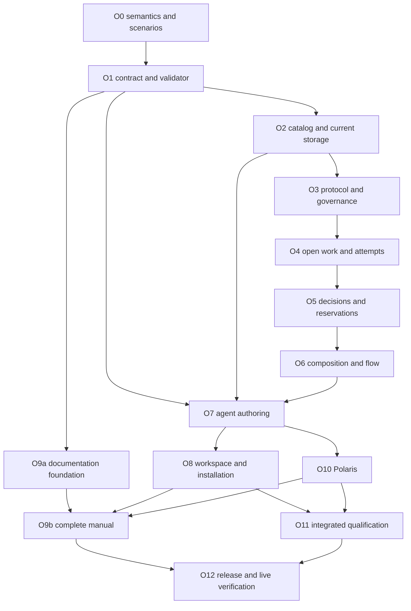

# Organization blueprints implementation plan

Date: 2026-10-04. **Status: implementation plan for the accepted product direction;
not an implementation or a claim of qualification.** Baseline inspected:
`6d74f2384009ef1b52e2660c9fc03bf46fc0ebf8`. The
[accepted direction](organization-blueprints.md) establishes selectable
organization, easy agent authoring, and a Polaris visual editor over one contract.
The [research](../research/organization-blueprints.md) supplies source mappings
and alternatives. Recommendations in the decision register below are proposed
implementation choices until resolved at their dependent package, except D3,
which the owner resolved as a greenfield replacement.

**Owner clarification, 2026-10-04:** no migrations, backward compatibility, or
dead code. Replace the current implementation directly; remove superseded paths
as their replacements land. Old goals, formats and runtimes have no continuity
requirement. This supersedes every earlier migration/compatibility proposal in
the linked plans and research.

**Full scope includes public documentation on locust.farm.** The companion
[public documentation plan](public-documentation-plan.md) specifies the complete
manual, route inventory, generated references, agent-readable documentation,
site implementation, verification, and publication gates. It is a required
workstream of this plan, not a post-release cleanup task.

This plan supersedes the universal-coordinator target in the older
[implementation plan](implementation-plan.md). Writing it changes no behavior;
implementing it replaces protocol 1 under D3, and historical evidence stays as a
labeled record. The
[last-mile plan](last-mile-implementation-plan.md) still supplies installation,
permission, and delivery work; organization-sensitive portions must use this
plan's new identities and state model. Publishing software/site content, paid
campaigns, and changing platform qualification scope remain separate actions.

## 1. Outcome and completion of the project

A participant can describe an arrangement to an agent, inspect a short effective
agreement, validate and publish it, and create a goal with that exact definition.
Agents can collaborate freely, use coordinator assignment, reserve open work,
make independent attempts, hand off work, use dependencies, and apply explicit
review/completion rules. Tasks can specialize the goal's arrangement within its
delegated authority. Polaris can open the same definition, edit it visually,
and return it to an agent without semantic loss.

The complete delivery includes:

- A versioned declarative contract, deterministic validator/explainer, schema,
  examples, and a pinned definition/instance lifecycle.
- A protocol and durable runtime that enforce those arrangements at local
  authoring, incoming peer ingestion, and replay.
- Contribution exchange without tasks; tasks with multiple attempts and
  results; explicit completion and optional output selection.
- Agent-friendly CLI/MCP/skill flows and honest information about available
  actions, pending evidence, local permissions, and disconnected peers.
- Workspace and managed-client integration, fresh-state installation and recovery
  for the current model, with all superseded implementation paths removed.
- Polaris authoring and goal inspection with scoped credentials and the same
  contract/validator as Locust.
- A complete, versioned public manual and a working agent-readable entry path
  on the marketing site, tied to the actual release and qualification evidence.

Ship intermediate standalone candidates when their gates pass. That does not
complete this entire plan: Polaris authoring and the public documentation remain
required deliverables. Do not call browser-only UI proof native integration,
scripted clients real-model evidence, or a built site publicly available.

### Non-goals and boundaries

No arbitrary executable policy language, mandatory workflow DAG, required cloud
coordinator, private-conversation harvesting, automatic closed-client wake, or
automatic widening of local permissions. Keep Merak optional as a local executor.
Do not model remote participants as local Merak child runs.

Multi-administrator Byzantine consensus, private topics inside one encrypted
goal, and timing-based veto/lease semantics are not prerequisites to the accepted
model. Do not claim them through a generic field the engine cannot enforce.
Independent attempts, reviewer thresholds, and named decision authorities remain
in scope without those stronger guarantees.

Do not invent limits on tasks, attempts, reasoning tokens, rule iterations, or
execution time. Retain explicitly authored limits and documented physical/wire
constraints. Pagination and finite test/model-checker bounds are not product
execution budgets.

## 2. Verified starting points

| Area | Current source | Implication |
| --- | --- | --- |
| Contract/version | [locust-proto](../crates/locust-proto/src/lib.rs), [events](../crates/locust-proto/src/event.rs), [API](../crates/locust-proto/src/api.rs) | Protocol/API are globally version 1; owner/coordinator and decision variants are baked into signed events |
| State and authority | [chain](../crates/locust-core/src/goal/chain.rs), [fold](../crates/locust-core/src/goal/fold.rs), [state](../crates/locust-core/src/goal/state.rs), [access](../crates/locust-core/src/node/access.rs) | Membership, key epochs, assignment, cancellation, and acceptance share one coordinator chain; one task has one current assignment/result |
| Durable proof | [commitments](../crates/locust-core/src/goal/commitments.rs), [screening](../crates/locust-core/src/goal/screen.rs) | Exact contribution ancestry survives forks through coordinator commitments; new decisions need an equally explicit retention/proof model |
| Claims and execution | [claims](../crates/locust-core/src/node/requests/claims.rs), [sessions](../crates/locust-core/src/node/sessions.rs), [managed sessions](managed-clients.md) | Current claim generations fence sessions on one daemon; they are not a distributed open-pool reservation algorithm |
| Content graph | [content graph](../crates/locust-core/src/node/content_graph.rs), [content requests](../crates/locust-core/src/node/requests/content.rs) | Admission and fetchability follow typed roots; standalone contributions and blueprint definitions need explicit root types |
| Persistence | [store open](../crates/locust-store/src/store.rs), [preflight](../crates/locust-store/src/connection.rs), [schema](../crates/locust-store/src/schema.rs), [local records](../crates/locust-core/src/node/records.rs) | Unsupported event versions are refused before migration; SQL schema migration is separate from postcard record and event compatibility |
| Authoring/API surfaces | [operation registry](../crates/locust-proto/src/api.rs), [CLI arguments](../crates/locust/src/cli/args.rs), [MCP schema](../crates/locust/src/mcp/schema.rs) | Operation metadata is shared, but field schemas/CLI mappings are not all generated; budget work for contract generation and parity tests |
| Workspace integration | [CLI workspace](../crates/locust/src/cli/workspace.rs), [application](../crates/locust-workspace/src/apply.rs) | Submission needs assignment/generation; application assumes a goal's accepted head. Both assumptions must change for open contributions and multiple selected outputs |
| Installation | [onboarding](onboarding.md), [packaging](packaging.md) | Source setup and local Mac qualification exist; artifact trust, client discovery, and live publication have separate evidence |
| Public site | [site README](../sites/locust.farm/README.md), [docs placeholder](../sites/locust.farm/src/routes/docs/+page.svelte), [guide](../sites/locust.farm/src/lib/onboarding/guide.ts), [CI](../.github/workflows/ci.yml) | `/docs` is a placeholder; public guide claims need reconciliation; CI does not run site checks |
| Polaris | Separate Merak repository, paths in section 8 | Blueprint editor pieces exist, but a production Locust connector/organization editor does not |

Preserve existing crate boundaries from [workstreams](workstreams.md). Put plain
types/canonical contracts in `locust-proto`, pure evaluation in `locust-core`,
storage in `locust-store`, and process/client integration in `locust`. Add a crate
only when an actual consumer requires a dependency boundary that modules cannot
provide. Inspect status and relevant diffs again at each implementation package.

## 3. Decision register and recommended implementation choices

Resolve each decision before its dependent work, without blocking independent
schema, documentation, or fixture work. Record decisions in the accepted-direction
document or a linked protocol contract. Do not substitute a silent implementation
choice for a product-visible change in authority. The greenfield decision is
settled and does not need another approval.

| ID | Recommended choice | Resolve before |
| --- | --- | --- |
| D1 — Definition language | Typed declarative JSON contract; offer YAML as a restricted authoring representation if its parser round-trip/diagnostic prototype passes. One normalized semantic representation. No arbitrary scripts or model calls in evaluation | O1 schema freeze |
| D2 — Organization/governance | Separate administration, work organization, evaluation, and local execution. Initially one explicit membership/rule administrator; it does not approve each work event. Open collaboration is the proposed default | O0 transcript acceptance, O3 |
| D3 — Greenfield replacement (resolved) | No migrations, backward compatibility, old-format readers, parallel runtimes or dead code. Initialize current state directly; remove superseded implementation and fixtures; refuse unsupported formats without interpreting/converting them | Enforce in every package, especially O2/O8 |
| D4 — Completion/finality | Positive review evidence can satisfy a non-exclusive completion condition without a central finalizer. Exactly-one selection and authoritative closure use a named scope-specific decision authority initially. Threshold approval does not imply threshold consensus on one winner | O0 model, O5 |
| D5 — Exclusive reservations | Optional named task-scoped single-writer reservation authority, with durable generations and explicit release/replacement; new exclusive claims wait when it is unreachable. Independent attempts remain available when the blueprint allows them. No clock-only reassignment | O5 reservation implementation |
| D6 — Rule revisions | Pin definition, bindings, and completion context for active work. Amend future defaults explicitly under current authority; revise/reopen work through an explicit current-model transition, never reinterpret past signatures. No old-format conversion | O1/O3/O6 |
| D7 — Sharing | Initial goal membership remains the read boundary. Topics/roles organize attention but do not grant confidentiality. Different membership means a separate goal with explicit shared inputs | O3/O6 and public privacy docs |
| D8 — Editor authority | Local private draft ownership and scoped authoring credentials. Polaris retains credentials in native Rust and uses Locust APIs; viewers remain read-only. Publishing a definition is distinct from creating/changing a goal | O7/O10 |
| D9 — Public documentation | One canonical manual, versioned release snapshots, generated contract references, checked examples, and distinct released/development views. Implementation detail in [site plan](public-documentation-plan.md) | O9a |
| D10 — Qualification/release | Keep the four-client baseline. Preserve the current Linux build-only boundary until explicitly expanded. Select actual model/account/spend inputs for paid tests and public hosting/signing inputs before executing those campaigns | O11/O12 |

D3 removes the former side-by-side and mixed-version options from scope. Version
markers identify supported formats and permit clear rejection; they do not imply
decoders, negotiation fallbacks or conversion for older formats. Current-model
crash recovery, durable evidence, definition revisions and repeat installation
remain required. Rejecting unsupported local state does not silently delete it.

## 4. Target contracts

### 4.1 Definition, catalog, and instance

Keep these separate:

| Entity | Required information and behavior |
| --- | --- |
| Draft | Owner principal, source format/text or tree, schema version, expected revision for updates; loadable incomplete work is allowed and gets diagnostics |
| Published definition | Canonical immutable semantic body and content hash; required capabilities; optional input/role slots; guidance is versioned with behavior, while layout/marketing labels are separate |
| Presentation | Name/description/catalog metadata and Polaris layout, with its own revision; no authority or execution effect |
| Goal instance | Exact definition hash, inputs, authenticated role bindings, administration identity, and current control-history reference |
| Task instance | Creator, inputs/criteria, inherited or allowed specialized definition, binding context, dependencies, and completion rule |
| Attempt | Independent participant effort; optional local execution-session association; requested/running/reported/abandoned/cancelled/uncertain facts without claiming remote process liveness |
| Contribution | Immutable finding/artifact/output and provenance, optionally linked to task/attempt; no assignment required for the open case |
| Review/attestation | Exact subject hash, author/eligibility proof, rule context, verdict or check evidence; identity and assertion scope are explicit |
| Completion evidence | Proof that the pinned task criterion is satisfied, potentially by more than one contribution; does not itself choose a unique code head |
| Selection/closure | Optional explicit decision, selected exact outputs, authority/rule context, prior decision reference where uniqueness is required |

Drafts are local/private by default. Publishing to the local catalog does not
share the definition with peers. Binding it to a shared goal makes the necessary
definition and approved inputs available to those members. Copies/imports retain
origin metadata without inheriting the source's credentials or powers.

Reusable definitions may be published with declared, unbound role/input slots.
Validate their structure at publication, concrete bindings and scope when creating
an instance, and current availability when acting. An offline reviewer does not
make a structurally valid template invalid. Keep the semantic definition hash
distinct from a goal's encrypted content-object hash: encryption and key rotation
can change stored bytes while preserving the definition's semantic identity.

Canonicalization must define integer/enum semantics, object ordering, omitted
defaults, strings, normalized selector forms, and precisely which fields affect
identity. Reject unknown behavior-bearing fields/versions at publication, rather
than silently discarding them. Preserve raw newer source as read-only if it
cannot be interpreted. A YAML loader must reject executable/custom tags, duplicate
keys, ambiguous scalar coercions, and unsupported aliases without inventing
semantics. Do not promise comment-preserving formatting unless implemented.

### 4.2 Typed rule vocabulary

Use a finite set of typed operations with composition, not a preset enum that
selects different runtimes. Final field spellings are frozen in O1, not in this
plan's illustrative descriptions.

- Selectors: member, specific authenticated identity, bound role, task creator,
  contribution author, and explicit exclusion of that author.
- Work policies: propose, start independent attempt, offer/assign, recipient
  accept/decline, optional confirmed reservation, release, and handoff offer.
- Evidence predicates: an exact contribution exists; a permitted author reports
  completion; a check attestation matches its subject; distinct eligible reviews
  meet a specified threshold; named authority records a decision.
- Composition: `all`, `any`, and explicit count thresholds over a defined set.
  Positive evidence should be monotonic within a pinned decision context.
- Flow: explicitly named prerequisite evidence, work/review offer, and authorized
  creation of a child task with mapped inputs. No automatic local process launch.
- Outcomes: ongoing scope, criteria satisfied, optional selected outputs, and
  explicit closure/reopen. No inference that an empty locally seen board is done.

Reject or mark unsupported negative/absence conditions, mutable-electorate
majority selection, automatic lease expiry, and other constructs until their
protocol semantics are defined. This is capability validation, not an arbitrary
runtime cap. A validator should explain the unsupported guarantee and offer an
expressible alternative.

### 4.3 Authority and three distinct revisions

Do not collapse these into one overloaded epoch:

1. Membership/control-history reference: who was admitted/removed and what
   author-log cutoffs apply.
2. Organization/rule and role-binding revision: which actions and reviewers are
   authorized for this scope or round.
3. Content-key epoch: which encrypted content the participant can decrypt.

Work events reference sufficient authenticated context to be validated without
a new administrator signature per work event. Role strings are selectors, not
self-issued permissions. Historical valid evidence, events concurrent with
removal, re-admission, changing roles, and pending/missing proofs require explicit
rules in O0/O3. A removal cannot erase copies already learned or physically stop
an offline process.

### 4.4 Completion, reservation, and selection

The first complete set of blueprints must express:

| Arrangement | Completion behavior | Additional guarantee |
| --- | --- | --- |
| Open collaboration | Unattached findings need no task completion; optional tasks explicitly choose contributor declaration or another rule | No common accepted head required |
| Coordinator | A scoped coordinator accepts an exact contribution | Named decision stream for selection, preserving current-style behavior |
| Shared pool with peer review | One eligible non-author review satisfies each candidate's approval rule | Exclusive pickup only if the configured reservation service confirms it |
| Independent attempts | Keep all candidates; complete after authored positive evidence or a named choice | No inferred winner from earliest arrival, timestamps, or hash order |
| Review panel | A specified threshold of distinct eligible identities approves an exact candidate | Multiple candidates may qualify; unique selection is separately configured |
| Pipeline/handoff | Required input evidence makes the next work available; recipient accepts an offer | No promise of wake, automatic execution, or handoff before acknowledgment |

Criterion satisfaction is derived from verifiable evidence and the pinned rule.
Any authorized peer may relay proof; there must be no hidden universal finalizer
for open or non-exclusive approval. Evidence may be missing locally, so distinguish
pending verification from unsatisfied, invalid, or disputed.

For unique decisions, use an explicit per-scope authority/serial decision stream
under D4; this identity need not be the membership administrator. For reservations,
separate distributed reservation generation from local execution-session fencing.
Persist the reservation and retry receipt atomically before confirming ownership.
Lost replies, release, cancellation, and replacement must not allow duplicate
currently effective reservation generations; reject writes using a stale
generation under the defined authority context. Disconnected peers may retain an
old confirmation or keep executing, so this does not promise globally unique
observed ownership or physical execution. A discovered authority fork halts the
affected authority scope; it does not silently choose a winner. Do not claim
Byzantine tolerance.

O0 must settle which review/fork evidence a completion proof pins, when a round
closes relative to membership changes, and the treatment of superseded or disputed
evidence. Approved output updates require a new contribution and review context.
Where irrevocable finality has not been established, the API must say so. Do not
make a local observation of 'no objections' a completion rule.

### 4.5 Composition and information boundaries

A task inherits a fully resolved effective arrangement at creation. Overrides
can use delegated alternatives and narrow authority; arbitrary widening requires
an explicit parent-authorized change. Check authority inclusion, not just schema
validity. Dependency satisfaction names exact task revisions/evidence, not titles.

A subgroup with different membership is a separate goal with explicit export
and return references. Child acceptance never automatically satisfies parent
acceptance. Cycles in static readiness dependencies are rejected with a path;
intentional iterative work creates explicit new attempts/tasks or authored
feedback semantics rather than an implicit recursive scheduler.

Reactive creation uses a logical effect key derived from rule version, trigger,
scope, and intended effect. Signed event IDs remain author-specific. Define which
identity may author a materialized effect and deduplicate it durably. Derived
readiness itself does not need to mint events.

## 5. Work packages and dependency order

All packages are unstarted under this plan. Package IDs are planning identifiers,
not claims that new CLI commands or modules already exist.

| Package | Deliverable | Depends on | Primary owner |
| --- | --- | --- | --- |
| O0 | Semantic decisions, golden scenarios, protocol/model obligations | Accepted direction | Protocol/integration |
| O1 | Definition types, canonicalization, schema, pure validator/explainer | O0 vocabulary; D1 | Contract/core |
| O2 | Current storage schema, local draft/published catalog, obsolete-path removal | O1; resolved D3 | Storage/integration |
| O3 | New governance references, admission, typed content and peer validation | O0/O1/O2 | Protocol/core/network |
| O4 | Open contributions, tasks, independent attempts, local execution bindings | O3 | Core/clients |
| O5 | Completion/reviews, selections, exclusive reservation | O0/O4; D4/D5 | Core/protocol |
| O6 | Task variations, dependencies, handoff, deduplicated flow | O4/O5; D6/D7 | Core/integration |
| O7 | Agent authoring and operating CLI/MCP/skill | O1/O2 early; O3–O6 integration | Agent experience |
| O8 | Workspace, managed clients, installed packages, integration cleanup | O4–O7 | Runtime/release |
| O9a | Documentation content/build/navigation infrastructure | O1 contracts; D9 | Site/docs |
| O9b | Complete manual, generated reference and tested tutorials | O3–O8; O9a; O10 for Polaris pages | Site/docs with feature owners |
| O10 | Polaris native adapter and visual authoring/inspection | O1/O2/O7 stable API; runtime for live flows | Polaris/Merak |
| O11 | Integrated deterministic, real-client, multi-machine qualification | O3–O10 incrementally | Integration/qualification |
| O12 | Release readiness, public site and artifact verification | O8/O9b/O11; D10 | Release/site |

The diagram shows integration gates, not a demand to finish all runtime work
before starting agent/UI/docs design. Prepare fixtures, schema consumers, docs
navigation, and editor components in parallel against versioned contract fixtures.
Avoid parallel edits to shared contract registries without an integration owner.

### O0 — Specify the semantics with executable examples

1. Resolve the register entries needed for the first signed contract, particularly
   D2 and D4–D6; D3 is resolved. Record the current protocol contract and mark old
   contracts as historical evidence, with no obligation to keep their runtime.
2. Write plaintext stories and fixture transcripts for every arrangement in
   section 4.4, plus one goal mixing open research, reviewed coding, and competing
   benchmarks. Include a no-task contribution and a human/external contribution.
3. Define authority, fork/evidence selection, closure, removal, and unknown-rule
   outcomes before implementing their event shapes. Document availability/trust
   assumptions for the optional reservation and decision authorities.
4. Extend the existing TLA+ work with models for governance/work separation,
   completion evidence, and reservation/session interaction. Replace superseded
   executable models and fixtures; retain useful findings as labeled historical
   evidence with source commits. Identify bounds, omissions and source mappings.
5. Inventory code, APIs, CLI flags, schemas, fixtures and dependencies made obsolete
   by the new contract, assign each removal to its replacing package, and define
   fresh-state setup plus clear unsupported-format refusal. No conversion path.

**Exit:** reviewed state-transition tables and scenario expectations; every
exclusive/finalizing operation names its conflict rule; finite models cover the
principal race cases. Resolve safety counterexamples or explicitly withhold the
affected capability before dependent implementation/release; retain them as
evidence of unsupported guarantees. Model checks support this scope, not a blanket
proof. Open questions are assigned to named dependent packages.

### O1 — Build one authoring contract and validator

Source owners: [contract](../crates/locust-proto/src/lib.rs),
[core](../crates/locust-core/src/lib.rs). Proposed modules can start as
`locust-proto::organization` and `locust-core::organization`; these paths do not
exist yet. Keep semantics outside the CLI and UI.

1. Implement the normalized types, version marker, canonical bytes/hash, typed
   selectors/predicates/effects, input slots, role bindings, and feature capabilities.
2. Separate parse/loadability, structural validity, semantic validity, contextual
   binding/authority validity, and current execution readiness. A draft can be
   loadable but not publishable; an otherwise valid definition can need bindings.
3. Implement a single pure validator, effective-default expansion, deterministic
   human/agent explanation, semantic diff, and stable diagnostics with field paths.
4. Export JSON Schema and a machine-readable operation/type catalog from the
   authoritative types/registry. Generate TypeScript types and example reference
   inputs from that output; prevent handwritten copies in Polaris or the site.
5. Add fixture definitions for all presets and compositions, malformed documents,
   forbidden privilege widening, missing identities, newer/unknown versions,
   contradictory completion conditions, and unsatisfiable reviewer bindings.
6. Prototype JSON/YAML ingestion under D1 and preserve exact source separately
   where needed. Demonstrate semantic round trips and useful error locations.

**Exit:** all examples pass the Rust validator; equivalent authoring representations
produce identical semantic hashes; layout changes preserve those hashes; generated
contract drift fails CI; completion explanations identify which facts would satisfy a task.
Offline validation needs no daemon, model account, or network.

### O2 — Persist drafts/definitions in the current schema

Source owners: [store schema](../crates/locust-store/src/schema.rs),
[store preflight](../crates/locust-store/src/connection.rs),
[local records](../crates/locust-core/src/node/records.rs),
[local API](../crates/locust-proto/src/api.rs).

1. Add principal-owned draft catalog records with compare-and-swap revisions;
   give presentation its own revision. Preserve both drafts on a conflict.
2. Store immutable published definitions and dependency closure by hash. Make
   publish idempotent and retain definitions referenced by active or historical
   goals within the current contract.
3. Define the current local-record encoding and direct SQL schema initialization.
   The store has one schema entry and untagged postcard local records, so a
   protocol-1 home holding enrolled agents but no events passes the event-version
   preflight. Give the new schema a distinct marker and refuse every other
   nonzero value before reading local records. Test crash/reopen and recovery
   for this schema. Schema numbers do not create a migration API.
4. Use one current contract through event/invitation codecs, local hello, network
   hello/framing and diagnostics. Reject unsupported markers before decoding or
   mutating state. Do not add old-goal dispatch, fallback codecs or conversion.
5. Initialize fresh goals, principals and grants through current setup. Remove
   v1 transition/import tooling from scope; normal sharing within the current
   model remains supported.
6. Delete superseded persistence/codecs/tests/dependencies with their replacements.
   Keep regression coverage for current invariants, using current-model fixtures.

**Exit:** concurrent edits, interrupted publish, durable-commit recovery, fresh
schema initialization and unsupported-format refusal tests pass. Only the current
schema/codec path remains. No converter, old reader, parallel runtime or dormant
compatibility switch is retained; rejected state is not silently overwritten.

### O3 — Separate governance from work validation

Source owners: [event contract](../crates/locust-proto/src/event.rs),
[goal engine](../crates/locust-core/src/goal/mod.rs),
[node authoring](../crates/locust-core/src/node/authoring.rs),
[sync](../crates/locust-core/src/sync/mod.rs),
[content graph](../crates/locust-core/src/node/content_graph.rs).

1. Introduce the new genesis/control references, definition hash, explicit
   administration, and independent rule/binding/content-key revisions.
2. Build governance validation for invitations, admission/removal, role grants,
   future-rule revisions, and authority delegation. Separate these from task actions.
3. Replace the global coordinator check/classification with typed scoped
   authorization. Use the same evaluator for authored and received events;
   enforce authority at replay, not merely in tool descriptions.
4. Specify evidence closure and author-fork handling from O0. Retain referenced
   definitions, role proofs, contributions, and decisions. Distinguish unknown,
   missing, excluded, invalid, and conflicted evidence without inventing validity.
5. Extend typed content-root traversal to definitions, standalone contributions,
   reviews/attestations, and proof dependencies. Preserve sealed-content checks,
   key access, safe retention, interrupted fetch recovery, and withdrawal semantics.
6. Extend synchronization and reconciliation for new record kinds and capabilities.
   Unknown versions are rejected safely with actionable update guidance.

**Exit:** two members can author/exchange open findings while administration is
offline; equal held evidence produces equal state regardless of arrival order;
role spoofing, cross-goal references, revoked/forked authorities, and missing
proofs cannot become authorized work. Existing crypto and transport tests remain
passing; new behavior has source-specific conformance tests.

### O4 — Implement open work, attempts, and contributions

Source owners: [task state](../crates/locust-core/src/goal/state.rs),
[transitions](../crates/locust-core/src/goal/transition.rs),
[task requests](../crates/locust-core/src/node/requests/tasks.rs),
[claims](../crates/locust-core/src/node/requests/claims.rs),
[views](../crates/locust-core/src/node/views.rs).

1. Add standalone messages/findings/artifact publication with no manufactured task.
2. Represent desired work separately from attempts, offers, contributions, and
   candidate evaluations. Multiple attempts/results must survive reconciliation.
3. Implement eligible self-start, directed offers, accept/decline, progress,
   abandonment/failure, and explicit cancellation acknowledgment. Preserve the
   difference between received, authorized, claimed, and actually observed running.
4. Generalize local authorization from assignment IDs to precise task/attempt
   scopes without widening existing grants. Keep session binding/generation local;
   human/external contributions need not invent a managed harness session.
5. Project opportunities and obligations for each caller. Add stable pagination
   and full-content retrieval, not silent truncation. Expose provenance and the
   exact rule that permits or refuses an action.

**Exit:** open publication and simultaneous offline attempts both work; returning
peers retain all permitted candidates; stale sessions cannot submit for a replaced
local attempt; local owner authorization remains separate from goal membership.

### O5 — Implement completion, reviews, selection, and reservations

1. Add immutable subject-bound reviews/check attestations and positive-evidence
   evaluation. Distinguish a worker's reported test result from an independently
   configured verifier's attestation. No quality claim is inferred from its label.
2. Implement contributor-declared completion, designated review, independent peer
   review, `all`/`any`, and distinct-reviewer thresholds under fixed context rules.
3. Expose criterion-satisfied, task-completed/closed where configured, candidate
   approved, output-selected, and applied-here as distinct fields with evidence.
   Any participant can explain what is missing without acting as coordinator.
4. Implement D4's optional scoped selection/closure stream and conflict handling.
   Two approved alternatives may coexist; only an explicit valid selection chooses
   a common output. A threshold alone is not a unique decision protocol.
5. Implement D5's optional reservation authority: atomic acquisition/receipt,
   ownership generation, release, cancellation, restart recovery, replacement,
   and unavailable status. Do not retry an uncertain acquisition as a fresh request.
6. Preserve exact evidence selected by valid decisions across missing content and
   member forks according to O0, rather than using arrival order. Add explicit
   disputed/halted states for authority equivocation.

**Exit:** thresholds cannot count the same principal twice, the wrong revision,
the author when excluded, or an ineligible binding. Races between reviews/removal,
selection/cancellation, and competing acquisitions match the specified outcomes.
Proof-based non-exclusive completion works without a hidden central finalizer.

### O6 — Add scoped composition and optional flow

1. Resolve inherited task defaults to a pinned effective arrangement. Validate
   task overrides against parent-delegated capabilities and input visibility.
2. Implement dependency readiness against the exact prerequisite evidence required
   by the pinned rule: publication, review, completion, or selection. Current
   dependency metadata alone does not establish execution order.
3. Add handoff offers with recipient acknowledgment, stage-specific criteria,
   parallel work and collection, and explicit mapping into child task definitions.
4. Add durable logical-effect deduplication and retry/authority rules for
   materialized work/review requests. Avoid generating work repeatedly on replay.
5. Implement explicit future-default amendment and active-work revision/reopen
   paths where supported. Preserve historical rule identity and finalized records.
6. Keep different-member subgoals separate, with deliberate exported inputs and
   returned outputs. Do not leak all parent context through nesting.

**Exit:** mixed-mode goal scenario passes; child approvals cannot bypass parent
selection; static dependency cycles give useful errors; reconnect/replay creates
no duplicate child work; an offline or unwilling recipient leaves an honest
pending handoff rather than a falsely running task.

### O7 — Make authoring and operation easy for agents

Source owners: [API/operation registry](../crates/locust-proto/src/api.rs),
[CLI](../crates/locust/src/cli/mod.rs), [MCP](../crates/locust/src/mcp.rs),
[MCP schemas](../crates/locust/src/mcp/schema.rs),
[operating skill](../skills/locust/SKILL.md).

1. Expose offline contract discovery, example lookup, validation, explanation,
   normalization, and semantic diff through the CLI. No daemon or enrolled
   principal is necessary to validate a document from disk.
2. Add authenticated catalog/draft operations with structured outputs. Provisional
   operation families are `blueprint.contract`, `list`, `show`, `draft.create`,
   `draft.update`, `validate`, `explain`, `diff`, and `publish`. Final names belong
   in O1's generated operation catalog. Keep task/goal creation separate.
3. Require expected revision on draft updates and expected revision plus document
   hash on publish. Revalidate server-side before atomically publishing. Return
   the current revision and a recoverable conflict, not silent last-writer wins.
   Update presentation through its independent revision.
   Specify a revisioned catalog/draft refresh or watch contract with resume and
   reconnect behavior, missed-notification recovery and scope invalidation; a
   goal-event cursor cannot observe an unbound draft.
4. Generate MCP field schemas from authoritative request/response definitions or
   enforce exhaustive parity with that exported contract. Do not merely generate
   tool names while maintaining a second schema by hand. Provide stable diagnostic
   code, severity, phase, JSON Pointer, semantic element ID where available,
   related paths, and correction guidance. Preserve these fields in MCP errors.
5. Make installed contract/schema/examples discoverable from the binary and API;
   do not depend on a sibling source checkout. Return full retrievable source and
   provenance. Add capability/version negotiation and actionable mismatches.
6. Replace the skill's universal assignment/coordinator assumptions with a short
   loop: inspect effective rules and allowed actions; obtain separate local
   execution authorization if needed; contribute; inspect evidence and next
   obligations. The daemon's effective rules decide which steps apply.
7. Add short authoring instructions and examples covering all six arrangements,
   one mixed goal, deliberate invalid input, and contextual binding. Keep the
   operating skill focused; discover the reference when needed.

**Exit:** from a natural-language request, a fresh client can discover the schema,
draft a valid arrangement, explain authority/completion, repair a specific error,
publish, and instantiate it. Test first-draft validity, invented fields, repair
steps, correct explanations, and revision conflict recovery. Record observed
friction; do not declare a hand-authored fixture an agent-usability result. Start
deterministic contract/transport checks early; O11 supplies real-client evidence.

### O8 — Carry the model through workspaces, sessions, and distribution

Source owners: [workspace CLI](../crates/locust/src/cli/workspace.rs),
[workspace library](../crates/locust-workspace/src/lib.rs),
[managed adapters](../crates/locust-adapter/src/lib.rs),
[installation](../crates/locust/src/installation.rs),
[release builder](../scripts/build_release.py),
[package contract](packaging.md), [onboarding](onboarding.md).

1. Bind exported snapshots and patches to precise contributions/attempts, not an
   obligatory assignment. Bind local run/session identity before launch and
   reconcile it after crash. A remote participant remains a Locust participant.
2. Let a caller inspect and explicitly select an authorized contribution or
   selected output for application. Preserve base/snapshot checks, dirty-worktree
   review, conflicts, receipts, and idempotent retry. Where a common head exists,
   name its scope/revision; open findings do not manufacture one.
3. Update delivery, pending obligations, read/acknowledgment, cancellation, and
   managed-client recovery for independent attempts and scoped decisions. Do not
   label a delivered offer as running or a cancellation request as stopped.
4. Carry the new schema/skill/capability version through Codex, Claude Code, Pi,
   and Factory Droid enrollment. Preserve unrelated client configuration and
   approval policy. Create current-model profiles/principals/grants directly;
   never widen permissions to make a demonstration pass.
5. Remove old assignment-only workspace routes, obsolete API/MCP operations and
   flags, adapter fallbacks, fixtures and dependencies as their replacements land.
   Keep coordinator behavior through the new primitives, with no retained v1 engine.
6. Version and package all required offline authoring material. If adding payload
   files to the current strict package format, update builder, manifest/signature,
   verifier, activation, repeat installation and removal together. Prove discovery after
   installation without a checkout or development environment.
7. Reconcile the organization-sensitive W4–W9 items in the
   [last-mile plan](last-mile-implementation-plan.md) with this model. Preserve its
   reliable context, consent, naming and explicit application requirements; use
   its selected delivery work without reinstating a mandatory coordinator. W9's
   deferred extensions remain deferred unless separately selected.

**Exit:** an installed candidate completes a reviewed coding task through actual
CLI/MCP/native-client boundaries; an open artifact can be shared with no task;
restart and uncertain replies preserve claims, submissions and application
receipts. Only current-contract integration paths remain. Packaging, local
execution and public-download claims have separate evidence.

### O9a/O9b — Deliver the complete manual on locust.farm

The [public documentation plan](public-documentation-plan.md) is the detailed
specification and required page inventory for this package. Documentation covers
the entire product, including existing installation, sharing, operations and
recovery, as well as organization blueprints.

**O9a, alongside contract work:** establish canonical public Markdown, an explicit
route/version/status manifest, build-time rendering, grouped navigation, search,
raw source and machine indexes, shared example/reference generation, and site CI.
Prototype one tutorial, one conceptual page, and one generated reference in the
production build before multiplying pages. Keep engineering plans and exploratory
research discoverable in the repository without publishing them as user manuals.

**O9b, with each feature:** write every required guide/reference, replace `/docs`
coming-soon content, reconcile `/start` and `/llms.txt`, and execute the documented
journeys against the corresponding candidate. Feature owners supply behavior and
evidence; the documentation owner checks the user journey, links, and consistency.
Development content must show its version/status. A labeled stub does not satisfy
the complete-manual gate.

**Exit:** humans and agents can discover, install, author, collaborate, review,
apply, reinstall and recover using only the current contract's public manual.
Commands/examples are validated against that version. All required pages exist,
site checks and accessibility/navigation tests pass, and release artifacts include
the matching manual snapshot. O12 proves actual public availability.

### O10 — Add Polaris visual authoring and live inspection

This work occurs in the separate Merak repository after Locust's stable contract
and standalone lifecycle gates. The concrete starting seams are listed in section
8. No Merak code change is part of writing this plan.

1. Choose a supported versioned distribution path for the Rust client/types and
   generated TypeScript contract. Pin an immutable package/source revision. A
   sibling-checkout path dependency or copied protocol is not the release strategy.
2. Implement the typed native Locust adapter, daemon discovery, protocol/capability
   negotiation, reconnect and errors. Store a separately issued authoring credential
   in native Rust. Authorize catalog/draft edit and publish independently of goal
   creation, administration, execution and sharing; read-only viewers stay read-only.
3. Build a dedicated organization library/editor with source, visual, effective
   rules and diagnostics views. Start with forms for participants, context, work,
   completion and optional flow. Simple open collaboration needs no graph.
4. Use the Locust validator/explainer for all authoritative results. Render field
   diagnostics at the relevant control; distinguish draft saving from publishing
   and goal creation. Show the exact semantic change before publishing.
5. Implement source/visual round trips and independent presentation updates.
   Preserve an unknown newer construct in read-only source; never silently drop
   it. Track dirty fields, external revisions, stale validation replies, and
   save/publish races with reviewable conflicts. Test external-save notifications
   arriving before and after the editor's own save response, and reconnect while
   local edits are dirty.
6. Bind a published definition when creating a goal; inspect tasks/attempts,
   contributions, review evidence, optional selections, and local application
   separately. Explain what is missing for completion and which actions the
   current principal may perform. Do not infer a goal is done from local emptiness.
7. Add a real-Locust browser test leg, native-shell integration tests, and installed
   candidate smoke tests. Browser fixtures alone cannot qualify native credential
   handling, daemon reconnection, or a packaged application. Test that untrusted
   browser/devserver, embedded-content and voice channels, including forged
   authority fields, cannot invoke privileged native authoring routes or obtain
   credentials. Trusted isolated browser fixtures use only fixture credentials.

**Exit:** agent creates → person edits in Polaris → agent reads/explains → goal
pins exactly the reviewed definition. Semantic round trips and layout identity
tests pass; revoked credentials fail safely; concurrent edits survive; the
packaged app talks to the identified Locust candidate through the native adapter.

### O11 — Qualify behavior, usability, and deployment boundaries

1. Run section 7's deterministic scenarios at each dependent package, including
   arbitrary arrival order, duplicate delivery, missing content, forks, interrupted
   transactions and restart. Retain small failing transcripts as regression cases.
2. Run natural-language authoring and operating campaigns for the four baseline
   clients in fresh disposable profiles. Identify client/model versions, inputs,
   grants, approval interactions and actual provider use. Use authorized account
   and spending inputs; retain redacted transcripts and measured friction.
3. Exercise one-person/two-agent collaboration, then two people on two physical
   machines. Include an offline administrator with open collaboration, peer review,
   independent attempts, and one mixed-mode goal. Verify the resulting artifact
   and, for coding, the explicit application and tests in the target checkout.
4. Test the stated transport paths and sleep/restart recovery using the existing
   [transport qualification](transport-probe.md) framework. A local three-process
   pass is useful but does not prove separate-machine connectivity.
5. Execute the documentation journeys and agent/Polaris round-trip against the
   same candidate. Run native/package tests for every platform/harness support
   claim; leave Linux marked build-only unless its qualification scope is expanded
   and completed. Record failures and exclusions alongside successes.
6. Update the [release ledger](release-evidence.md) and tracked research evidence
   with source SHA, package hashes, platform/harness versions, scenario, outcome,
   omitted steps, and exact boundary proved. Never preserve credentials or live
   invitation secrets in evidence.

**Exit:** all required scenarios have current evidence or an explicit unresolved
release blocker. Scripted provider, real model, browser, native/package, separate
machine and public-download results remain separately identified.

### O12 — Publish a coherent release and verify it live

1. Review remaining D10 choices, supported capabilities, evidence ledger, known
   limitations, obsolete-code removal, artifact origin/signing and hosting. A
   proposed plan is not authorization to publish software or modify a public site.
2. Build software, operating skill, schemas/examples, references and immutable
   documentation snapshot from the identified committed candidate. Record their
   hashes and version relationship. Separate source builds from signed artifacts.
3. Rehearse fresh and repeat installation, current-service recovery, and docs/site
   deployment in disposable/preview environments. Website rollback must not
   imply runtime/data downgrades or maintaining old binaries. Retain historical
   evidence separately from active product instructions.
4. Once publication is authorized, upload the exact verified artifacts, deploy
   the site, and switch the current documentation/support pointers only after
   their targets exist. Follow the concrete deployment checklist in the site plan.
5. Independently fetch public downloads and documentation. Check hashes, trust,
   version routes, setup prompts, raw/schema/example links, search, redirects,
   HTTPS and the intended cache behavior. Record public URL, source SHA and time.

**Exit:** an independent fresh user/agent can follow the published version's path
through a successful collaborative task; the deployed manual and advertised
qualification match the downloadable artifact. A successful build or HTTP accept
response alone does not complete this package.

## 6. Delivery slices and ownership

Assign one integration owner for protocol/API changes and release state. Use the
existing [workstream rules](workstreams.md) for shared contracts, cross-review and
commit ownership. Work in small verified logical commits; preserve unrelated work
and avoid changing another lane's contract without coordination.

Each completed replacement removes the code and public surface it supersedes.
The O0 removal inventory must be empty before release: obsolete variants, aliases,
fallbacks, feature flags, unused dependencies, old schema/model fixtures and
misleading active docs are deleted. The Coordinator preset uses the same new
evaluator as other arrangements. Do not preserve a second engine behind it or
keep dead enum positions just to preserve old serialization.

| Milestone | Reviewable delivery | Gate |
| --- | --- | --- |
| M0 — Contract ready | State tables, greenfield removal inventory, JSON/YAML decision, fixtures, typed schema and validator | O0/O1; implementation blockers resolved for the first slice |
| M1 — Open collaboration | New-version admission/content/proofs, no-task findings, independent attempts, first installed agent flow | O2–O4 plus minimal O7/O8; administrator-offline scenario |
| M2 — Selectable organization | All arrangements, explicit completion, reservations/selection where configured, composition and contextual actions | O5–O7 and mixed-goal tests |
| M3 — Standalone candidate | Full workspace/fresh-install/recovery flow, four-client qualification, full standalone public manual in preview | O8, standalone pages of O9b, standalone portion of O11 |
| M4 — Polaris candidate | Native adapter and complete visual/agent round trip, matching editor manual | O10 and remaining O11 |
| M5 — Complete release | Matching public artifacts, full manual, supported-platform evidence and verified live journey | O12; all definition-of-done items |

M1 and M2 are useful development candidates, not claims that all advertised modes
or platforms work. M3 may be published as a standalone release if separately
authorized and labeled accurately; the full user-requested plan still includes
M4/M5. Dates should follow measured slice work and the actual qualification
environment; this plan does not invent a calendar estimate.

Parallel lanes after O0/O1: core/protocol (O2–O6), agent/workspace (O7/O8), site/docs
(O9), and Polaris (O10 once its stable interface is available). Keep fixture/schema
generation under one owner. Each feature commit updates its contract, examples,
reference and public page; website launch cannot repair a stale runtime contract.

## 7. Verification matrix

These are tests to implement/run, not results already established by this plan.

| ID | Scenario and required assertion | Primary package |
| --- | --- | --- |
| V01 | Minimal open template publishes with unbound declared slots; valid bindings instantiate it; findings need no task, assignment or review | O1/O4/O7 |
| V02 | Coordinator template reproduces assignment/acceptance semantics without making coordinator checks universal | O3/O5 |
| V03 | Two peers start independently while disconnected; reconnect preserves both contributions and equal evidence gives equal projection | O4/O11 |
| V04 | Two exclusive acquisition requests, uncertain reply, restart and retry yield one confirmed reservation generation; unavailable authority is explicit | O5 |
| V05 | Peer/threshold review counts distinct eligible identities for the exact subject and rule; forged, self-excluded and stale-context reviews fail | O5 |
| V06 | Two approved alternatives coexist; configured unique selection follows its authority stream; equivocation halts only the affected scope | O5 |
| V07 | Administrator offline does not block authorized open work or non-exclusive completion with already available proofs | O3/O5 |
| V08 | Removal/re-admission, binding changes, forks and missing proof closure obey specified cutoffs; local missing evidence is not invented permission | O3/O5 |
| V09 | Child task variation cannot widen parent delegation; dependencies name exact evidence; replay creates no duplicate handoff/child effect | O6 |
| V10 | Different-member subgroup receives only explicitly exported inputs; topic names do not imply read isolation | O3/O6 |
| V11 | Replicated authority/effect rules agree through authoring, ingestion and replay; local consent/session guards remain local; crash/retry preserves event, receipt, feed and claim atomicity | O2–O8 |
| V12 | Replaced local session cannot submit on its old generation; distributed reservation does not assert the old process physically stopped | O4/O8 |
| V13 | Template save/publish does not launch work or change pinned instances; concurrent draft edits preserve work and give a revision conflict | O2/O7 |
| V14 | Agent/visual/source round trips preserve semantics; layout edits preserve semantic hash; stale validations and publish races cannot select wrong source | O7/O10 |
| V15 | Fresh state initializes directly; current state reopens after restart; unsupported schema/protocol markers fail clearly before mutation, with no old decoder or conversion | O1/O2/O8 |
| V16 | Reviewed and owner-selected open/taskless contributions both support explicit local application against the intended base/checkout; the open case needs no goal-wide accepted head; dirty state, conflicts and retry preserve work | O8 |
| V17 | Installed CLI/MCP discover schema, examples and skill without repository files; all four clients complete the current required journey | O7/O8/O11 |
| V18 | Two-machine transport, reconnect and restart converge with identified evidence; no live/remote claim derives solely from local fixtures | O11 |
| V19 | Every documentation example validates; required routes/anchors/raw assets work; version support claims match release evidence; tutorials actually execute | O9/O11 |
| V20 | Independent public download and deployed manual match recorded hashes/versions; fresh setup and website rollback match shipped behavior without an old-runtime support promise | O12 |
| V21 | Removal inventory is empty: no superseded code/API/CLI/MCP path, compatibility flag/alias, unused dependency, old-format executable fixture, or stale active documentation remains | Every replacement; O11/O12 |

Use the pinned Rust toolchain and run `cargo fmt --all --check`,
`cargo clippy --locked --workspace --all-targets -- -D warnings`, and
`cargo test --locked --workspace` for Rust changes. For site changes run
`npm run lint`, `npm run check`, `npm test`, and `npm run build` in
`sites/locust.farm/`. Run `python3 scripts/check_docs.py` after staging new
documentation/index entries; checker changes additionally need
`python3 -m unittest discover -s scripts/tests`.

Add contract/export drift checks, applicable finite-model checks, installation
and failure-injection campaigns to those existing gates. Do not claim formal
verification of behaviors outside the modeled assumptions. For implementation
commits, run the checks required for changed surfaces; for this plan-only change,
content/link review and the documentation checker are sufficient.

## 8. Polaris repository mapping

The paths below are in the separate `merak10` repository, inspected at
`4704c2a` during this planning pass; recheck them before implementation. They are
code references, not current Locust integration claims.

| Concern | Existing seam / proposed addition |
| --- | --- |
| Native client and secret ownership | Proposed `crates/merak-host/src/locust_client.rs`; compose in `src-tauri/src/lib.rs` and the native entrypoint `crates/polaris/src/lib.rs` |
| Typed native requests and channel policy | `src-tauri/src/routes.rs`, `src-tauri/src/handlers.rs`; add dedicated typed operations and enforce their permissions |
| Frontend/native contracts | `crates/merak-contract/src/lib.rs`, `crates/merak-contract/codegen/generator.rs`; connect generated Locust schemas through the supported dependency |
| Product API and dispatch | `crates/polaris/frontend/src/lib/productApi.ts` and `crates/polaris/frontend/src/lib/api/dispatch.ts` native adapter pattern; avoid UI shell calls or caller-selected credential paths |
| Editor interactions | `crates/polaris/frontend/src/lib/components/blueprint/BlueprintEditorPageImpl.svelte` and `crates/polaris/frontend/src/lib/blueprints/{draftSubscriber,presentationCas,recordProjection}.ts`; reuse interactions without their execution semantics |
| Browser and native verification | `crates/polaris/e2e/legs.mjs`, `crates/polaris/e2e/playwright.config.ts` plus actual native adapter and packaged-app tests |

Reuse draft subscription, presentation CAS and conflict UI patterns, not Merak's
execution `NodeKind`, `BlueprintVersion`, run controller or local-worker identity.
An organization agreement and a local execution blueprint have different owners.
Existing viewer credentials cannot be made authoring credentials by adding editor
buttons. Source/visual parity does not require shipping every Merak graph feature.

## 9. Risks, remaining choices, and implementation readiness

| Risk / unresolved choice | Required treatment |
| --- | --- |
| Completion accidentally becomes universal coordinator acceptance | Require V01/V03/V07 early; separate candidate approval, scoped selection and local application |
| New fold loses current fork-proof guarantees | Specify evidence/authority rules in O0; extend typed proof retention and adversarial replay tests before O5 |
| Obsolete implementation survives behind the new design | Enforce resolved D3 and V21; remove old paths with replacements; use fresh state and explicit unsupported-format refusal |
| Single-writer reservation mistaken for distributed consensus | Expose named dependency and unavailable/fork states; make independent attempts explicit |
| Rules appear to grant execution or confidential topic access | Enforce local grants separately and document goal membership as read boundary |
| Agent, UI and website diverge | One types/validator/export pipeline and checked fixtures; fail drift checks |
| Source or visual edits destroy newer definitions | Preserve unsupported source read-only and protect updates with revisions |
| Public docs imply support not actually tested | Keep implemented, published and qualified facts separate by version/platform/harness |
| Public origin, artifact signing, hosting or paid tests not selected | Complete local/preview work, then resolve the concrete external input at its release/campaign gate |

The accepted product model is sufficient to begin O0 and prototype O1/O9a.
It is not sufficient to freeze the signed protocol or promise a release date.
The blocking design decisions are D2 and D4–D6's exact authority, evidence and revision
rules. D3 is settled: greenfield, no migrations/backward compatibility/dead code.
Language/representation, editor credentials, public build and
qualification inputs have their own later gates. Prototype reversible work while
those decisions are made; do not declare a placeholder implementation complete.

## 10. Definition of done and status ledger

The project is complete when all six arrangements plus the mixed scenario work;
no-task collaboration and human participation are first-class; authority and
evidence are enforced at every ingress; completion/selection/application remain
distinct; fresh initialization/recovery are tested; superseded code and active
documentation are removed; four-client standalone use and the
Polaris round trip have the stated evidence; and the full matching public manual
and software have passed independent publication checks.

Track each O package and V scenario as `not started`, `in progress`, `verified`,
or `blocked`, with owner, implementation commit, evidence link, remaining failure
and qualification boundary. A merged implementation and a passed release gate
are different facts. Store useful findings in tracked `research/` with its index;
accepted behavior and enforcing code/test links belong in `docs/`.

**Current status:** O0–O12 and V01–V21 are planned; D3 is resolved by the owner.
This document records a code-backed implementation sequence and future
verification obligations only.
No organization-blueprint runtime, Polaris connector, site manual or public
release is implemented or qualified by the documentation change itself.
