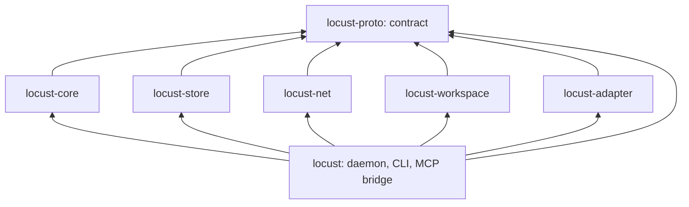

# Crates and workstreams

Date: 2026-10-03. **Current execution: T2 MCP, operating skill and snapshot/contribution workflow are implemented and locally verified at `8a7d170`. Managed sessions are the next implementation checkpoint; production-client qualification can run in parallel, and the owner handles physical-machine testing separately. See [T2 workflow](t2-workflow.md) and the remaining sequence in section 10 of the [implementation plan](implementation-plan.md).**

**T1 baseline:** runtime remediation is implemented in `d253a07`; its identified
protocol-1 artifact passes all 21 local three-process checks. The owner handles
further physical-machine testing separately; publication remains deferred. See
[the candidate record](t1-build.md) for exact identity and qualified boundaries.
The repository owner approved the crate split and shared checkout without
worktrees. One orchestrator owns lanes A and B; lane C remains independent.
This supersedes the earlier guidance in the
[implementation plan](implementation-plan.md) to keep every module inside one crate.

**Ownership update, October 3:** the owner has now assigned Lane A to Lane B's
orchestrating session, including responsibility for completing and integrating
the unfinished runtime. The crate boundaries below remain; one orchestrator now
coordinates both A and B. Lane C keeps its existing scope. Independent subagents
review completed slices before integration. The [takeover review](../research/lane-a-review-2026-10-03.md)
records the captured starting state: the committed foundation passes checks,
while the working Goal, sync and daemon are incomplete. The reviewed working
files were preserved in a scratch snapshot before editing.

The takeover used disjoint subagent scopes for Goal/local Node behavior, sync and
peer integration, and bounded storage/export/CLI work. The orchestrator owns
contract changes, integration, release preparation and full-workspace checks.
Each reassignment is explicit; agents do not commit another scope's work. T1's
three-process checks and T2's local implementation checks have passed. Complete
two-Mac task/recovery and sleep/wake qualification remains open, with any
third-daemon or third-Mac extension recorded separately. The owner handles live
testing while implementation advances; publication remains deferred.

## Why the workspace is split

Several agent sessions edit this checkout at once. In a single crate, one stream's half-written file breaks every other stream's build and tests. With one crate per stream, unfinished code breaks only its own crate and the binary that links it. The split also fixes the dependency direction, which the single crate could not enforce: every library crate depends on the contract crate and on no other workspace crate.

## Ownership

The lane labels retain functional ownership under the current shared orchestrator. **Lane A** owns the contract, the daemon's core path and every integration commit. **Lane B** owns everything that faces the coding clients, the network and the release. Each lane may run its streams as sub-agents; the lane's orchestrator is answerable for them.

| Crate or path | Lane | Responsibility | Tests alone against |
|---|---|---|---|
| [`crates/locust-proto`](../crates/locust-proto/src/lib.rs), root [`Cargo.toml`](../Cargo.toml), `Cargo.lock` | A | The contract: identifiers, signed events, invitations, sync frames, local API types, storage seam, limits, golden vectors; all dependency pins | Its own unit tests |
| [`crates/locust-core`](../crates/locust-core/src/lib.rs) | A | State machine with no I/O: validation, authority, tasks, claims, projections, what to send a peer | `MemStore` and the test kit |
| [`crates/locust-store`](../crates/locust-store/src/lib.rs) | A | SQLite implementation of the storage seam | The store conformance suite plus crash tests |
| [`crates/locust`](../crates/locust/src/main.rs) | A | Daemon process, socket server, CLI, `locust mcp`; wires the other crates | `MemStore`, then the real store |
| [`crates/locust-workspace`](../crates/locust-workspace/src/lib.rs) | A | Manifest export, materialization, patches; runs in the CLI, never in the daemon | Plain directories and Git object reads |
| [`crates/locust-net`](../crates/locust-net/src/lib.rs) | B | Endpoint, relay and address configuration, framed links, in-memory link; the two-machine transport probe | An in-memory link; then two machines |
| [`crates/locust-adapter`](../crates/locust-adapter/src/lib.rs) | B | Per-client configuration, launch, session binding, hooks, diagnostics | Scripted provider fixtures |
| Real-client qualification harness | B | Default-profile Codex, Claude Code, Factory Droid and Pi runs: tool reach, approvals, wait, interruption, resume, hook delivery | Existing fixture MCP records; next qualify the implemented production daemon and `locust mcp` |
| `scripts/`, skill and installer files | B | Installer, operating skill, client configuration, user-service units, install prompt | The development binary |
| `.github/`, release manifest and signing | B | macOS and Linux CI, release-build smoke test on a fresh database, artifacts | — |
| [`release-evidence.md`](release-evidence.md) | B | Keeps the gate ledger; lane A supplies records for its own gates | — |
| [`sites/locust.farm/`](../sites/locust.farm/README.md) | C | The website and its short `/start` guide with the entry prompt | The site's `npm` lint, check, test and build |
| [`first-contact.md`](first-contact.md), [`lane-c-log.md`](lane-c-log.md), [first-contact research](../research/first-contact-integrations.md) | C | First-contact experience contract, harness routing, Polaris handoff and requests to other owners | `python3 scripts/check_docs.py` |

Lane A makes each integration commit that wires crates together, including the one that connects `locust-net` to the daemon.

**Lane C** owns the first-contact experience: the website and the documents above. It implements no runtime, setup or client integration. It asks lanes A and B, and the separate Polaris work, for what it needs in its own [log](lane-c-log.md), and updates its copy when their records show new behavior.

### Continuing lane B

Read, in order: this document, the [version 1 contract](protocol-v1.md), sections 6 to 10 of the [implementation plan](implementation-plan.md), the [T2 implementation record](t2-workflow.md), the [hcom assessment](../research/hcom-dissection.md) and the client findings in the [independent review](../research/implementation-plan-independent-review.md). The work packages below retain their scope; existing transport, configuration, fixture-harness and skill implementations must be reused. Section 10 of the plan gives the current execution sequence.

1. **Transport probe.** Two machines on separate networks connect with Iroh 1.3 at the pinned version; the direct and the forced-relay path are both observed; an alternate relay works; the default relay and address-lookup operator and what each observes are written down. Deliver in `locust-net` a framed link that carries `locust_proto::sync::SyncMessage` frames using `locust_proto::codec`, exposes the authenticated remote `EndpointId` of each link, and has an in-memory twin for tests. Evaluate the blob layer separately at pinned versions, including unauthorized fetch and push and crash durability. The transport decides nothing about membership: the daemon feeds received frames to the state machine and writes back what it returns.
2. **Default-profile client qualification.** In isolated, default-configured profiles (never the owner's own, which are permissive), establish for Codex, Claude Code, Factory Droid and Pi: whether a registered stdio MCP server reaches a Unix socket under `$LOCUST_HOME`, which tool calls prompt, how a blocking wait behaves at each client's limits, what interruption and explicit resume look like, and which hooks deliver between tool calls. Run scripted-provider checks without real credentials where the selected client supports that path; real-account checks need the owner to sign in to those isolated profiles. Record client/version, effective permissions, provider/authentication mode and any missing capability separately in the [client matrix](release-evidence.md).
3. **Client lifecycle adapters**, following the adapter table in plan section 6. Codex, Claude Code, Factory Droid and Pi use active sessions and explicit resume. Automatic wake is scoped only to Merak for now, with its own qualification; unattended closed-session startup remains deferred.
4. **Installer, skill installation and client configuration**, using the implemented operating skill and current operation names. The skill source and configuration generation already exist; installing and qualifying them remains work.
5. **CI and release packaging.**

Subagents keep explicit path ownership. The shared A/B orchestrator handles contract and dependency changes and records them in the [lane A log](lane-a-log.md); the [lane B log](lane-b-log.md) retains network, client and release findings.

## Cross-review

Each orchestrator reviews the other's work. This is the scoped review the plan requires before a change counts as reviewed, and the release ledger's review reference points at these entries.

- **When.** Before an integration checkpoint that depends on the commits, and without waiting for one when a commit touches authorization, signing or verification, the wire format, export or materialization, the installer, or the transport's admission of peers.
- **How.** Read the diff, run that crate's checks, and try to break it. A reviewer does not edit the other lane's files.
- **Record.** The reviewer writes the commit range and numbered findings in its own log. The owning lane fixes each finding or declines it with a reason, and replies in its own log by finding number. Each log has exactly one writer, so the two sessions never edit the same file.

## Rules for one shared checkout

These are conventions; nothing enforces them except the checks named below.

1. **Stay inside your paths.** A stream edits only its crate or paths from the table. A change to `locust-proto`, the root `Cargo.toml` or `Cargo.lock`, including any new dependency, is requested from lane A.
2. **Commit by path.** Use `git commit -- <your paths>` so another session's staged files are never swept in. Do not amend, rebase or otherwise rewrite history.
3. **Build in your own directory.** Set `CARGO_TARGET_DIR` to a per-stream directory under `target/` so concurrent builds do not queue on Cargo's lock.
4. **Contract changes are versioned.** A change that alters a golden vector in [`vectors.rs`](../crates/locust-proto/src/vectors.rs) changes the wire format and needs a new protocol version once a release exists.
5. **Checks.** The current [AGENTS.md](../AGENTS.md) requires whole-workspace formatting, strict Clippy and tests before Rust commits. Focused package checks can be used during development. This supersedes the earlier package-only stream-commit allowance; report unrelated blockers explicitly rather than claiming the workspace passed.

## Integration order

**T2 implementation below is complete; managed sessions are the next implementation checkpoint.** Production-client qualification and owner-operated physical testing can proceed in parallel. The T1 physical-run instructions remain: test an identified integrated binary on the **two Macs currently available**, rather than wait for a third. Use the [two-Mac run guide](t1-run.md), fix its failures, and keep three-peer fault coverage separate. The existing three-process local record remains valid for its recorded topology. Publication remains deferred.

**Scaffolding** is done when these exist together: contract revision 2 complete (lane A); the core state machine and the SQLite store (lane A); the daemon shell with its socket and a CLI for the operations below (lane A); a transport that the daemon can bind and dial with contract types, with the hello-then-peer frame limit and delivery of a final frame (lane B; findings A-R1, A-R2 and A-R4 in the [lane A log](lane-a-log.md)).

### T1: the first binary on two Macs, then a third-peer extension

- **Binary.** The identified `aarch64-apple-darwin` candidate can serve both Apple Silicon Macs. Copy the executable bundle through AirDrop or a shared folder and verify the same version, source commit and SHA-256 on each. Each Mac creates its own state and credentials; never clone a participant's home. Publication is not required or authorized. Linux x86_64 remains a later release target.
- **Network.** Use daemon-default discovery and relays wherever the machines are. Record direct/relay routes as observations; a same-LAN run does not qualify separate-network operation.
- **Operations.** `daemon run`, `status`, `agent enroll`, `goal create`, `goal invite`, `goal join`, `goal status`, `note add`, `notes`, `task propose`, `task assign`, `task authorize`, `session create`, `task claim`, `task submit`, `event show`, `result accept`, `board`, `pending`. The initial task carries sealed text within one content chunk.
- **Two-Mac first pass.**
  1. M1 creates a goal and one invitation; M2 joins. Both list two members and the same title, and record peer routes.
  2. M1 proposes and assigns; M2 authorizes, claims and submits; M1 inspects and accepts. Both retain the accepted task and readable result.
  3. Stop M1. M2 writes a local note while disconnected. Restart M1 and verify catch-up. This establishes offline authoring and later replication, not exchange between two surviving peers.
  4. Restart each daemon independently with its existing home, then test laptop sleep/wake while the other Mac writes a note. Check stable identity, retained history and reconnection.
- **Third-peer extension.** To test a passive replica and two surviving peers exchanging while M1 is offline, add M3 with an independent home and identity. It can run as a separate daemon on either available Mac; label that evidence as three daemons on two Macs. A later third physical Mac is another topology check. Neither is silently claimed by a two-peer pass.
- **Evidence.** Record hash/version, OS/architecture, exact topology, commands, event identifiers, observed routes and failures in the [release ledger](release-evidence.md). Historical mixed-build two-Mac join, note and assignment-readiness evidence is recorded; complete task/recovery and sleep/wake qualification remains open. Existing three-process checks do not close these physical-machine checks.
- **Outside this first pass.** Real coding clients/MCP, workspace snapshot/patch flow, member-removal/key-rotation workflow, document-revision workflow, managed sessions, large-content qualification, installer and signed artifacts. Several underlying runtime features already have component tests; this list limits the test scope, not the implementation.

### T2: coding agents on the same machines

[The T2 MCP and workspace flow](t2-workflow.md) is implemented and locally verified at `8a7d170` (A-C5/B-C9). Remaining work is to qualify the production daemon, `locust mcp` and operating skill in actual default-profile clients, then on the two available Macs: a real task with a workspace snapshot and a patch, wait, interruption and explicit resume. Baseline clients are Codex, Claude Code, Factory Droid and Pi; start with a runnable pair. Pin source and artifact identity for each run; the earlier identified T1 artifact does not contain T2.

### After T2

Complete workflow and qualification work for member removal/key rotation, cancellation delivery, document revisions, content larger than one chunk and managed client sessions, then packaging and the one-prompt install against the release candidate. Reuse existing core implementations and tests; deferred qualification does not mean those components are absent. Publication still requires the owner to reopen it.

Deterministic tests do not wait for the machines: the core's shuffled-delivery and multi-node tests and the store's conformance and crash tests run as their crates land.
