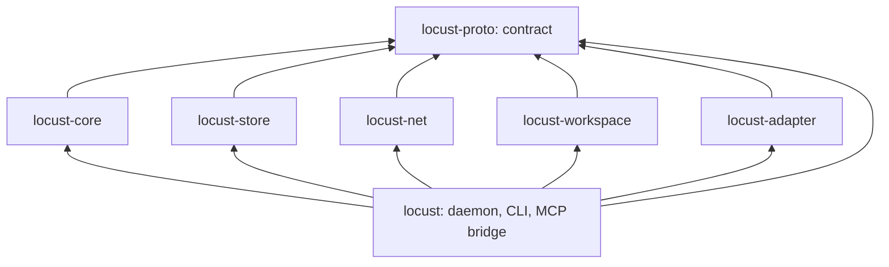

# Crates and workstreams

Date: 2026-10-03. **Status: accepted layout and working rules for the October 4 push; the crates other than `locust-proto` are stubs with no behavior yet.** The repository owner approved the crate split on 2026-10-03, chose to keep all streams in one checkout without worktrees, and divided the work between two orchestrating sessions that review each other. This supersedes the earlier guidance in the [implementation plan](implementation-plan.md) to keep every module inside one crate.

## Why the workspace is split

Several agent sessions edit this checkout at once. In a single crate, one stream's half-written file breaks every other stream's build and tests. With one crate per stream, unfinished code breaks only its own crate and the binary that links it. The split also fixes the dependency direction, which the single crate could not enforce: every library crate depends on the contract crate and on no other workspace crate.

## Ownership

Two orchestrating sessions run the streams. **Lane A** owns the contract, the daemon's core path and every integration commit. **Lane B** owns everything that faces the coding clients, the network and the release. Each lane may run its streams as sub-agents; the lane's orchestrator is answerable for them.

| Crate or path | Lane | Responsibility | Tests alone against |
|---|---|---|---|
| [`crates/locust-proto`](../crates/locust-proto/src/lib.rs), root [`Cargo.toml`](../Cargo.toml), `Cargo.lock` | A | The contract: identifiers, signed events, invitations, sync frames, local API types, storage seam, limits, golden vectors; all dependency pins | Its own unit tests |
| [`crates/locust-core`](../crates/locust-core/src/lib.rs) | A | State machine with no I/O: validation, authority, tasks, claims, projections, what to send a peer | `MemStore` and the test kit |
| [`crates/locust-store`](../crates/locust-store/src/lib.rs) | A | SQLite implementation of the storage seam | The store conformance suite plus crash tests |
| [`crates/locust`](../crates/locust/src/main.rs) | A | Daemon process, socket server, CLI, `locust mcp`; wires the other crates | `MemStore`, then the real store |
| [`crates/locust-workspace`](../crates/locust-workspace/src/lib.rs) | A | Manifest export, materialization, patches; runs in the CLI, never in the daemon | Plain directories and Git object reads |
| [`crates/locust-net`](../crates/locust-net/src/lib.rs) | B | Endpoint, relay and address configuration, framed links, in-memory link; the two-machine transport probe | An in-memory link; then two machines |
| [`crates/locust-adapter`](../crates/locust-adapter/src/lib.rs) | B | Per-client configuration, launch, session binding, hooks, diagnostics | Scripted provider fixtures |
| Real-client qualification harness | B | Default-profile Codex, Claude Code, Factory Droid and Pi runs: tool reach, approvals, wait, interruption, resume, hook delivery | A stand-in stdio MCP server until `locust mcp` exists |
| `scripts/`, skill and installer files | B | Installer, operating skill, client configuration, user-service units, install prompt | The development binary |
| `.github/`, release manifest and signing | B | macOS and Linux CI, release-build smoke test on a fresh database, artifacts | — |
| [`release-evidence.md`](release-evidence.md) | B | Keeps the gate ledger; lane A supplies records for its own gates | — |

Lane A makes each integration commit that wires crates together, including the one that connects `locust-net` to the daemon.

### Starting lane B

Read, in order: this document, the [version 0 contract](protocol-v0.md), plan sections 6 to 8 of the [implementation plan](implementation-plan.md), the [hcom assessment](../research/hcom-dissection.md) and the client findings in the [independent review](../research/implementation-plan-independent-review.md). Then:

1. **Transport probe.** Two machines on separate networks connect with Iroh 1.3 at the pinned version; the direct and the forced-relay path are both observed; an alternate relay works; the default relay and address-lookup operator and what each observes are written down. Deliver in `locust-net` a framed link that carries `locust_proto::sync::SyncMessage` frames using `locust_proto::codec`, exposes the authenticated remote `EndpointId` of each link, and has an in-memory twin for tests. Evaluate the blob layer separately at pinned versions, including unauthorized fetch and push and crash durability. The transport decides nothing about membership: the daemon feeds received frames to the state machine and writes back what it returns.
2. **Default-profile client qualification.** In isolated, default-configured profiles (never the owner's own, which are permissive), establish for Codex, Claude Code, Factory Droid and Pi: whether a registered stdio MCP server reaches a Unix socket under `$LOCUST_HOME`, which tool calls prompt, how a blocking wait behaves at each client's limits, what interruption and explicit resume look like, and which hooks deliver between tool calls. Run scripted-provider checks without real credentials where the selected client supports that path; real-account checks need the owner to sign in to those isolated profiles. Record client/version, effective permissions, provider/authentication mode and any missing capability separately in the [client matrix](release-evidence.md).
3. **Client lifecycle adapters**, following the adapter table in plan section 6. Codex, Claude Code, Factory Droid and Pi use active sessions and explicit resume. Automatic wake is scoped only to Merak for now, with its own qualification; unattended closed-session startup remains deferred.
4. **Installer, skill and client configuration**, against the operation names in the contract.
5. **CI and release packaging.**

Lane B never edits lane A's paths. A needed contract change or new dependency is written as a request in the [lane B log](lane-b-log.md); lane A answers in the [lane A log](lane-a-log.md) and makes the change.

## Cross-review

Each orchestrator reviews the other's work. This is the scoped review the plan requires before a change counts as reviewed, and the release ledger's review reference points at these entries.

- **When.** Before an integration checkpoint that depends on the commits, and without waiting for one when a commit touches authorization, signing or verification, the wire format, export or materialization, the installer, or the transport's admission of peers.
- **How.** Read the diff, run that crate's checks, and try to break it. A reviewer does not edit the other lane's files.
- **Record.** The reviewer writes the commit range and numbered findings in its own log. The owning lane fixes each finding or declines it with a reason, and replies in its own log by finding number. Each log has exactly one writer, so the two sessions never edit the same file.

## Rules for one shared checkout

These are conventions; nothing enforces them except the checks named below.

1. **Stay inside your paths.** A stream edits only its crate or paths from the table. A change to `locust-proto`, the root `Cargo.toml` or `Cargo.lock`, including any new dependency, is requested from lane A.
2. **Commit by path.** Use `git commit -- <your paths>` so another session's staged files are never swept in. Do not amend, rebase or otherwise rewrite history.
3. **Build in your own directory.** Set `CARGO_TARGET_DIR` to a per-stream directory under `target/` so concurrent builds do not queue on Cargo's lock.
4. **Contract changes are versioned.** A change that alters a golden vector in [`vectors.rs`](../crates/locust-proto/src/vectors.rs) changes the wire format and needs a new protocol version once a release exists.
5. **Checks.** Approved by the owner on 2026-10-03: a stream commit runs `cargo fmt`, `cargo clippy` and `cargo test` for its own package (`-p <crate>`), so a neighbour's unfinished crate does not block it. Lane A runs the same three checks across the whole workspace at each integration commit, as does any change to `locust-proto`, the root `Cargo.toml` or `Cargo.lock`. [AGENTS.md](../AGENTS.md) carries the commands.

## Integration order

1. Core, local API and bridge on `MemStore`: a scripted MCP client drives propose, assign, claim, submit and accept.
2. The same flow in default-profile Codex, Claude Code, Factory Droid and Pi sessions; first [release evidence](release-evidence.md) records. Start with a runnable pair, then cover all four before baseline qualification is complete.
3. `MemStore` replaced by the SQLite store.
4. Two daemons over the transport, with invitation and reconciliation.
5. Workspace snapshots and patches in the task flow.

Encryption and key distribution, revocation, cancellation delivery and blob retention start after step 1, because they need membership decisions from the core and a working link.
