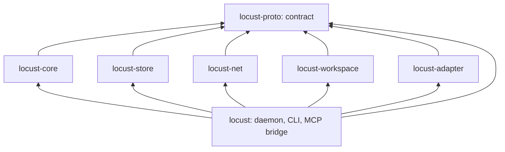

# Crates and workstreams

Date: 2026-10-03. **Status: accepted layout and working rules for the October 4 push; the crates other than `locust-proto` are stubs with no behavior yet.** The repository owner approved the crate split on 2026-10-03 and chose to keep all streams in one checkout, without worktrees. This supersedes the earlier guidance in the [implementation plan](implementation-plan.md) to keep every module inside one crate.

## Why the workspace is split

Several agent sessions edit this checkout at once. In a single crate, one stream's half-written file breaks every other stream's build and tests. With one crate per stream, unfinished code breaks only its own crate and the binary that links it. The split also fixes the dependency direction, which the single crate could not enforce: every library crate depends on the contract crate and on no other workspace crate.

## Ownership

| Crate or path | Stream | Responsibility | Tests alone against |
|---|---|---|---|
| [`crates/locust-proto`](../crates/locust-proto/src/lib.rs) | Integration owner | The contract: identifiers, signed events, invitations, sync frames, local API types, storage seam, limits, golden vectors | Its own unit tests |
| [`crates/locust-core`](../crates/locust-core/src/lib.rs) | Core | State machine with no I/O: validation, authority, tasks, claims, projections, what to send a peer | `MemStore` and the test kit |
| [`crates/locust-store`](../crates/locust-store/src/lib.rs) | Storage | SQLite implementation of the storage seam | The store conformance suite plus crash tests |
| [`crates/locust-net`](../crates/locust-net/src/lib.rs) | Transport | Endpoint, relay and address configuration, framed links, in-memory link | An in-memory link; then two machines |
| [`crates/locust-workspace`](../crates/locust-workspace/src/lib.rs) | Workspace | Manifest export, materialization, patches; runs in the CLI, never in the daemon | Plain directories and Git object reads |
| [`crates/locust-adapter`](../crates/locust-adapter/src/lib.rs) | Client lifecycle | Per-client configuration, launch, session binding, hooks, diagnostics | Scripted provider fixtures |
| [`crates/locust`](../crates/locust/src/main.rs) | Local API and bridge | Daemon process, socket server, CLI, `locust mcp`; wires the other crates | `MemStore`, then the real store |
| `scripts/`, `.github/`, skill and installer files | Installation and release | Installer, skill, client configuration, CI jobs, release build | The development binary |

The integration owner also owns the root [`Cargo.toml`](../Cargo.toml), `Cargo.lock` and each integration commit that wires streams together.

## Rules for one shared checkout

These are conventions; nothing enforces them except the checks named below.

1. **Stay inside your paths.** A stream edits only its crate or paths from the table. A change to `locust-proto`, the root `Cargo.toml` or `Cargo.lock` is requested from the integration owner, including any new dependency.
2. **Commit by path.** Use `git commit -- <your paths>` so another session's staged files are never swept in. Do not amend, rebase or otherwise rewrite history.
3. **Build in your own directory.** Set `CARGO_TARGET_DIR` to a per-stream directory under `target/` so concurrent builds do not queue on Cargo's lock.
4. **Contract changes are versioned.** A change that alters a golden vector in [`vectors.rs`](../crates/locust-proto/src/vectors.rs) changes the wire format and needs a new protocol version once a release exists.
5. **Checks.** [AGENTS.md](../AGENTS.md) requires the workspace-wide `cargo fmt`, `cargo clippy` and `cargo test` before every Rust commit, and that remains the rule. Proposed and not yet approved by the owner: stream commits run those checks for their own package (`-p <crate>`), and the integration owner runs them workspace-wide at each integration commit, because a neighbour's unfinished crate would otherwise block unrelated commits.

## Integration order

1. Core, local API and bridge on `MemStore`: a scripted MCP client drives propose, assign, claim, submit and accept.
2. The same flow in default-profile Codex and Claude Code sessions; first [release evidence](release-evidence.md) record.
3. `MemStore` replaced by the SQLite store.
4. Two daemons over the transport, with invitation and reconciliation.
5. Workspace snapshots and patches in the task flow.

Encryption and key distribution, revocation, cancellation delivery and blob retention start after step 1, because they need membership decisions from the core and a working link.
