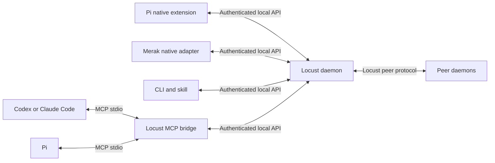

# Agent-agnostic daemon integration and local sandboxing

Date: 2026-10-03. **Status: researched recommendation, not an accepted design or implemented adapter.** The goal is to connect different coding agents to Locust while enforcing a locally chosen sandbox. Merak native integration and a Pi extension are candidate adapters, not requirements for participation.

## Finding

Transport need not make Locust agent-specific. Codex, Claude Code and current Pi documentation all describe local MCP servers over stdio. A proposed `locust mcp` process can translate those calls into the same authenticated daemon API used by the CLI. Clients do not need to implement Locust's peer transport or understand its Unix socket protocol.

The more consequential differences are **session lifecycle and execution control**: whether the adapter can deliver work to an idle session, observe cancellation, resume an attempt, and enforce a particular local filesystem/network policy. Test and describe these separately from successful connectivity.

The [implementation plan](../docs/implementation-plan.md) already provides the right base: one daemon state-transition implementation behind local IPC, a structured CLI and a portable skill. MCP and unattended runners are currently deferred in that plan. This document proposes an integration experiment and does not silently move either into the release requirements.

## Three separate interfaces

| Interface | Proposed responsibility | Who needs to understand it |
|---|---|---|
| Peer-to-peer protocol | Replicate authorized events and artifacts between participants | Locust daemons |
| Local daemon API | Authenticate client scope; read/claim/submit tasks; retrieve context/artifacts; resume an event cursor | CLI and client bridges |
| Client integration | Translate named tools, lifecycle events and local execution policy into daemon operations | A thin MCP bridge, native host adapter or extension |

The diagram shows alternatives for Pi; it does not require both paths or prescribe an additional daemon. Each stdio connection may have its own small bridge process, all connected to the existing daemon with separately scoped client authority. Closing an agent session closes its bridge, not the daemon's durable identity or history.

Start with stdio for the generic local adapter. This avoids making an HTTP listener a prerequisite and works with the plan's Unix-socket daemon API. Streamable HTTP remains an option when a concrete client/deployment needs it. Authorization belongs in the daemon regardless of bridge or transport; an agent bridge receives agent authority, never the owner/admin credential. Hosted/cloud clients are a separate connectivity environment and are not qualified merely because their local counterparts support stdio.

## Available integration paths

These are capabilities documented by the upstream projects on the research date, not successful Locust integration tests or confirmation of versions installed on a participant's machine.

| Client | Documented path | Recommended use |
|---|---|---|
| Codex local clients | [MCP documentation](https://learn.chatgpt.com/docs/extend/mcp?surface=cli) lists stdio and Streamable HTTP. [App Server](https://learn.chatgpt.com/docs/app-server) provides session integration and experimental client-handled dynamic tools. | Use the common stdio bridge first. Evaluate App Server only if Locust needs a separately supervised runner or deeper lifecycle control. |
| Claude Code | [MCP documentation](https://code.claude.com/docs/en/mcp) describes local stdio and HTTP servers. | Use the same bridge. Treat hooks or a supervised runner as additional capabilities, not requirements for daemon access. |
| Pi | [MCP documentation](https://github.com/earendil-works/pi/blob/main/packages/coding-agent/docs/mcp.md) describes stdio and Streamable HTTP; [extensions](https://github.com/earendil-works/pi/blob/main/packages/coding-agent/docs/extensions.md) support custom tools, lifecycle handlers and tool interception/overrides. | Use MCP for basic participation; prototype an extension for session-aware work delivery and routing execution through the local sandbox. |
| Merak | [Local source assessment](merak-native-local-sandbox.md) identifies native permission, subprocess and child-authority seams. | Build a native adapter for run admission and sandbox enforcement, retaining the same daemon API and task contract. |

Pi's former `badlogic/pi-mono` repository redirects to `earendil-works/pi`. The linked Pi documentation tracks its current main branch; qualify a specific released build before publishing support. An extension can own a local connection and react to session events, but the Unix-socket framing, credentials and reconnection logic would still be ours to implement.

## Keep collaboration and execution authority separate

An MCP tool such as reading a task or submitting a patch gives an agent access to Locust. It does not interpose on every built-in shell, file, browser or extension operation that client can perform. Therefore adding Locust tools alone cannot satisfy a whole-worker sandbox policy.

Use the same outcome-based sandbox contract with two possible implementations:

1. **Integrated execution:** a Merak adapter or trusted Pi extension routes every enabled execution path through the approved local runner and confines host-side file/network tools too. Tool interception is useful policy plumbing; the arbitrary commands still require an OS enforcement boundary. Extensions themselves are trusted code, not confined merely because model tool calls are intercepted.
2. **Supervised client:** run an external coding client inside a participant-selected sandbox/container/VM with explicit filesystem, credential and network grants. Give it only the required daemon/model connectivity. This can enforce local isolation without owning the client's agent loop. It must be tested with the actual client, authentication flow and all child processes.

Require the same declared outcomes: permitted read/write roots, command execution, network access, credential exposure, descendant policy and artifact export. A host should refuse a run when its chosen implementation cannot enforce the requested policy. Do not translate a missing control into a broader implicit grant.

Two upstream details reinforce this distinction. Claude's [sandbox documentation](https://code.claude.com/docs/en/sandboxing#what-runs-outside-the-sandbox) says its Bash sandbox does not cover built-in file/web tools, MCP servers or hooks. Its [HTTP hook behavior](https://code.claude.com/docs/en/hooks#http-response-handling) treats connection and HTTP errors as non-blocking; a policy bridge cannot assume a disconnected hook denies execution. These do not prevent integration; they identify boundaries the adapter must handle and verify.

The stricter Merak profile proposed in the [local sandbox assessment](merak-native-local-sandbox.md) is one concrete experiment. Its choice to keep provider transport in the trusted host is specific to that architecture. A supervised external client may need a different credential arrangement; shared daemon semantics do not require identical process layouts.

Pi also has an official [sandbox extension example](https://github.com/earendil-works/pi/blob/main/packages/coding-agent/examples/extensions/sandbox/index.ts), making it a concrete starting reference. The example can fall back to ordinary Bash when sandbox initialization fails; a mandatory Locust worker policy must instead refuse execution. Wrapping Bash also leaves the coverage of other enabled tools to be established.

## Minimal adapter contract and experiment

Keep the first adapter contract small and versioned:

- A scoped connection to the existing daemon and the same typed task/context/artifact operations as the CLI.
- A durable event cursor with explicit acknowledgment/recovery. A delivered notification is a wakeup hint, not the durable record itself.
- A persisted mapping from Locust assignment/attempt to the client's run/session when the adapter manages execution.
- Explicit capability declarations for active-session delivery, manual resume, cancellation reporting, restart recovery and the locally enforceable sandbox policy, including unsupported or manual-only modes. Do not infer these capabilities from the client name or successful MCP initialization.

A local MCP connection does not automatically start a new model turn or wake a closed session. Use the supported client notification/lifecycle path or the plan's wait/resume workflow, and record what actually works. Start with explicit resume if automatic delivery is unqualified; do not make polling or a long-lived tool call an undocumented readiness guarantee.

The proposed first experiment has two independent checks:

1. **Portability:** one real Locust task flow through the stdio bridge in a supported Codex or Claude Code version, plus the same flow in Pi. Verify task/context reads, exact attempt binding, result submission, bridge restart and durable cursor recovery. The CLI remains the fallback/reference client.
2. **Enforcement:** one strict local worker profile through Pi's extension or Merak's native adapter. Demonstrate a useful edit/test/patch task and actual denied outside-root reads/writes, credential access, unapproved network and privilege widening. Reuse the canary-based [sandbox acceptance cases](merak-native-local-sandbox.md). Merak and Pi can later qualify against the same cases without identical internals.

This tests the two claims separately: Locust is portable across agents, and a particular adapter/runner enforces a particular sandbox. Prefer this to building a Merak-specific daemon and attempting to generalize it later.

## Verification boundary

Official client documentation and local Merak/Locust source were reviewed. No client was installed or reconfigured, no daemon transport was exercised, and no sandbox/runtime tests were run. The proposed `locust mcp` command and adapters do not exist yet. Keep the protocol agent-neutral, use a thin stdio bridge for broad compatibility, and use native/extension integration where lifecycle and local policy control justify it.
