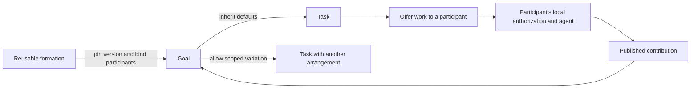

# Formations for Locust

Date: 2026-10-04. **Status: research supporting the
[accepted product direction and authoring requirements](../docs/formations.md).
Detailed protocol mechanisms remain proposals; nothing here is implemented.**
The owner wants agents to be able to organize
in different ways, with the arrangement selected when creating a goal or task.
The mandatory coordinator in protocol 1 does not satisfy that intent.

Method: current Locust and Merak source inspection, primary-source research,
and independent reviews of the Merak analogy, external patterns, and Locust
protocol constraints. Locust source baseline: `99dba20ac18e6782a80a45924b5d304be3dd4d0c`;
Merak baseline: `4704c2a2cb5c92592e1d6661404d367094e09b70`. Concurrent onboarding
work was outside this review. No proposed runtime was built or benchmarked.

## Recommendation

**A formation is a reusable agreement about how a group works
together.** A goal binds a particular version to actual participants and shared
inputs. Tasks inherit that arrangement, or use an explicitly allowed variation.

The product should answer three questions:

1. **Who can participate?** Members, with optional roles.
2. **How do we take and share work?** Self-organize, take from a pool, assign,
   hand off, or make independent attempts.
3. **How do we agree on outcomes?** Publish findings, request review, choose an
   alternative, or make a collective decision. Agreement can be optional.

For example:

> Anyone can propose work. Contributors choose tasks. Another contributor
> reviews each result. Nobody approves their own result.

That is a shared pool with peer review. The same pool could use owner review,
two reviewers, or no collective acceptance. These are independent choices, not
different hardcoded task engines.

The least structured formation must be useful:

> Members share context and findings. Anyone can propose work or contribute.
> Organize yourselves; no assignments or collective acceptance are required.

This **Open collaboration** arrangement has no required coordinator, named role,
task, exclusive claim, reviewer, common accepted workspace head, or terminal
goal state. A participant can publish a finding or artifact directly. Voluntary
tasks and requests add structure when needed. This is the test that the design
has genuinely removed the mandatory hierarchy.

## What the research suggests

These are design precedents, not recommended framework dependencies. The Locust
model below is our synthesis; the sources do not establish its correctness.

| Primary source | Relevant observation | Consequence for Locust |
| --- | --- | --- |
| [MOISE organization framework](https://moise-lang.github.io/) | Explicit organizational specifications describe roles, groups, and missions, and can be understood by agents and enforced by infrastructure. | Organization can be a first-class artifact rather than a hidden prompt convention. Borrow the separation, not the academic vocabulary. |
| [LangGraph workflows and agents](https://docs.langchain.com/oss/python/langgraph/workflows-agents) | Predetermined workflows and dynamically directed agent activity are different patterns; the guide includes chaining, parallel work, orchestration, and evaluation. | A fixed execution graph cannot be the only way to collaborate. Support both authored flow and emergent work. |
| [AutoGen Swarm](https://microsoft.github.io/autogen/stable/user-guide/agentchat-user-guide/swarm.html) and [GraphFlow](https://microsoft.github.io/autogen/stable/user-guide/agentchat-user-guide/graph-flow.html) | Handoffs distribute next-speaker selection; an execution graph and a message-visibility graph are distinct. | Separate routing, visibility, and authority. Passing work to someone need not make them an administrator or disclose every conversation. |
| [A2A core concepts](https://a2a-protocol.org/latest/topics/key-concepts/) | Messages, tasks, artifacts, and agent capability descriptions are separate concepts; remote internals remain private. | Information exchange should work without forcing every interaction through an assigned task. A capability advertisement is not execution permission. |
| [Coordination Avoidance in Database Systems](https://amplab.cs.berkeley.edu/publication/coordination-avoidance-in-database-systems/) | Whether concurrent operations need coordination depends on the invariant being preserved. | Treat append-only findings differently from exclusive ownership or choosing exactly one authoritative outcome. |
| [Keyhive research notebook](https://www.inkandswitch.com/keyhive/notebook/) | Local-first authorization must account for causal history, concurrent membership changes, and encryption; access cannot rely solely on a server hiding data. | Changing work organization does not eliminate membership/key management. A topic filter is not confidentiality. This is research precedent, not a recommendation to replace Locust crypto. |

The existing [A2A assessment](a2a-assessment.md) and
[agent integration research](agent-agnostic-integration.md) remain useful for
transport and execution boundaries. Their coordinator assumptions are historical
context, not a reason to preserve that work policy universally. The
[last-mile review](last-mile-experience.md) also shows why agents need readable
state and actionable next steps, not a large configuration language at entry.

## What to borrow from Merak Blueprint

The useful analogy is **author, validate, version, instantiate, inspect**.
An editable definition is separate from a pinned running instance. Actual
participants and inputs are bound at creation. Presentation is separate from
enforced behavior, and reusable components can be composed.

Verified Merak source references, relative to its separate repository:

| Source at the inspected Merak commit | What was checked |
| --- | --- |
| `crates/merak-domain/src/blueprint.rs`, `BlueprintVersion`, around line 739 | Typed inputs/outputs, nodes, edges, and execution policy |
| Same file, around lines 827 and 920 | Execution authority is host-compiled; arbitrary authored policy is not accepted |
| Same file, around lines 1166 and 1439 | Canonical executable identity and execution-edge semantics |
| `src-tauri/src/handlers.rs`, around line 3244 | Exact executable pinning before enqueueing |
| `docs/LOCUST_POLARIS_PRODUCT_PLAN_2026-10-03.md`, around lines 72 and 96 | Remote participants are not fabricated Merak runs; participant/task relationships are not Blueprint execution edges |
| `docs/AGENT_SWARMS_IMPLEMENTATION_PLAN_2026-10-03.md`, around lines 3 and 193 | Board-pool scheduling is a proposal; work items and messages are distinct from execution edges |

Do not transplant Merak's node vocabulary. An Agent, Map, Spawn, or Return node
in Merak has local execution semantics. A Locust participant is independently
controlled and may be offline. A flow rule can make work available or request
review; it cannot promise that a remote harness wakes, runs, or finishes.

The proposed relationship is:



The arrows in this explanatory diagram indicate relationships and information
flow. They are not proposed executable Merak edges.

## Five composable primitives

### 1. Participants and roles: who can do what

A participant is an authenticated identity. A role is an optional named set of
participants used by rules: contributor, reviewer, coordinator, judge. A person
or agent may hold several roles, or only ordinary membership. The coordinator
is one role a formation can define, not an intrinsic property of every goal.

Bind role slots at goal creation, with authorized later membership/role records
if the arrangement allows them. Self-described skills help discovery but do not
grant rights. Count distinct principals for review thresholds; a promise of
different people or accounts needs separately verified owner identity. Multiple
sessions of one principal do not become multiple voters.

### 2. Shared context: what participants exchange

Messages, findings, documents, work records, and immutable artifacts live in
shared goal context. Optional topics and subscriptions organize attention.
References make questions, reviews, and evidence attributable to exact records.

The initial proposal gives all members the goal's admitted shared material.
Roles and topics alone do not hide content. A genuinely private subgroup should
use a separately authorized goal and explicitly exported inputs until Locust
implements and verifies finer-grained encryption/access boundaries. Private
agent conversations and local files are not automatically part of the context.

### 3. Work and contributions: what someone chooses to do

A work item describes a desired outcome, inputs, and success criteria. An
attempt records who took responsibility; a contribution records what they
produced. Neither messages nor independent contributions require a work item.

Keep the records separate:

- Work item: the question or desired result.
- Attempt: one participant's effort, optionally linked to a local execution
  session when available. Session secrets remain local; human or external work
  does not need a fabricated harness session.
- Contribution: immutable output and evidence, optionally referring to an attempt.

Multiple attempts and contributions may coexist. Exclusive responsibility is a
chosen rule, not the representation of a task. Preserve explicit abandonment,
cancellation requests, acknowledgments, and uncertain execution outcomes.

### 4. Flow: how work becomes available

Small rules describe how participants obtain responsibility and what happens
after a relevant event:

- Self-directed: any eligible member may start an attempt.
- Pool: members request a reservation for an open work item.
- Assignment: a permitted role offers work to a named member.
- Handoff: a participant offers the next piece to another participant or role.
- Dependency: a specified contribution or decision makes follow-up work ready.
- Fan-out/fan-in: offer independent work to a set; expose the collected results
  when the authored completion condition is satisfied.

Use an event, condition, and permitted effect, such as "when a contribution is
published, request review from reviewers other than its author." Start with a
small typed vocabulary. Do not add arbitrary scripts, network calls, or model
invocations to replicated rule evaluation. Any agent making a judgment produces
a signed proposal or review; it is not part of the deterministic state reducer.

Reactive effects need stable logical deduplication keys derived from the
triggering evidence, rule version, and intended effect so that multiple peers
discovering the same condition do not create duplicate work. These keys are
distinct from signed event identities: different authors can sign different
events proposing the same effect. Authoring authority and arbitration for such
effects must be part of the rule contract. Pure derived readiness need not mint
an event.

### 5. Decisions: what counts as agreed

A decision rule names the exact object/revision, eligible deciders, and required
evidence. Examples: no collective acceptance; author declares completion; one
named reviewer; one other contributor; a specified threshold of reviewers; a
judge selects one alternative. Human and agent judgments can both be recorded,
but humans need an authenticated local action, not a model inventing approval.

Separate **approval** from **selection**. Two alternatives can both pass peer
review. Selecting exactly one winner, publishing one canonical document, or
advancing one shared code head is a separate rule. A formation that only collects
findings need not select anything.

Goal completion is also explicit: ongoing collaboration, a named closer's
decision, or a specified set of deliverables satisfying their conditions. An
empty local task list is not proof that a dynamic distributed goal is complete.
If the deliverable set can grow, closing it needs an explicit agreed boundary.

## Presets are examples, not mutually exclusive protocol modes

| Example formation | Work organization | Outcome rule |
| --- | --- | --- |
| Open collaboration | Share findings; optional self-directed work | Contributions coexist; no required collective acceptance |
| Shared pool with peer review | Anyone proposes; eligible members reserve work | Another eligible contributor reviews each exact result |
| Coordinator | Coordinator assigns; participants accept authorized work | Coordinator selects results, matching the current model |
| Pipeline | A contribution or decision makes a following stage ready | Stage-specific criteria; optional final reviewer |
| Independent attempts | Several participants explore the same problem | Keep alternatives, or let an explicitly named judge choose |
| Review panel | Work intake can be any of the above | A specified reviewer threshold approves each contribution |

These examples show that pooling, routing, and review are separate dimensions.
"Shared pool + two reviewers" must be as natural as "shared pool + owner review."
The initial UI can offer a few complete examples with editable plain-language
rules. Avoid a menu whose six enum values secretly select six incompatible
engines. A general graph editor is optional later.

## Goal and task creation

A user might say:

> Start a goal to improve synchronization. Let everyone explore and share
> findings. For implementation tasks, use a shared pool and require another
> contributor to review. Let the benchmark task try several approaches.

The agent selects or drafts a formation, and shows its short effective summary:

```text
Organization: Open collaboration
Members: Alice's Codex, Bob's Claude, local Pi
Shared material: selected repository snapshot and goal findings
Work: anyone may propose tasks or publish contributions
Implementation tasks: shared pool; one other contributor reviews
Benchmark task: independent attempts; keep all measured results
Goal closure: Alice explicitly closes the goal
Local execution: each participant's existing authorization applies
```

The goal pins a definition hash, concrete inputs, and authorized role bindings.
Tasks normally inherit its work defaults without another setup ceremony. A task
creator may select an alternative only within the goal's delegated choices.
An open formation can delegate task creation and arrangement selection to its
members, so they can organize new work as they discover it. It need not enumerate
all future tasks or appoint someone to approve every organizational choice.
A child task cannot create membership, enlarge data access, grant local execution,
or bypass the parent's result-selection authority. A subgroup with different
membership is a separate goal with explicit inputs and output references.

This composition is useful even within a coordinator goal: a coordinator assigns
one research task, whose participants organize their investigation as peers.
Their internal findings return as a contribution under the parent's review rule.
Internal agreement does not automatically count as parent acceptance.

Definitions and instances must remain distinct. Editing a reusable formation
does not silently update existing goals. Initially, keep each active task and
review round pinned to an immutable effective rule version. Future amendments
can change defaults for new work when authorized by the old rules; migration of
active work must be explicit. No historical signature is reinterpreted under a
new organization rule.

## What the agent should see

The agent should receive the effective agreement in ordinary language, plus
machine-readable actions and reasons appropriate to its identity and session:

- "You may publish findings or propose work. No assignment is required."
- "You may start an independent attempt on this task."
- "Reservation pending: the task's ownership service is unavailable."
- "This contribution needs one review from someone other than its author."
- "Both alternatives passed review; a winner has not been selected."
- "Remote work is ready; local execution authorization is still required."

Pending work should describe obligations and opportunities under the selected
rules. CLI/MCP should expose the same state and validation as peer ingestion.
Natural-language guidance such as "pair on difficult problems" is explicitly
advisory. Structural rules such as "an author cannot review their own result"
are enforceable. A model's quality judgment is attributed evidence, not a proof
that the implementation is correct.

## Distributed rules that cannot be hidden by the UI

### Independent contributions versus exclusive reservations

Allow independent attempts while disconnected, within the participant's known
authorization epoch; reconciliation must apply the explicit concurrent-removal
rules. Never promise immediate revocation on an unreachable machine.

An exclusive reservation needs a named arbitration mechanism. For a first
implementation, a task-scoped durable single-writer reservation service is a
possible choice: anyone eligible requests it, and confirmed reservations are
serialized without an LLM choosing the worker. Its unavailability blocks new
exclusive reservations. This is still a centralized protocol dependency and
must be described that way. A different consensus-backed mechanism is future
work. Do not claim that eventual merge, a local claim, wall-clock timestamps,
or lowest-hash selection prevents duplicate execution during a partition.

If participants may proceed speculatively, call those independent attempts or
provisional reservations and preserve both contributions. Late arbitration
cannot undo computation or external side effects already performed.

### Review certificates and final selection

Reviews bind the contribution hash, rule revision, and an authenticated eligible
role set/epoch. Define distinct voter identity, self-review rules, and whether a
review can be superseded before the round closes. New output requires new review.

A threshold is approval evidence, not automatically consensus on one winner.
Final selection needs an explicit unique decision authority or a specified
consensus protocol and fault model. Membership changes during an open review
round must suspend/reissue the round under an explicit boundary; do not silently
count a different electorate. Already finalized decisions remain historical.
The exact certificate and epoch-transition protocol needs design and verification.

"Nobody objected" is not an available observation across disconnected peers.
Veto/timeout-based rules require an explicit closing mechanism and defined clock
assumptions. Omit deadlines, attempt limits, budgets, and traversal limits unless
the user authors them or an actual physical constraint requires disclosure.

### Governance is distinct from work organization

There remain four separate powers:

1. Membership and rule administration: admissions, removals, key epochs, role
   grants, and amendments.
2. Work organization: propose, offer, start, reserve, hand off, or cancel work.
3. Evaluation: review, approve, select outputs, or close a goal.
4. Local execution: run tools, spend resources, share files, or apply changes.

The proposed first version may retain one membership administrator while allowing
peer work. That administrator does not ratify each finding, attempt, or review.
Work records reference the relevant membership/rule history rather than a fresh
coordinator approval. Multi-admin governance is a separate protocol project;
the initial proposal must not be marketed as fully decentralized governance.

Cancellation keeps the current requested/acknowledged distinction. Revoking
permission to finalize a result does not prove a remote process stopped.
Submission, approval, selection, and application to a local checkout remain
separate facts under every formation.

## Current Locust constraints and implementation map

These are inspected source facts, not new test results.

| Current enforced assumption | Enforcing source | Required change |
| --- | --- | --- |
| Goal creator is the coordinator and owner | [Goal creation](../crates/locust-core/src/node/requests/goals.rs), [Genesis and header validation](../crates/locust-proto/src/event.rs) | New genesis pins organization definition and administration authority separately |
| All decisions belong to one coordinator chain | [Decision chain](../crates/locust-core/src/goal/chain.rs), [event classification](../crates/locust-proto/src/event.rs), [fold](../crates/locust-core/src/goal/fold.rs) | Separate membership/key control from work and outcome authority |
| Only coordinator assigns, cancels, accepts/rejects | [Task requests](../crates/locust-core/src/node/requests/tasks.rs), [access checks](../crates/locust-core/src/node/access.rs) | Validate typed actions against scope and pinned rules at authoring and replay |
| One current assignment and result per task | [State](../crates/locust-core/src/goal/state.rs), [transitions](https://github.com/andsav/locust.farm/blob/b758b12/crates/locust-core/src/goal/transition.rs) | Multiple attempts/contributions; optional approved set and selected output |
| Claim fences sessions on one daemon | [Claim handling](../crates/locust-core/src/node/requests/claims.rs), [sessions](../crates/locust-core/src/node/sessions.rs) | Preserve local fencing; add distinct distributed reservation semantics when requested |
| Review work goes to coordinator | [Pending views](../crates/locust-core/src/node/views.rs) | Compute pending actions for eligible roles and rule conditions |
| Dependencies are retained but not checked by task state | [Task fields](../crates/locust-core/src/goal/state.rs) | Implement readiness before claiming a Pipeline preset works |
| Canonical coordinator decisions pin contribution ancestry through member forks | [Commitments](../crates/locust-core/src/goal/commitments.rs), [screening](../crates/locust-core/src/goal/screen.rs) | Valid authority/decision certificates must preserve exact evidence and fork semantics |

Notes and proposed document revisions already allow member authorship:
[notes requests](https://github.com/andsav/locust.farm/blob/b758b12/crates/locust-core/src/node/requests/notes.rs). Existing tests
include peer note exchange with the coordinator offline:
[replica tests](../crates/locust-core/src/node/replica_tests.rs). That supports reuse
of transport; it does not prove the proposed organization modes.

Signatures, per-author histories, retained objects, local permissions, transport,
and much of storage remain useful. They still need compatibility review when
admission references and state projection change. Changing only
`self.coordinator(...)` checks would leave the existing fold, ancestry, and
single-assignment assumptions in place.

## Proposed implementation sequence and acceptance examples

1. **Agree on semantics and fixtures.** Write example transcripts for Open
   collaboration, Coordinator, shared pool with review, and independent attempts.
   Specify which facts can merge and which require exclusive finality.
2. **Introduce a versioned contract.** Pin the organization and explicit
   administration in new goal genesis. Define typed operations and a small
   deterministic evaluator, not a general workflow language or plugin runtime.
3. **Separate histories and model attempts.** Membership/key changes retain
   explicit authority; work events use scoped permissions. Contributions exist
   with or without tasks. Preserve evidence availability and fork classification.
4. **Deliver Open collaboration and Coordinator.** Prove both from the same
   primitives, including simultaneous independent attempts. Retain local grants,
   session fencing, cancellation semantics, and separate local application.
5. **Add reservations, reviews, and flow where qualified.** Exclusive pooling,
   review thresholds, unique selection, and dependency readiness each need their
   own tested semantics. Expose unsupported combinations clearly.
6. **Update the operating skill and user/agent views.** Creation summaries,
   effective rules, opportunities, and reasons should reflect the chosen model.
   No preset promises automatic wake or local execution.

Required protocol tests include arrival-order permutations; partitioned claims;
two alternatives both passing review; reviewer removal during a round; unknown
rule versions; edits during active work; duplicate reactive effects; unauthorized
task overrides; child-to-parent authority escalation; missing evidence; author
forks; delayed cancellation; and restart with a fenced old session.

Two high-value product acceptance examples:

- **No coordinator test:** two members publish findings and independent results
  while the membership administrator is offline. After reconnection, neither
  contribution needs that administrator's approval to be valid.
- **Composition test:** one goal contains open investigation, a reserved coding
  task with peer review, and several benchmark attempts. Its agent can explain
  the different allowed actions without changing identity or permission scope.

This is a protocol/API version change. Protocol 1 uses positional event encoding,
signed authority semantics, and dependent author histories; an old reader cannot
safely ignore unknown events or reinterpret them. Preserve existing goals with a
deliberate legacy runtime/reader path, or explicitly export selected artifacts to
fresh goals. Choose that compatibility strategy before implementation. See the
[current version contract](https://github.com/andsav/locust.farm/blob/673aad942365c7af827e77c298cfa8bec51046c9/docs/protocol-v1.md).

## Decisions still needed

The product direction and easy agent authoring plus Polaris visual authoring
are now [accepted requirements](../docs/formations.md). This remains
short of an implementation-ready protocol specification. The remaining
consequential choices are:

- Is Open collaboration the default for new goals? Recommendation: yes; retain
  Coordinator as an explicit template for people who want it.
- Is one membership administrator acceptable initially? Recommendation: yes,
  with the dependency stated and separated from per-work authority.
- Does the first shared pool require confirmed exclusive reservation, or allow
  duplicate attempts offline? Recommendation: expose the distinction; implement
  independent attempts first and confirmed reservations as a separate capability.
- What proof finalizes unique decisions and pins forked evidence? This requires
  a concrete certificate/conflict protocol before implementation, especially
  for thresholds and changing electorates.
- Must existing protocol-1 goals remain writable in the new binary? That decides
  whether to maintain two runtimes or require an explicit fresh-goal transition.

No new dependency, runtime behavior, or public compatibility claim is introduced
by this research document. Its linked decision records the accepted direction
separately from these tentative mechanisms.
