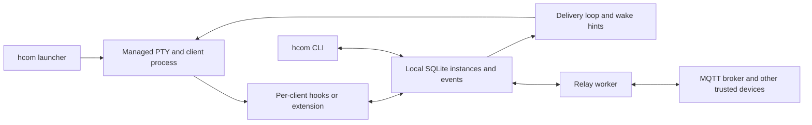

# hcom dissection and reuse assessment

Date: 2026-10-03. **Status: source-backed research and local characterization, with adoption recommendations. No hcom code, dependency or runtime integration has been added to Locust.**

Reviewed [aannoo/hcom](https://github.com/aannoo/hcom) at commit [`132250bca22d7f25ac6e1fe3ac04710a6bfd5283`](https://github.com/aannoo/hcom/commit/132250bca22d7f25ac6e1fe3ac04710a6bfd5283), package version **0.7.27**. All source links below pin that revision. Compare the [Locust implementation plan](../docs/implementation-plan.md), [agent-agnostic integration](agent-agnostic-integration.md) and [second independent review](implementation-plan-independent-review.md).

## Recommendation

hcom is valuable prior art for the difficult last mile between a local collaboration service and a running coding client: configuration, session/actor binding, mid-turn delivery, terminal wake, resume and diagnostics. Its relay and database do not implement Locust's independent-participant authority, accepted task/artifact state or durable signed history.

The largest useful reuse is **the pinned hcom binary as an optional local client runtime**, behind a narrow Locust adapter. Keep its launch, hooks/plugins, PTY delivery, session binding, readiness and resume machinery together, including the local state they require. That state is non-authoritative session/notification transport: Locust still owns task claims, permissions and accepted results. Start with that integration experiment rather than rebuilding the same client compatibility layer or extracting a large new library. A small maintained patch for bootstrap/policy behavior may be preferable to a full extraction.

There are also smaller transplant candidates: transcript normalization, per-run argument/configuration helpers and test infrastructure. The localhost mock HTTP fixture can be copied as a whole file; provider codecs need extraction. These are useful supporting assets, not the main reason to study hcom. Replication findings below establish the boundary and do not drive the client integration recommendation.

## What it actually builds



This is a local agent-messaging application, not a library façade over a single authenticated daemon API. CLI commands and hooks open shared SQLite state. PTY and plugin paths supply delivery; a separate relay worker synchronizes device state and handles controls. The [binary module tree](https://github.com/aannoo/hcom/blob/132250bca22d7f25ac6e1fe3ac04710a6bfd5283/src/main.rs#L7-L46), [database opening](https://github.com/aannoo/hcom/blob/132250bca22d7f25ac6e1fe3ac04710a6bfd5283/src/db/mod.rs#L193-L219) and [per-run integration contract](https://github.com/aannoo/hcom/blob/132250bca22d7f25ac6e1fe3ac04710a6bfd5283/src/hooks/runtime.rs#L31-L125) expose those boundaries.

| hcom concept | Useful Locust parallel | Important difference |
|---|---|---|
| Instance name, process binding, client session, Claude actor | Separate participant, client session and worker attempt identity | hcom's local name/binding is not a signed participant identity or Locust claim proof |
| SQLite message/events and receive cursors | Durable notification state and replayable observations | Receiving text does not create an assignment, claim or accepted result |
| `request`, `inform`, `ack`, reply/thread references | Attributed discussion attached to tasks | Message intent and a read receipt do not enforce a task state machine |
| Hooks, PTY delivery, native Pi extension | Multiple adapters over a common collaboration contract | hcom adapters directly depend on its schema, CLI and launcher |
| Status, subscriptions, idle/file collision notifications | Useful operational diagnostics | Client idle or file collision is an observation, not authority to reassign or merge |
| MQTT relay and event backfill | Reconnect diagnostics and missing-range detection | One shared-key trust domain, remote controls and source-dependent backfill differ from Locust's protocol |

The typed message envelope is visible in [messages.rs](https://github.com/aannoo/hcom/blob/132250bca22d7f25ac6e1fe3ac04710a6bfd5283/src/messages.rs#L41-L104). The distinction between process and session is substantial implementation work in [instance_binding.rs](https://github.com/aannoo/hcom/blob/132250bca22d7f25ac6e1fe3ac04710a6bfd5283/src/instance_binding.rs#L473-L501). Reuse the lessons without substituting those identities for daemon authentication.

## What can be adopted wholesale

| Candidate | Reuse decision | Work and constraints |
|---|---|---|
| Entire hcom binary | **Recommended first local integration experiment** | Retains the working client compatibility stack. Use dedicated state/client profiles, explicit launch policy and a narrow Locust bridge. Preserve its local DB as session/notification state; Locust remains authoritative. |
| [`transcript/shared.rs`](https://github.com/aannoo/hcom/blob/132250bca22d7f25ac6e1fe3ac04710a6bfd5283/src/transcript/shared.rs), [`claude.rs`](https://github.com/aannoo/hcom/blob/132250bca22d7f25ac6e1fe3ac04710a6bfd5283/src/transcript/claude.rs), [`codex.rs`](https://github.com/aannoo/hcom/blob/132250bca22d7f25ac6e1fe3ac04710a6bfd5283/src/transcript/codex.rs), [`pi.rs`](https://github.com/aannoo/hcom/blob/132250bca22d7f25ac6e1fe3ac04710a6bfd5283/src/transcript/pi.rs) | **Near-wholesale production-code transplant for optional diagnostics** | 2,178 lines including tests, with standard-library/JSON/regex dependencies and a small dispatcher to replace. One Codex test depends on the original façade. Output is intentionally summarized/truncated, so retain raw evidence separately. |
| [`tests/support/mock_http.rs`](https://github.com/aannoo/hcom/blob/132250bca22d7f25ac6e1fe3ac04710a6bfd5283/tests/support/mock_http.rs) | **Copy whole file when the first client qualification harness lands** | 265 lines, only standard library and `serde_json`; loopback HTTP, recorded requests, scripted SSE/JSON, unexpected-request reporting and teardown. Test infrastructure only, not a production HTTP server. Preserve upstream notices and provenance. |
| Provider response builders in [`codex_mock.rs`](https://github.com/aannoo/hcom/blob/132250bca22d7f25ac6e1fe3ac04710a6bfd5283/tests/support/codex_mock.rs#L227) and [`claude_mock.rs`](https://github.com/aannoo/hcom/blob/132250bca22d7f25ac6e1fe3ac04710a6bfd5283/tests/support/claude_mock.rs#L147) | **Extract, do not copy whole modules** | Wire builders are useful. The surrounding modules implement hcom's scenario trait, message proofs and lifecycle assumptions. Bind extracted codecs to Locust's own cases. |
| [`hooks/runtime.rs` argv helpers](https://github.com/aannoo/hcom/blob/132250bca22d7f25ac6e1fe3ac04710a6bfd5283/src/hooks/runtime.rs#L603-L675) | **Small functions can be copied unchanged if needed** | Preserve option-value forms and the `--` separator; bring their tests. Do not add an abstraction or dependency merely to reuse these helpers. |
| Whole hcom crate or fork | **Do not adopt as Locust's core** | Only a binary target exists; no library or feature separation. Forking would bring a second coordination/configuration model and a large maintenance surface. |

The [manifest](https://github.com/aannoo/hcom/blob/132250bca22d7f25ac6e1fe3ac04710a6bfd5283/Cargo.toml) includes terminal UI, bundled SQLite, MQTT, TLS and crypto together, plus platform-specific PTY support. It patches `vt100` to a Git revision. This checkout contains 168 Rust source files / 143,538 lines under `src`, including inline tests, and 316 lockfile package entries including hcom. These are source/dependency counts, not binary size or runtime measurements. Python packaging distributes the binary, not a separate SDK.

The broad integration subtree alone is about 55,000 Rust lines including tests before database, identity, common infrastructure and embedded plugins: hooks, PTY, launcher, terminal, delivery, argument handling, transcript and registry code. Its coupling preserves behavior, not just inconvenient imports. Replacing the database under copied hooks would require reproducing binding, cursor and lifecycle semantics. Keeping the binary as a backend avoids that rewrite. A later integration-only fork should keep this cohesive runtime separate from Locust's protocol rather than scatter its modules through the daemon.

The [MIT license](https://github.com/aannoo/hcom/blob/132250bca22d7f25ac6e1fe3ac04710a6bfd5283/LICENSE) permits reuse subject to retaining its copyright and permission notice. Any actual transplant should retain the license in third-party notices and record original path/commit. Transitive dependency licenses were not audited. Locust's own license choice remains separate.

## Client integration worth extracting

### Per-run configuration and capabilities

`LaunchCtx`, `RuntimeInjection` and `PerRunAdapter` separate effective child environment, argument/configuration generation and client-specific merging. This is a useful structure for optional Locust adapters. hcom also models readiness, hook mode, resume/fork argument shape and instance-specific environment variables in [integration_spec.rs](https://github.com/aannoo/hcom/blob/132250bca22d7f25ac6e1fe3ac04710a6bfd5283/src/integration_spec.rs). Keep these capabilities separate from a generic “supported client” flag.

Its [content-addressed runtime artifacts](https://github.com/aannoo/hcom/blob/132250bca22d7f25ac6e1fe3ac04710a6bfd5283/src/hooks/runtime.rs#L368-L507) and [Claude settings merge](https://github.com/aannoo/hcom/blob/132250bca22d7f25ac6e1fe3ac04710a6bfd5283/src/hooks/claude.rs#L2665-L2759) can inform a generated, reviewable configuration overlay. They are not a received-tree validator or durable object store. Runtime publication assumes trusted filenames, and its age-based cleanup needs reconsideration for long-lived sessions.

“Per-run” also does not mean “no persistent changes”: the launch pipeline performs legacy cleanup and permission-file synchronization. Locust should retain caller configuration and make those effects explicit, rather than copying [that pipeline](https://github.com/aannoo/hcom/blob/132250bca22d7f25ac6e1fe3ac04710a6bfd5283/src/hooks/runtime.rs#L187-L212) unchanged.

### Codex

hcom uses native hooks during a turn and its managed terminal to wake an idle session. The delivery loop types a bodyless marker, after which a hook fetches pending messages. This is a capability of an open hcom-managed client process, not a universal idle/closed-session Codex API. See [PTY wake](https://github.com/aannoo/hcom/blob/132250bca22d7f25ac6e1fe3ac04710a6bfd5283/src/delivery.rs#L1973-L1989) and [prompt-hook delivery](https://github.com/aannoo/hcom/blob/132250bca22d7f25ac6e1fe3ac04710a6bfd5283/src/hooks/codex.rs#L808-L830).

The adapter is version-coupled: it enables hooks, invokes Codex App Server's experimental `hooks/list`, obtains hook trust hashes, and supplies session overrides. [Configuration preparation](https://github.com/aannoo/hcom/blob/132250bca22d7f25ac6e1fe3ac04710a6bfd5283/src/hooks/codex.rs#L258-L343) is an optional adapter reference, not a prerequisite to Locust's stdio MCP path.

Its launch defaults must not be inherited silently:

- Append hcom state to workspace writable roots; the implementation notes limits involving project/system roots and newer permission profiles.
- Set `sandbox_workspace_write.network_access=true` unless an explicit CLI override prevents it; a configuration-file value alone can be superseded.
- With default automatic approval enabled, maintain persistent `rules/hcom.rules`. The allowed subcommands include configuration, relay and terminal operations, not only reads.
- Default workspace auto-trust is enabled too.

These are exact [argument transformations](https://github.com/aannoo/hcom/blob/132250bca22d7f25ac6e1fe3ac04710a6bfd5283/src/tools/codex_preprocessing.rs#L10-L76), [network override](https://github.com/aannoo/hcom/blob/132250bca22d7f25ac6e1fe3ac04710a6bfd5283/src/tools/codex_preprocessing.rs#L273-L323), [defaults](https://github.com/aannoo/hcom/blob/132250bca22d7f25ac6e1fe3ac04710a6bfd5283/src/config.rs#L315-L346) and [rule generation](https://github.com/aannoo/hcom/blob/132250bca22d7f25ac6e1fe3ac04710a6bfd5283/src/hooks/codex.rs#L1508-L1556). They do not imply hcom disables every sandbox; they establish why the launcher cannot be adopted under Locust's existing policy-preservation claim without adaptation.

### Claude Code

Active-session hooks deliver after tool calls. PTY-mode `Stop` delegates idle wake to the terminal wrapper; the non-PTY path uses a blocking poll and a continuation response. Some registrations request day-long hook timeouts. This is different from Locust's nonblocking optional hook convention. See [stop behavior](https://github.com/aannoo/hcom/blob/132250bca22d7f25ac6e1fe3ac04710a6bfd5283/src/hooks/claude.rs#L1750-L1796) and [registrations](https://github.com/aannoo/hcom/blob/132250bca22d7f25ac6e1fe3ac04710a6bfd5283/src/hooks/claude.rs#L2596-L2614).

Its subagent routing is particularly useful prior art: Claude subagents share the root session, so hcom distinguishes actor IDs before handling lifecycle events. However, [actor capabilities](https://github.com/aannoo/hcom/blob/132250bca22d7f25ac6e1fe3ac04710a6bfd5283/src/claude_actor.rs#L22-L54) can fall back to ordinary identity resolution when unusable. Locust must keep its own mandatory scoped credential and claim proof; session/actor attribution is not that proof.

### Pi

The [460-line extension](https://github.com/aannoo/hcom/blob/132250bca22d7f25ac6e1fe3ac04710a6bfd5283/src/pi_plugin/hcom.ts) is the clearest native-adapter model: register session identity, listen for wake hints, fetch pending work, use `sendUserMessage` when idle or `followUp` while busy, and distinguish shutdown from new/resume/fork. An in-flight guard and queued-wake flag prevent a wake from disappearing while delivery is busy.

Extract that state-machine pattern, not the entire plugin. It spawns hcom-specific CLI operations, uses hcom names/cursors, injects message bodies as user text and acknowledges after enqueue. Its [ack helper](https://github.com/aannoo/hcom/blob/132250bca22d7f25ac6e1fe3ac04710a6bfd5283/src/pi_plugin/hcom.ts#L271-L279) clears in-memory pending state before invoking the CLI and does not inspect that command's result. Its [before-tool Rust handler](https://github.com/aannoo/hcom/blob/132250bca22d7f25ac6e1fe3ac04710a6bfd5283/src/hooks/pi.rs#L232-L244) always allows execution. This is integration plumbing, not local sandbox enforcement.

## Delivery guarantees to adopt and strengthen

hcom's Claude and Codex hook-output paths separate preparation from acknowledgement: they commit only after successful output write/flush, and the shared acknowledgement helper cannot rewind a newer cursor. Its [prepared delivery](https://github.com/aannoo/hcom/blob/132250bca22d7f25ac6e1fe3ac04710a6bfd5283/src/hooks/common.rs#L197-L204), [commit helper](https://github.com/aannoo/hcom/blob/132250bca22d7f25ac6e1fe3ac04710a6bfd5283/src/hooks/common.rs#L319-L390) and [delivery regressions](https://github.com/aannoo/hcom/blob/132250bca22d7f25ac6e1fe3ac04710a6bfd5283/tests/send_delivery.rs) are worth adapting. Do not generalize this to every adapter: Pi acknowledges enqueue through its own cursor update path.

Keep four observations distinct in Locust: a wake hint was issued; notification text was emitted/enqueued; the session durably claimed an attempt; a result was accepted. Stdout flush or a successful plugin API return proves only its local handoff. A client can exit afterward. Duplicate notification is preferable to losing a task, and pending work must remain reconstructible from task state regardless of delivery cursor.

hcom injects peer-written message bodies into hook `additionalContext` or Pi user messages. Locust's hooks should instead announce daemon-authored IDs/status; ordinary scoped tools retrieve attributed peer data. The hcom formatting wrapper does not make the text trusted. Compare [Codex output](https://github.com/aannoo/hcom/blob/132250bca22d7f25ac6e1fe3ac04710a6bfd5283/src/hooks/codex.rs#L747-L752) and [Pi enqueue](https://github.com/aannoo/hcom/blob/132250bca22d7f25ac6e1fe3ac04710a6bfd5283/src/pi_plugin/hcom.ts#L201-L246).

## Why the relay and persistence should not be transplanted

The upstream [security model](https://github.com/aannoo/hcom/blob/132250bca22d7f25ac6e1fe3ac04710a6bfd5283/README.md#security-model) explicitly describes one operator's trusted devices, shared-key encryption and all-or-nothing authority. A joined peer can invoke remote launch, kill and control operations. There are no Locust-style scoped participants, signed acceptance chain or per-goal authority boundaries. This is an intentional product difference, not evidence that hcom fails its stated threat model.

Recovery also has a weaker contract:

- **Locally reproduced loss on storage error:** inject a SQLite failure for a remote message insert. hcom reports new imported events and advances the peer cursor from 100 to 101 while retaining zero rows and recording no gap. Remove the failure and retry event 101: the cursor causes it to be skipped again. [Full original probe, command and output](evidence/hcom-validation.md). The causal source is [unchecked insertion followed by cursor advancement](https://github.com/aannoo/hcom/blob/132250bca22d7f25ac6e1fe3ac04710a6bfd5283/src/relay/pull.rs#L679-L702) and [discarded database error](https://github.com/aannoo/hcom/blob/132250bca22d7f25ac6e1fe3ac04710a6bfd5283/src/relay/pull.rs#L783-L790). This component probe did not use an MQTT broker or establish WAN behavior.
- **Source-established acknowledgement boundary:** [push](https://github.com/aannoo/hcom/blob/132250bca22d7f25ac6e1fe3ac04710a6bfd5283/src/relay/push.rs#L437-L454) advances its outbound cursor after enqueueing into the MQTT client while a connected flag is true. That is not a broker or peer durable receipt. Backfill may repair some gaps; this source fact alone does not prove every such interruption loses data.
- **Source-established bounded backfill:** missing ranges are requested from their origin using its retained events. Fixed attempt/gap limits can abandon recovery with logs. It is not arbitrary-peer retained-history reconciliation. [Backfill implementation](https://github.com/aannoo/hcom/blob/132250bca22d7f25ac6e1fe3ac04710a6bfd5283/src/relay/backfill.rs#L1-L40).

For Locust, atomically persist accepted ingress and its checkpoint, propagate storage errors, retain pending delivery, and test replay after storage recovers. Do not import hcom's relay schema, controls or fixed recovery cutoffs merely because its messaging experience works.

## Its test architecture is especially useful

The upstream real-tool tests launch actual pinned client binaries against a localhost scripted provider. They test the real CLI/hook/PTY machinery while keeping provider responses deterministic. The [shared scenario runner](https://github.com/aannoo/hcom/blob/132250bca22d7f25ac6e1fe3ac04710a6bfd5283/tests/support/real_tool.rs), [isolated fixture](https://github.com/aannoo/hcom/blob/132250bca22d7f25ac6e1fe3ac04710a6bfd5283/tests/support/mod.rs#L148-L196) and [CI matrix](https://github.com/aannoo/hcom/blob/132250bca22d7f25ac6e1fe3ac04710a6bfd5283/.github/workflows/ci.yml#L117-L155) are stronger references than a mock client that merely echoes what its own adapter expects.

At this commit, pins are Codex 0.159.2 and Claude Code 2.1.283; the Pi SDK type baseline is 0.81.1. CI config covers real-tool paths on Linux and Windows, not macOS. Source presence and configured CI are not a claim that those jobs passed at this revision.

The lifecycle tests also do not qualify stock permissions: [Codex uses `--yolo`](https://github.com/aannoo/hcom/blob/132250bca22d7f25ac6e1fe3ac04710a6bfd5283/tests/support/codex_mock.rs#L62-L67), while [Claude uses `dontAsk` and selected allowed tools](https://github.com/aannoo/hcom/blob/132250bca22d7f25ac6e1fe3ac04710a6bfd5283/tests/support/claude_mock.rs#L349-L364). Separate approval tests exist. Locust needs both deterministic lifecycle tests and isolated default-profile tests, plus later real-model/task and packaged-install evidence.

Executed locally on macOS arm64 with Rust 1.96.1:

| Run | Actual outcome |
|---|---|
| Existing CLI and delivery suites | 40 + 23 passing test executions |
| Real Codex 0.159.2 with local scripted provider | Lifecycle and approval-gate cases both passed |
| Real Claude Code 2.1.283 with local scripted provider | Lifecycle passed; approval-resume initially timed out, then passed once on an unchanged repeat |
| Extra storage-error characterization | Reproduced receive-cursor loss; test passes by asserting the faulty behavior |

The Claude failure retained one unread message while the client remained blocked at approval; the test's injected approval keystroke did not produce the expected command output. Its root cause was not isolated, and the repeat does not erase the failure. This is an integration reliability gate for adoption. The native-client runs are evidence that hcom's real client machinery works in substantial scenarios, not proof of Locust integration, real-model collaboration, untouched default policy or sandbox enforcement. Upstream pins Rust 1.97.1 and declares MSRV 1.88; these runs used Locust's available pinned 1.96.1. [Commands, output and failure excerpts](evidence/hcom-validation.md).

Only the named Codex/Claude ignored test targets were run after fixture inspection, using disposable client installs/profiles and dummy credentials against localhost responses. No live-model provider call, live relay or user-profile reconfiguration was performed. A blanket ignored-test invocation remains unsuitable: other suites incur model use or connect to a broker, and one relay fixture uses broad process-name cleanup.

## Recommended local client-runtime experiment

The recommended integration experiment is:

```text
Locust daemon -> locally generated pending-event ID -> local hcom send/wake
client -> Locust MCP -> scoped read/claim/submit operations -> Locust daemon
```

hcom would own local session lifecycle and notification delivery. Locust remains the source of task truth, peer transport, authorization and artifacts. The owner initiates client launch; a remote assignment does not directly call hcom launch/kill. An adapter persists Locust worker/attempt to hcom batch/instance/session mappings, and the daemon still validates each claim generation. hcom's identity/status is an observation, not an authentication grant.

| Adapter operation | Existing local hcom surface | Locust interpretation |
|---|---|---|
| Launch approved client | `hcom <client> --dir <workspace> --batch-id <id>` with the chosen terminal/headless mode and explicit client arguments | Persist the launch request/mapping; do not parse the prose launch response as readiness |
| Observe launch | `hcom events launch <batch-id> --timeout <seconds>` | JSON distinguishes ready, blocked, error and timeout; preserve required user action |
| Inspect binding | `hcom list --json` | Record exact client/session, workspace, hook/process binding and runtime status |
| Deliver wake hint | `hcom send @<instance> --from locust --intent inform --json -- <daemon-authored IDs/status>` | Retain the hcom event ID for diagnostics; message receipt does not claim or complete a task |
| Observe activity | `hcom events --full` and optional `--wait`; transcript JSON when explicitly needed | Local observations only; reconcile missing/duplicate observations and keep raw artifact evidence separate |
| Resume/fork/stop | hcom's local resume/fork/kill commands | Only under local authorization; update the mapping and verify process/session outcome |
| Read/claim/submit work | Locust's own MCP or authenticated CLI/API | Remains identical for hcom-launched, Pi-native and manually resumed clients |

The existing [launch observation JSON](https://github.com/aannoo/hcom/blob/132250bca22d7f25ac6e1fe3ac04710a6bfd5283/src/commands/events.rs#L797-L833), [send JSON receipt](https://github.com/aannoo/hcom/blob/132250bca22d7f25ac6e1fe3ac04710a6bfd5283/src/commands/send.rs#L1133-L1141) and [session listing](https://github.com/aannoo/hcom/blob/132250bca22d7f25ac6e1fe3ac04710a6bfd5283/src/commands/list.rs#L331-L400) make a subprocess adapter feasible without direct access to hcom's database. `events --wait` is a wake facility, not a complete durable subscription: it uses a lookback/current-event position, so an adapter needs reconciliation. An ascending after-ID query would be a useful small upstream/fork addition if needed.

Batch IDs correlate launches; they do not deduplicate them. The [launch loop](https://github.com/aannoo/hcom/blob/132250bca22d7f25ac6e1fe3ac04710a6bfd5283/src/launcher.rs#L1920-L1966) creates new process identities on another invocation with the same batch. Persist launch intent and inspect an uncertain batch before retrying. Also distinguish `hcom stop`, which ends messaging participation, from `hcom kill`, which terminates the managed process; neither notification nor idle status proves cancellation completed.

For Claude/Codex, native wake generally requires hcom to own the launch/PTY/hook setup. Plain `hcom start` in an existing unwrapped session falls back to an ad hoc polling integration; it is not equivalent to attaching native wake. Keep ordinary existing sessions on Locust MCP/manual resume. For Pi, direct extension adaptation remains a smaller alternative when hcom's whole local runtime is unnecessary.

Configure a dedicated `HCOM_DIR` and dedicated client profiles. In hcom's config set `[preferences] auto_approve = false`, `[launch] auto_trust_workspace = false` and `auto_subscribe = ""`, and `[relay] enabled = false`; provide no relay membership. Apply the participant's explicit execution policy independently, including explicit Codex CLI network/root settings where applicable. Relay settings are [file-only](https://github.com/aannoo/hcom/blob/132250bca22d7f25ac6e1fe3ac04710a6bfd5283/src/config.rs#L619-L630), so setting an apparent environment override is insufficient. A [config-load failure falls back to defaults](https://github.com/aannoo/hcom/blob/132250bca22d7f25ac6e1fe3ac04710a6bfd5283/src/launcher.rs#L1741-L1747); hcom settings alone cannot be a fail-closed boundary.

For the older Codex workspace-write configuration, an explicit whole-table CLI override causes both hcom root/network preprocessors to preserve the supplied table. That is a concrete experiment input, not proof of all current/future client permission profiles. Private effective profiles must include the intended Locust MCP/skill setup and the participant's chosen authentication path; do not copy private credentials wholesale. If execution confinement is claimed, enclose the complete hcom-managed worker process tree and its hooks/plugins in the participant's runner, rather than treating the wrapper as that boundary. The headless local spawn path makes this composition plausible; it has not been tested here.

One likely narrow patch is a Locust bootstrap profile. hcom's [built-in instructions](https://github.com/aannoo/hcom/blob/132250bca22d7f25ac6e1fe3ac04710a6bfd5283/src/bootstrap.rs#L39-L93) teach agents to reply, spawn and coordinate through hcom; user notes are appended, not a replacement. For an experiment, daemon-owned notes can explain the Locust tool contract. For a product, replace or parameterize the bootstrap so hcom teaches session/delivery mechanics while Locust teaches claim/execute/submit. This preserves the hard-won client machinery without two competing coordination instructions.

Before adopting that backend, prove caller policy is preserved, no unrelated config is touched, pending work survives a lost wake/client exit, stale sessions cannot claim, and idle wake works on the exact client version. Pin hcom and expose manual-resume fallback. This experiment could save most of the launch/hook/PTY compatibility implementation, but adds another binary, state store and compatibility matrix. It remains optional alongside the simple MCP path; the research does not make it a required release dependency.

## What to fold into Locust now

1. Evaluate the pinned hcom local client runtime behind the narrow adapter above, retaining its cohesive lifecycle machinery. Keep this optional alongside the common MCP path; decide between an unchanged binary and a small bootstrap/policy fork from that experiment.
2. Use the mock-provider/real-client test pattern early; transplant the small HTTP fixture when it has a consumer. Keep tools, active-session delivery, idle wake, binding and execution confinement as separately tested capabilities.
3. Add notification-before-claim crash, duplicate/late wake and failed-ingress retry cases to the existing conformance work.
4. Treat client configuration as scoped generated data and verify preservation of caller policy. Do not inherit hcom's launch allowances or peer-text hook elevation.
5. Retain direct Pi extension adaptation and transcript normalization as smaller alternatives where they meet the need. Keep the hcom runtime separate from the Locust protocol modules.

These recommendations narrow reuse to concrete needs. The [implementation plan](../docs/implementation-plan.md) incorporates the qualification and failure cases; wholesale source adoption remains unimplemented.
