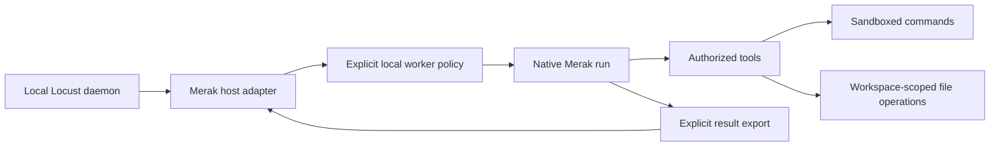

# Native Merak integration for local Locust sandboxing

Date: 2026-10-03. **Status: source-based exploration and proposed experiment; not an accepted design or implemented integration.** The question is whether native integration gives us enforceable control over Locust work executing locally. Controlling other participants' machines is outside this investigation.

The broader [agent-agnostic integration assessment](agent-agnostic-integration.md) places this Merak experiment alongside Pi extensions and Codex/Claude bridges. Native Merak execution is one way to satisfy a local sandbox contract, not a Locust prerequisite.

## Finding

**Yes: Merak's native execution path is a suitable place to enforce a local Locust worker sandbox.** It owns tool dispatch, child-run permissions and subprocess launch. A Locust skill can describe the policy; a native adapter can bind that policy to a run and enforce it before operations execute. The useful addition is a dedicated local worker policy backed by OS confinement, not simply making Locust commands available as tools.

Merak already supplies much of the enforcement machinery, but its current desktop command sandbox is not the strict worker boundary proposed here. It deliberately permits broad filesystem reads, supports explicit unsandboxed execution, and supplies OS confinement only on macOS. Native integration therefore reduces the integration work; it does not make the desired isolation an existing guarantee.

The Locust [implementation plan](../docs/implementation-plan.md) already separates daemon authorization from participant-managed execution. Keep that separation: Locust validates assignments and submissions; Merak enforces what an admitted local run can do. This exploration does not change the plan's release scope or client qualification matrix.

## Evidence and present behavior

Inspected clean local checkouts: Locust `07510fee9c8deb5b7408327d75e290aae00d22c8` and Merak `91abb02adb601ab3d45122186c045c73a72b1d9d`. Merak links below pin the inspected source revision; this was a local source review, not a deployed-binary test or verification of GitHub link accessibility.

| Boundary | Source-established behavior | Consequence for a local worker |
|---|---|---|
| Locust runtime | [The binary](../crates/locust/src/main.rs) only prints `locust`. The daemon and integration remain proposed. | There is no existing Locust sandbox to enable. |
| Native tool invocation | [Engine authorization](https://github.com/33CCFF/dreamcolor10/blob/91abb02adb601ab3d45122186c045c73a72b1d9d/crates/merak-engine/src/effect_ports.rs#L5782) refuses denied calls and approval-required calls reaching enforcement without a decision. | Use this existing enforcement boundary for worker tools. Merely hiding a tool from the model is insufficient. |
| Model-initiated child authority | [Authority comparison and tests](https://github.com/33CCFF/dreamcolor10/blob/91abb02adb601ab3d45122186c045c73a72b1d9d/crates/merak-domain/src/authority.rs#L121) reject widening of tools, capabilities, filesystem/context roots and permission modes. | Worker descendants should inherit or narrow the worker grant. New sandbox fields must also propagate through these checks; trusted user-authored subgraphs must not become an alternate worker admission path. |
| Command sandbox | [Production process wiring](https://github.com/33CCFF/dreamcolor10/blob/91abb02adb601ab3d45122186c045c73a72b1d9d/crates/merak-tools/src/process.rs#L28) enables OS confinement on macOS. [The profile](https://github.com/33CCFF/dreamcolor10/blob/91abb02adb601ab3d45122186c045c73a72b1d9d/crates/merak-tools/src/host_command.rs#L398) starts with broad access, denies network by default, restricts writes to granted roots/temp, and denies reads of selected credential directories. | Reuse the launch mechanism, but provide a stricter worker-specific filesystem policy. Workspace write confinement is not workspace read confinement. |
| Broad reads are intentional | [Process tests](https://github.com/33CCFF/dreamcolor10/blob/91abb02adb601ab3d45122186c045c73a72b1d9d/crates/merak-tools/tests/it/process_pack.rs#L923) explicitly expect reads outside the workspace to succeed. | A worker must not be advertised as unable to read other local projects under the current profile. |
| Privilege exceptions | [Process permission handling](https://github.com/33CCFF/dreamcolor10/blob/91abb02adb601ab3d45122186c045c73a72b1d9d/crates/merak-tools/src/process.rs#L652) can disable the sandbox or grant network/credential-path access. [The common grant helper](https://github.com/33CCFF/dreamcolor10/blob/91abb02adb601ab3d45122186c045c73a72b1d9d/crates/merak-tools/src/common.rs#L524) ties unsandboxed execution to desktop Bypass policy. | A dedicated worker boundary must not inherit the desktop chat's ability to remove confinement. |
| Environment | [Host command setup](https://github.com/33CCFF/dreamcolor10/blob/91abb02adb601ab3d45122186c045c73a72b1d9d/crates/merak-tools/src/host_command.rs#L215) clears the environment, then restores an allowlist. | Reuse environment scrubbing, add worker-owned HOME/temp, and test that no host credentials or agent sockets reach subprocesses. |
| Other platforms | [The non-macOS test](https://github.com/33CCFF/dreamcolor10/blob/91abb02adb601ab3d45122186c045c73a72b1d9d/crates/merak-tools/tests/it/process_pack.rs#L2094) expects the production process pack to run unsandboxed. | Start qualification on macOS; the new worker mode must refuse execution on an unsupported platform instead of falling back to this desktop behavior. |
| Cancellation | [Subprocess handling](https://github.com/33CCFF/dreamcolor10/blob/91abb02adb601ab3d45122186c045c73a72b1d9d/crates/merak-tools/src/subprocess.rs#L8) interrupts and kills the normal process group; it explicitly handles escaped sessions retaining pipes. | Reuse cancellation, but do not equate process-group termination with proof that every possible descendant or external effect stopped. |
| Existing security scope | [Merak doctrine](https://github.com/33CCFF/dreamcolor10/blob/91abb02adb601ab3d45122186c045c73a72b1d9d/docs/DOCTRINE.md#L160) describes a single-user local desktop threat model. | Qualify the new worker boundary explicitly rather than inheriting a stronger isolation claim from the desktop application. |

These are inspected implementations and test assertions. Their tests were not rerun for this investigation.

## Smallest useful integration

Integrate through Merak's native agent execution path. Keep the Locust daemon separate and connect it to a host-owned adapter through the authenticated local API proposed in the [plan](../docs/implementation-plan.md). Linking the entire protocol into Merak's engine is not required for local enforcement.

The proposed first worker policy is concrete:

- **Files:** read the materialized task snapshot and declared runtime/toolchain resources; write only the task workspace and private scratch space. Deny unrelated projects, home documents, application state and credentials. Prefer an independent materialized checkout initially: a Git worktree shares repository metadata and is not itself a sandbox.
- **Commands:** every enabled process-launch path uses the same required OS profile. Start with the native file/edit/search/command operations needed for an edit-test-patch task. Admit background processes, external harnesses, MCP servers, browser automation or other host-executing extensions only when their authority can be confined to that same policy.
- **Network:** deny worker subprocess network by default, including local services. Keep model-provider calls and Locust synchronization in the trusted host/daemon, outside the worker's execution authority. Any future worker network grant needs an explicit, tested scope.
- **Credentials:** keep Locust signing keys, administrative IPC credentials and model-provider secrets in the trusted host/daemon. Expose narrow typed operations rather than keys in the worker's prompt, environment or workspace. Test local sockets and credential agents as well as files.
- **Authority:** persist the locally approved policy with the run. Task text, repository instructions, child agents and desktop Bypass settings cannot expand it. If required capabilities are missing, refuse admission or request a separately authorized policy change; never silently execute with a broader policy.
- **Results:** export only the declared patch/artifacts through a checked host operation. A successful local command or model response does not itself publish arbitrary files.

All of these bullets are proposed requirements, not current enforcement claims. Host-executed tools also need policy checks: sandboxing shell subprocesses alone does not constrain a filesystem, network or extension tool executing inside the trusted Merak process.

Start with an active native worker session. Closed-session activation and unattended runners are separate work and are unnecessary to prove local confinement. Preserve the generic CLI/skill integration for other clients; native support does not require a different Locust protocol.

The skill/API distinction is supported by the [Agent Skills specification](https://agentskills.io/specification), which defines instructions and optional scripts and leaves experimental tool support to clients. An MCP surface could expose Locust operations, but [MCP assigns policy enforcement to the host](https://modelcontextprotocol.io/specification/2025-06-18/architecture). The transport or tool format alone does not supply OS confinement.

## First experiment and acceptance evidence

Build one macOS native worker lane against a fixed input snapshot. It should edit a file, run a real test and produce an inspectable patch. A fixture assignment can exercise the local boundary before Locust's daemon exists; label that as a local sandbox experiment, not an end-to-end Locust integration.

For the same run, exercise these meaningful denial cases through actual operations:

| Case | Required result |
|---|---|
| Read/write task files and run the declared toolchain | Succeeds with useful output and the expected patch. |
| Read a canary in an unrelated sibling project or home directory | Denied through both native file tools and shell/subprocess paths. |
| Write outside the workspace, including via symlink/relative-path tricks | Denied; the outside canary remains unchanged. |
| Read a planted fake credential or use a host credential socket | Denied; neither prompt, environment, command output nor submitted artifact contains the canary. |
| Reach a controlled network endpoint or local service | Denied by the worker boundary; host model/daemon communication still works. |
| Request desktop Bypass, secret reads or network through task content/tool arguments | No automatic widening; the run retains its admitted policy. |
| Spawn a child or use another enabled execution path | Equal or narrower policy; unavailable paths are refused before execution. |
| Sandbox unavailable or launch/profile setup fails | No worker command is executed unsandboxed. |
| Cancel a command, then recover/restart the worker | Observe the actual process/artifact state and retain the original policy; no unconfined relaunch. |

Use synthetic canaries rather than real secrets. Capture the policy, runtime build, attempted operations, actual denial outcomes and resulting artifact hash. Profile text assertions are useful regression checks but cannot replace these process-level probes. A separate-machine trial is unnecessary for this local sandbox question.

Once the local boundary passes, connect the same worker to one real Locust assignment. Persist the assignment/attempt-to-Merak-run mapping before execution, use idempotent submission across the two stores, and ensure recovery does not launch a duplicate worker or broaden its policy. Do not attempt a shared transaction between Locust's proposed SQLite store and Merak's store.

## Recommendation and remaining decision

Use native Merak integration as one local enforcement experiment within the agent-agnostic design, with a distinct mandatory sandbox policy on macOS. Reuse existing permission and launch seams; tighten the worker's read access and privilege exceptions without changing ordinary desktop chat behavior. The first decision to validate experimentally is whether a stricter macOS process profile supports the required development toolchain while enforcing the declared boundary. If it cannot, use a stronger isolated runner and keep the same host policy contract.

This investigation makes no claim of a working integration, a completed isolation audit or a passing runtime test. Documentation content and links are the only verification appropriate to this research change.
