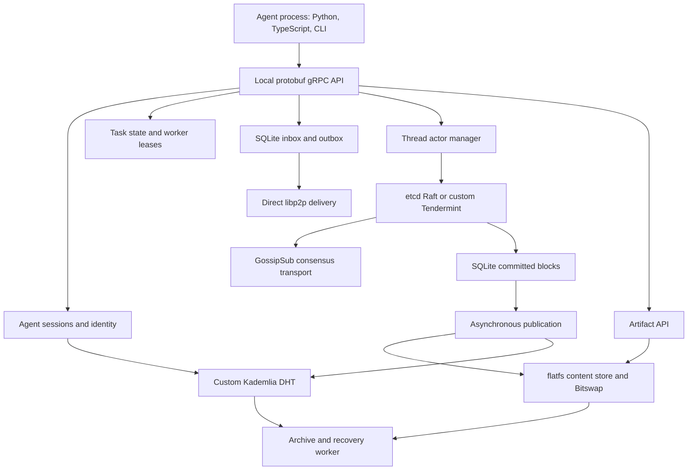

# MoltMesh architecture and consensus

Research date: 2026-10-03. Source: [`sahilpohare/MoltMesh`](https://github.com/sahilpohare/MoltMesh), default branch `actor-model`, commit [`707c870e3188df243e5aea3c4662daa3253270bc`](https://github.com/sahilpohare/MoltMesh/commit/707c870e3188df243e5aea3c4662daa3253270bc), dated 2026-09-17. This is a source review supplemented by the explicitly identified [runtime experiments](moltmesh-validation.md). It is not a formal consensus audit or an accepted Locust design.

## Assessment

MoltMesh is unusually close to Locust's intended product shape: install one daemon, connect agents in different languages, discover participants, exchange durable messages, delegate tasks, and retain shared context. It contains substantial implementation beyond a protocol proposal. The best material to reuse is its decomposition and the practical failure cases recorded in source and tests.

The evidence does not justify adopting the implementation as Locust's correctness foundation. Application persistence, recovery authentication, authority, and task lifecycle contain important gaps. The handwritten Tendermint-style backend particularly needs independent review before anyone relies on its advertised Byzantine tolerance. A mature consensus library also cannot make the surrounding application integration correct automatically.

## Implementation map

The daemon is Go, not Rust. Its pinned module requires Go 1.26.5 and combines libp2p v0.48.0, Boxo v0.39.0, etcd Raft v3.6.0, SQLite through `mattn/go-sqlite3`, and GoAkt actors. The CLI, TUI, and daemon share one binary. Python and TypeScript SDKs sit above a custom `A2ANode` protobuf service. Naming the service A2A is not evidence of conformance with the standardized A2A wire protocol. [Dependencies](https://github.com/sahilpohare/MoltMesh/blob/707c870e3188df243e5aea3c4662daa3253270bc/go.mod), [daemon composition](https://github.com/sahilpohare/MoltMesh/blob/707c870e3188df243e5aea3c4662daa3253270bc/cmd/moltmesh/daemon.go#L326-L415).

Different records have different authorities and persistence paths: local task rows, inbox/outbox records, a consensus thread, DHT discovery records, and content blocks. They are not one transaction or one replicated state machine. A task completion notification may be durable locally without its result being replicated or committed in the thread. API/UI states must preserve those distinctions.

## Thread execution and lifecycle

The canonical daemon constructs `ActorManager`. It creates actors on demand; `StartAll` intentionally does not instantiate every persisted thread. Actors have a 100 ms tick and a default five-minute inactivity passivation policy. This is an interesting approach to many mostly idle collaboration contexts, but an actor's lifecycle must remain compatible with participation in consensus. An inactive voter is still relevant to quorum and leader availability. Claims about very large thread counts need workload-specific measurement, not just actor-count tests. [Manager](https://github.com/sahilpohare/MoltMesh/blob/707c870e3188df243e5aea3c4662daa3253270bc/daemon/thread/actor_manager.go#L74-L150), [actor lifecycle](https://github.com/sahilpohare/MoltMesh/blob/707c870e3188df243e5aea3c4662daa3253270bc/daemon/thread/actor.go#L260-L321).

`ActorBackend` is a useful narrow seam: tick, inbound message, pump, deliver, stop. Optional interfaces expose voter changes and snapshots. It keeps scheduling separate from protocol implementation. The source suggests future database-backed ordering as another possibility, but that is a comment/proposal, not a shipped backend. [Backend interface](https://github.com/sahilpohare/MoltMesh/blob/707c870e3188df243e5aea3c4662daa3253270bc/daemon/thread/backend.go#L35-L77).

**Documentation correction:** README says the actor path is Raft-only. At the reviewed commit, `ThreadActor.PreStart` explicitly selects the Tendermint backend when thread metadata contains `backend=tendermint`; Raft is the default. The handwritten backend is therefore reachable in the current daemon. Another actor comment says actors never passivate, while the code implements passivation. Prefer executable paths over comments. [Selection](https://github.com/sahilpohare/MoltMesh/blob/707c870e3188df243e5aea3c4662daa3253270bc/daemon/thread/actor.go#L201-L215), [README claim](https://github.com/sahilpohare/MoltMesh/blob/707c870e3188df243e5aea3c4662daa3253270bc/README.md#L25-L29).

## Raft: good primitives, incomplete application guarantees

The intended Raft voter set is `N=2f+1`; extra replicas are observers. Late observer addition and promotion to voter are distinct operations, and actual voter changes go through etcd's configuration-change mechanism. That distinction is worth copying. A three-participant demo created with `f=0` still has one voter: observing three copies does not demonstrate quorum-based fault tolerance. [Sizing tests](https://github.com/sahilpohare/MoltMesh/blob/707c870e3188df243e5aea3c4662daa3253270bc/daemon/thread/quorum_test.go#L10-L68), [voter construction](https://github.com/sahilpohare/MoltMesh/blob/707c870e3188df243e5aea3c4662daa3253270bc/daemon/thread/raft.go#L150-L178), [membership RPC](https://github.com/sahilpohare/MoltMesh/blob/707c870e3188df243e5aea3c4662daa3253270bc/daemon/rpc/server_threads.go#L53-L125).

There are thoughtful persistence improvements: Raft `Ready` log entries and hard state are saved before outbound messages; pending application entries are reserved rather than immediately deleted; committing the application block acknowledges its pending inputs in the same transaction. Source comments document fixes for bugs around premature deletion, repeated heights, and misrouting point-to-point Raft messages through broadcast GossipSub. These are excellent examples of the work hidden behind “add Raft.” [Ready handling](https://github.com/sahilpohare/MoltMesh/blob/707c870e3188df243e5aea3c4662daa3253270bc/daemon/thread/raft.go#L494-L535), [pending transaction](https://github.com/sahilpohare/MoltMesh/blob/707c870e3188df243e5aea3c4662daa3253270bc/daemon/thread/store_pending.go#L64-L108), [block transaction](https://github.com/sahilpohare/MoltMesh/blob/707c870e3188df243e5aea3c4662daa3253270bc/daemon/thread/store_pending.go#L136-L200).

Several integration boundaries remain:

1. **Crash replay needs application-level deduplication.** Startup restores Raft log/hard state and a snapshot, but `raft.Config` does not set a durable application `Applied` index. `commitBlock` allocates a fresh application height whenever a committed log entry is applied. **A local probe reproduced this:** after one committed payload, reconstructing the backend without a snapshot changed application height and payload count from one to two, with no new enqueue, tick or network input. Graceful actor shutdown takes a snapshot; the probe models the unsnapshotted persistent state, rather than claiming a process-kill experiment. See [validation](moltmesh-validation.md). This is independent of whether Raft's log agreement is correct. [Restart](https://github.com/sahilpohare/MoltMesh/blob/707c870e3188df243e5aea3c4662daa3253270bc/daemon/thread/raft.go#L188-L292), [application append](https://github.com/sahilpohare/MoltMesh/blob/707c870e3188df243e5aea3c4662daa3253270bc/daemon/thread/raft.go#L710-L735).
2. **Snapshots do not carry application history.** `CreateSnapshot(..., nil)` contains Raft metadata; receiving one updates the Raft storage/configuration, not missing `thread_blocks`. That is useful for restarting a node with its existing local application database, but insufficient by itself to restore a new or lagging replica's application state. Archive/recovery is a separate path, with its own trust and availability problems. No snapshot-driven full application catch-up test was run here. [Snapshot creation](https://github.com/sahilpohare/MoltMesh/blob/707c870e3188df243e5aea3c4662daa3253270bc/daemon/thread/raft.go#L469-L486), [installation](https://github.com/sahilpohare/MoltMesh/blob/707c870e3188df243e5aea3c4662daa3253270bc/daemon/thread/raft.go#L500-L519).
3. **Observer commitment is a separate trust path.** The gossip validator checks that a signed publisher belongs to the descriptor's replica list. `handleInbound` then applies any `CommittedBlock` payload directly, with no guard restricting this path to observers; `applyCommittedBlock` checks only whether that height exists before saving it. It does not itself establish a quorum certificate, recompute its hash, or enforce that only the current leader sent it. This is an authenticated-member trust boundary, not Byzantine validation. [Topic validator](https://github.com/sahilpohare/MoltMesh/blob/707c870e3188df243e5aea3c4662daa3253270bc/daemon/thread/gossip_validation.go#L79-L103), [direct apply](https://github.com/sahilpohare/MoltMesh/blob/707c870e3188df243e5aea3c4662daa3253270bc/daemon/thread/raft.go#L594-L656).
4. **Naming obscures the wire contract.** A field called `RaftAppendEntries.Signature` contains JSON-encoded `raftpb.Message`, not a signature. GossipSub authenticates the publisher, but the backend does not bind that publisher to the inner `rm.From` field. This may be acceptable only under an explicit trusted-replica model. Prefer a correctly typed, versioned transport envelope. [Encoding](https://github.com/sahilpohare/MoltMesh/blob/707c870e3188df243e5aea3c4662daa3253270bc/daemon/thread/raft.go#L685-L706).

These findings concern the integration. etcd's own documentation explicitly leaves transport and storage to the embedding application. [Upstream integration contract](https://github.com/etcd-io/raft#usage).

## Custom Tendermint-style backend

This is a handwritten propose/prevote/precommit state machine, not integration with the production CometBFT engine. It includes signed votes, deterministic proposer rotation, durable votes/lock state, and tests for several round/lock cases. Those are useful educational material, but passing those tests does not establish BFT safety.

Source-established concerns:

- **A higher `PolRound` is trusted without proof.** `handleProposal` clears a conflicting lock based on a numeric comparison. It neither carries nor verifies the corresponding prevote quorum; the proposal signature also omits `PolRound`. BFT safety cannot follow from this branch alone. [Unlock rule](https://github.com/sahilpohare/MoltMesh/blob/707c870e3188df243e5aea3c4662daa3253270bc/daemon/thread/tendermint.go#L303-L338), [signed fields](https://github.com/sahilpohare/MoltMesh/blob/707c870e3188df243e5aea3c4662daa3253270bc/daemon/thread/tendermint.go#L686-L725).
- **The previously valid proposal is not retained for reproposal.** `buildProposal` explicitly falls through to newly dequeued entries while carrying the earlier valid round. A remembered round is not proof that different content was the valid value. [Reproposal](https://github.com/sahilpohare/MoltMesh/blob/707c870e3188df243e5aea3c4662daa3253270bc/daemon/thread/tendermint.go#L599-L630).
- **Proposal signatures authenticate a supplied hash string, without recomputing it from the block at acceptance.** The reviewed `handleProposal` path also lacks checks of expected parent linkage and entry authorization before voting. The later archive hash checker is not a substitute for live acceptance validation. [Acceptance](https://github.com/sahilpohare/MoltMesh/blob/707c870e3188df243e5aea3c4662daa3253270bc/daemon/thread/tendermint.go#L274-L302), [signature check](https://github.com/sahilpohare/MoltMesh/blob/707c870e3188df243e5aea3c4662daa3253270bc/daemon/thread/tendermint.go#L686-L701).
- **Pending inputs are deleted when a proposal is built.** Unlike the newer Raft claim/ack path, Tendermint calls `DequeuePendingEntries`, which deletes the SQLite rows before commitment. A failed round or interruption can lose that submission from the durable pending queue. [Delete-before-commit](https://github.com/sahilpohare/MoltMesh/blob/707c870e3188df243e5aea3c4662daa3253270bc/daemon/thread/store_pending.go#L26-L56).
- **Some durable vote/lock writes ignore errors.** `sendVote` can broadcast after an ignored `SaveVote` error; lock-state writes also ignore errors. Losing durable signing state across a crash is material to consensus safety. [Vote persistence](https://github.com/sahilpohare/MoltMesh/blob/707c870e3188df243e5aea3c4662daa3253270bc/daemon/thread/tendermint.go#L665-L683).
- **A quorum without its block does not trigger block retrieval.** The implementation logs and stalls when a committed proposal is unavailable. That limitation is acknowledged in its own comment. [Missing proposal](https://github.com/sahilpohare/MoltMesh/blob/707c870e3188df243e5aea3c4662daa3253270bc/daemon/thread/tendermint.go#L429-L454).

These are defensive source-review findings. No Byzantine partition experiment or formal proof was performed, and this report does not claim a demonstrated production fork.

## Implications for Locust

Use the decomposition, actor/state separation, and durable-queue ideas as references. Avoid importing the assumption that every collaboration thread needs a globally ordered log. Most messages and immutable contributions can merge as signed causal events. Only decisions requiring exclusivity—task reassignment, accepted workspace head, membership epoch, or an external side effect—need one explicit authority or a specified quorum rule.

“No central server” is compatible with a workspace choosing a participant as its coordinator. It does not imply leaderless agreement or progress on both sides of a partition. If Locust later adds replicated authority, choose a maintained consensus implementation and test the entire persistence/transport/application integration. For the initial protocol, an honest, explicit partition behavior is more valuable than an unproven BFT label. See [proposed Locust approach](locust-implementation-proposal.md).
