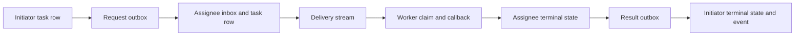

# MoltMesh task lifecycle and SDK reliability review

Research date: 2026-10-03. See the [research index](README.md) and [validation report](moltmesh-validation.md) for the full investigation.

Reviewed upstream: [sahilpohare/MoltMesh](https://github.com/sahilpohare/MoltMesh), commit [`707c870e3188df243e5aea3c4662daa3253270bc`](https://github.com/sahilpohare/MoltMesh/commit/707c870e3188df243e5aea3c4662daa3253270bc), actor-model branch. This document describes that implementation and proposes lessons for Locust; the recommendations are not implemented Locust behavior.

The implementation has useful durable queue and lease primitives, but the complete task workflow does not yet inherit all of their guarantees. The important gaps appear **between** receipt, claim, cursor advancement, task-state persistence, and notification persistence. A successful RPC, a durable task row, and a result delivered to the initiator are distinct outcomes.

## Evidence and limits

Five benign local characterization probes were executed during this research and their recorded output was inspected for this document. Their source was also read. **Passing these tests means the described behavior was reproduced, including the undesirable behavior. It does not mean the implementation passed a correctness specification.**

The probes use temporary local SQLite task stores, in-memory outboxes, and direct Go store/RPC-handler calls. Cross-daemon cases create two local stores and directly pass the serialized queued message into the receiving handler. They do not start a mesh, exercise NAT, run SDK processes, kill a daemon, measure production behavior, or execute external side effects. The cursor test emulates the database state immediately after a Python checkpoint; it does not run or crash Python. The same-identity claim test makes two sequential claims; it does not measure a concurrent-process race.

The complete original probe source and captured output are preserved in the [task probe appendix](evidence/task-probes.md). No additional tests were run to prepare this document. Separate findings labelled **source inference** describe visible ordering or missing transitions without claiming a reproduced crash.

| Characterization test | Observed result | What the evidence establishes |
|---|---|---|
| `TestObservationSameIdentityClaimsReturnSameLease` | Two claims using the same assignee identity returned the same active token. | Claim retry is idempotent at the identity level; the API does not distinguish two processes sharing that identity. |
| `TestObservationCursorBeforeClaimLeavesSubmittedTaskBehind` | Replaying after the recorded delivery cursor returned no task, while the unclaimed task remained `SUBMITTED`. | Advancing past an unclaimed delivery can skip it; there is no expired lease to generate a replacement delivery. |
| `TestObservationIdempotencyKeyCanResendToDifferentAssignee` | Reused key returned the original task/assignee, but a second queued request carried that task ID to a different assignee. | Idempotency applies to task-row identity, not the full task-creation and dispatch operation. |
| `TestObservationRemoteTaskOmitsRetryAndDeadlineSettings` | Caller requested seven attempts and a 60-second timeout; receiver stored three attempts and no deadline. | These outer RPC settings do not survive the current remote task message. |
| `TestObservationCancellationDoesNotReachAssignee` | Initiator copy became `CANCELLED`; receiver copy remained `SUBMITTED`; no cancellation notification was queued. | Current cancellation changes the local task copy only. |

The recorded test package result was `PASS`, with all five named tests passing. Interpret that as five confirmed characterizations within the boundaries above.

## What the task protocol actually does

A task is assigned to a specific agent DID. The initiator daemon stores its own task row and enqueues a `TASK_REQUEST`. On receipt, the assignee daemon creates another local row with the same task ID. A worker subscribes to the assignee's durable delivery sequence, claims a lease, runs an application callback, and completes or fails the lease. Completion separately enqueues a `TASK_RESULT`; receiving that result updates the initiator's copy.

This is a pair of materialized local task records joined by messages. The task store itself is not a globally replicated task-state machine. The thread subsystem is an additional log that some result paths append to; attaching a thread ID does not make all task transitions a consensus operation.

The arrows describe the implemented sequence, not atomic transactions. Source: [`daemon/rpc/server_tasks.go:144-213`](https://github.com/sahilpohare/MoltMesh/blob/707c870e3188df243e5aea3c4662daa3253270bc/daemon/rpc/server_tasks.go#L144-L213), [remote materialization:320-349](https://github.com/sahilpohare/MoltMesh/blob/707c870e3188df243e5aea3c4662daa3253270bc/daemon/rpc/server_tasks.go#L320-L349), [completion and result enqueue:50-109](https://github.com/sahilpohare/MoltMesh/blob/707c870e3188df243e5aea3c4662daa3253270bc/daemon/rpc/server_tasks.go#L50-L109), [result application:352-395](https://github.com/sahilpohare/MoltMesh/blob/707c870e3188df243e5aea3c4662daa3253270bc/daemon/rpc/server_tasks.go#L352-L395).

Useful building blocks are present:

- A defined status transition table prevents ordinary transitions out of terminal states. Status changes validate and update in one SQLite transaction. [`daemon/tasks/tasks.go:49-72`](https://github.com/sahilpohare/MoltMesh/blob/707c870e3188df243e5aea3c4662daa3253270bc/daemon/tasks/tasks.go#L49-L72), [transaction:320-365](https://github.com/sahilpohare/MoltMesh/blob/707c870e3188df243e5aea3c4662daa3253270bc/daemon/tasks/tasks.go#L320-L365).
- Claim checks the authenticated caller is the named assignee, creates a random token, increments the attempt, and records an expiry in a transaction. Renewal and completion require the matching owner/token and an unexpired working lease. [`daemon/rpc/server_tasks.go:33-55`](https://github.com/sahilpohare/MoltMesh/blob/707c870e3188df243e5aea3c4662daa3253270bc/daemon/rpc/server_tasks.go#L33-L55), [`daemon/tasks/tasks.go:405-468`](https://github.com/sahilpohare/MoltMesh/blob/707c870e3188df243e5aea3c4662daa3253270bc/daemon/tasks/tasks.go#L405-L468), [renew/finish:492-528](https://github.com/sahilpohare/MoltMesh/blob/707c870e3188df243e5aea3c4662daa3253270bc/daemon/tasks/tasks.go#L492-L528).
- Delivery cursors are assigned in persistent storage. Expired working leases are requeued with a new delivery sequence, subject to attempt/deadline policy. This repair runs when deliveries are queried. [`daemon/tasks/tasks.go:531-615`](https://github.com/sahilpohare/MoltMesh/blob/707c870e3188df243e5aea3c4662daa3253270bc/daemon/tasks/tasks.go#L531-L615).
- A unique index protects `(initiator, idempotency_key)` against duplicate local task-row creation, including a concurrent insertion race. [`daemon/tasks/tasks.go:159-171`](https://github.com/sahilpohare/MoltMesh/blob/707c870e3188df243e5aea3c4662daa3253270bc/daemon/tasks/tasks.go#L159-L171), [insert conflict recovery:232-250](https://github.com/sahilpohare/MoltMesh/blob/707c870e3188df243e5aea3c4662daa3253270bc/daemon/tasks/tasks.go#L232-L250), [unique index:820-823](https://github.com/sahilpohare/MoltMesh/blob/707c870e3188df243e5aea3c4662daa3253270bc/daemon/tasks/tasks.go#L820-L823).
- A received task result is correlated against the stored initiator, assignee, task ID, and thread ID before application. [`daemon/rpc/server_tasks.go:352-365`](https://github.com/sahilpohare/MoltMesh/blob/707c870e3188df243e5aea3c4662daa3253270bc/daemon/rpc/server_tasks.go#L352-L365).

## 1. Identity-idempotent claims are not process-exclusive claims

**Locally characterized.** `ClaimTask` resolves a session to an agent DID and passes only that DID to `Store.Claim`. The lease request contains task ID and lease duration; it contains no worker-instance ID or caller-provided acquisition ID. If an active lease already belongs to that DID, the store returns its token and original attempt.

Source: [`proto/a2a.proto:390-396`](https://github.com/sahilpohare/MoltMesh/blob/707c870e3188df243e5aea3c4662daa3253270bc/proto/a2a.proto#L390-L396), [`daemon/rpc/server_tasks.go:33-47`](https://github.com/sahilpohare/MoltMesh/blob/707c870e3188df243e5aea3c4662daa3253270bc/daemon/rpc/server_tasks.go#L33-L47), [`daemon/tasks/tasks.go:427-441`](https://github.com/sahilpohare/MoltMesh/blob/707c870e3188df243e5aea3c4662daa3253270bc/daemon/tasks/tasks.go#L427-L441).

The behavior is intentional for a retry after a lost claim response. The existing upstream test also expects repeated claims from one DID to return the same token while rejecting a different DID: [`daemon/tasks/tasks_test.go:398-424`](https://github.com/sahilpohare/MoltMesh/blob/707c870e3188df243e5aea3c4662daa3253270bc/daemon/tasks/tasks_test.go#L398-L424).

The missing distinction is between “the same process retrying the same claim” and “another process using the same agent identity.” Both receive authority to invoke their callback. Rejecting a second terminal database update does not undo duplicate computation or an external side effect already performed by the second callback. This is a reliability contract issue; it does not require an adversarial worker.

**Locust lesson:** separate stable agent identity, worker instance, and acquisition request ID. A retried acquisition with the same request ID can return the same lease; another instance/request must receive a conflict or a distinct explicitly authorized attempt. If multiple processes intentionally share an agent identity, the protocol must state how they coordinate work. Leases protecting external resources also need destination-enforced authority or idempotent actions; a token checked only by task completion cannot fence arbitrary callback side effects.

## 2. Python persists the cursor before a lease exists

**Database consequence locally characterized; SDK crash scenario inferred from source.** Both Python worker entry points advance the cursor and call `_save_cursor` before `_run` attempts `claim_task`. `run_forever` also advances before waiting for an execution slot. With a configured checkpoint path, the cursor is written through a temporary file and atomic replacement. This makes the checkpoint durable enough to survive the process even though the responsibility to perform that task has not yet been acquired.

Source: [`sdk/python/moltmesh/worker.py:44-61`](https://github.com/sahilpohare/MoltMesh/blob/707c870e3188df243e5aea3c4662daa3253270bc/sdk/python/moltmesh/worker.py#L44-L61), [cursor/scheduling:63-107](https://github.com/sahilpohare/MoltMesh/blob/707c870e3188df243e5aea3c4662daa3253270bc/sdk/python/moltmesh/worker.py#L63-L107).

If the process exits in that interval, restarting from the checkpoint asks for deliveries strictly after the skipped sequence. The task is still `SUBMITTED`; the expiry repair only considers `WORKING` tasks with expired leases. Therefore no expired lease exists to create the new sequence promised in the worker's comment. The same skip can follow a transient claim failure because `_run` treats every claim exception as a reason to return, although some errors are availability errors rather than an already-owned task.

The local probe reproduced the resulting store state by reading one delivery, retaining its sequence, making no claim, then reading after that sequence. The result was empty while the task stayed `SUBMITTED`. It did not reproduce an actual operating-system crash. Source: [delivery filter:538-575](https://github.com/sahilpohare/MoltMesh/blob/707c870e3188df243e5aea3c4662daa3253270bc/daemon/tasks/tasks.go#L538-L575), [expiry predicate:580-609](https://github.com/sahilpohare/MoltMesh/blob/707c870e3188df243e5aea3c4662daa3253270bc/daemon/tasks/tasks.go#L580-L609).

**Locust lesson:** a cursor records observation, not necessarily acknowledged ownership. Persist a claim or a durable local pending-work record before advancing the restart cursor. With concurrent delivery processing, checkpoint only a contiguous prefix of deliveries that have reached a recoverable state; simply saving the greatest observed sequence can skip earlier outstanding work. A server-side acknowledgement or delivery lease can provide that boundary. Preserve retryable transport failures separately from claim conflicts.

## 3. TypeScript has the same ordering, but different restart behavior

**Source inference; no TypeScript process was exercised by the five probes.** `DurableWorker` advances its cursor before checking the handler, waiting for concurrency capacity, and calling `claimTask`. A claim exception simply returns. This exposes the same skipped-delivery issue on a reconnect using the same worker object.

However, the TypeScript cursor is a private in-memory field initialized to zero. The class exposes `afterSequence()` but has no built-in checkpoint path, restore argument, or cursor persistence hook. A new worker created after a process restart therefore starts from zero and can rediscover a still-submitted task. It would be inaccurate to describe TypeScript as having Python's persisted-checkpoint crash behavior.

Source: [`sdk/typescript/openclaw-plugin/src/client.ts:628-688`](https://github.com/sahilpohare/MoltMesh/blob/707c870e3188df243e5aea3c4662daa3253270bc/sdk/typescript/openclaw-plugin/src/client.ts#L628-L688).

| Behavior | Python `Worker` | TypeScript `DurableWorker` |
|---|---|---|
| Advances before claim | Yes | Yes |
| Retains cursor during reconnect loop | Yes | Yes |
| Built-in cursor persistence | Optional checkpoint file | None in the class |
| New process starts from | Saved cursor when configured; otherwise zero | Zero |
| Claim error handling | Catch all and return | Catch all and return |
| Renewal failure | Renewal thread returns; callback continues | Renewal stops; callback continues |

Both workers renew in the background, but losing renewal does **not** interrupt the application callback. Python returns from the renewal thread, and TypeScript sets a flag that suppresses renewal; neither supplies a per-attempt cancellation signal to the handler. This limits what the daemon's lease can promise about external actions. Source: [Python:102-132](https://github.com/sahilpohare/MoltMesh/blob/707c870e3188df243e5aea3c4662daa3253270bc/sdk/python/moltmesh/worker.py#L102-L132), [TypeScript:678-701](https://github.com/sahilpohare/MoltMesh/blob/707c870e3188df243e5aea3c4662daa3253270bc/sdk/typescript/openclaw-plugin/src/client.ts#L678-L701).

**Locust lesson:** publish one language-neutral worker contract and run the same restart/reconnect scenarios against every SDK. Specify cursor persistence, claim error classes, renewal loss, handler cancellation, and callback result types. Expose cancellation to cooperative handlers while acknowledging that it cannot retract an already-issued external action.

## 4. Task-row idempotency does not cover dispatch intent

**Locally characterized.** The store returns the previous row for `(initiator, idempotency_key)` without comparing its assignee, skill, metadata, or other original inputs. After that return, `CreateTask` still applies the new retry/deadline settings, marshals the **current request**, and creates a new outbox message with a fresh message ID and the **current destination** but the original task ID.

Source: [`daemon/tasks/tasks.go:159-171`](https://github.com/sahilpohare/MoltMesh/blob/707c870e3188df243e5aea3c4662daa3253270bc/daemon/tasks/tasks.go#L159-L171), [`daemon/rpc/server_tasks.go:167-203`](https://github.com/sahilpohare/MoltMesh/blob/707c870e3188df243e5aea3c4662daa3253270bc/daemon/rpc/server_tasks.go#L167-L203).

The probe reused a key with a different assignee and metadata. It got the first task back, still assigned to the first worker, while the outbox contained a second request addressed to the second worker under that same task ID. Even an identical retry queues an additional message; receiver-side task-ID deduplication can make some repetitions harmless, but it does not repair different dispatch intent.

The remote store's duplicate check also returns an existing row by task ID without checking equivalence of the repeated request: [`daemon/tasks/tasks.go:174-190`](https://github.com/sahilpohare/MoltMesh/blob/707c870e3188df243e5aea3c4662daa3253270bc/daemon/tasks/tasks.go#L174-L190).

**Locust lesson:** define the logical operation covered by an idempotency key. Persist its canonical intent or digest, reject parameter mismatches, and create the task plus its outgoing dispatch intent atomically. Replay should return the same accepted operation and ensure its original dispatch is recoverable; it should not silently redirect it. A deliberate reassignment should be a separate authorized operation with its own attempt/version semantics.

## 5. Remote execution does not receive the caller's attempt/deadline policy

**Locally characterized.** `max_attempts` and `timeout_ms` are fields on `CreateTaskRequest`, while the transmitted payload is only its nested `TaskRequest`. That nested message contains skill, thread ID, input artifacts, and metadata. `CreateTask` sets attempt/deadline values on the initiator's local row, but `handleTaskRequest` calls `CreateFromRemote` without them. The receiver gets schema defaults: three attempts and a null deadline.

Source: [`proto/a2a.proto:145-150`](https://github.com/sahilpohare/MoltMesh/blob/707c870e3188df243e5aea3c4662daa3253270bc/proto/a2a.proto#L145-L150), [outer request:382-388](https://github.com/sahilpohare/MoltMesh/blob/707c870e3188df243e5aea3c4662daa3253270bc/proto/a2a.proto#L382-L388), [`daemon/rpc/server_tasks.go:174-199`](https://github.com/sahilpohare/MoltMesh/blob/707c870e3188df243e5aea3c4662daa3253270bc/daemon/rpc/server_tasks.go#L174-L199), [remote creation:337-349](https://github.com/sahilpohare/MoltMesh/blob/707c870e3188df243e5aea3c4662daa3253270bc/daemon/rpc/server_tasks.go#L337-L349), [`daemon/tasks/tasks.go:770-785`](https://github.com/sahilpohare/MoltMesh/blob/707c870e3188df243e5aea3c4662daa3253270bc/daemon/tasks/tasks.go#L770-L785).

The probe directly confirmed seven requested attempts becoming three and a requested 60-second timeout becoming no deadline at the assignee. This is precisely the row the assignee's lease checks use.

There is a separate **source-only policy limitation**: even where a deadline is present locally, `RenewLease` and `FinishLease` test lease expiry but not the task's deadline. Deadline checks occur on claim and when repairing an expired lease. A continuously renewed lease is therefore not shown to obey a hard execution deadline. Likewise, `max_attempts` governs claims/expired-lease recovery; the SDK's callback exception path calls `FailTask`, producing a terminal failure rather than automatically consuming another attempt. Source: [claim policy:430-453](https://github.com/sahilpohare/MoltMesh/blob/707c870e3188df243e5aea3c4662daa3253270bc/daemon/tasks/tasks.go#L430-L453), [renew/finish:492-528](https://github.com/sahilpohare/MoltMesh/blob/707c870e3188df243e5aea3c4662daa3253270bc/daemon/tasks/tasks.go#L492-L528), [expiry recovery:587-609](https://github.com/sahilpohare/MoltMesh/blob/707c870e3188df243e5aea3c4662daa3253270bc/daemon/tasks/tasks.go#L587-L609).

**Locust lesson:** place execution policy in the immutable task specification exchanged with the executor and acknowledged by it. Distinguish client wait timeout, scheduling deadline, lease expiry, and an execution deadline. State whether failures, abandoned leases, and cancelled attempts consume the retry budget. Do not silently substitute a remote default for an explicitly authored policy.

## 6. Cancellation is currently a local status change

**Locally characterized.** `CancelTask` authorizes the caller, then invokes the local store's `Cancel`. It does not enqueue a notification. `HandleIncoming` handles task request and result kinds but not cancellation. Although `MESSAGE_KIND_TASK_CANCEL` exists and is classified as durable by the outbox, that classification does not implement a cancellation workflow.

Source: [`daemon/rpc/server_tasks.go:261-270`](https://github.com/sahilpohare/MoltMesh/blob/707c870e3188df243e5aea3c4662daa3253270bc/daemon/rpc/server_tasks.go#L261-L270), [incoming dispatch:320-330](https://github.com/sahilpohare/MoltMesh/blob/707c870e3188df243e5aea3c4662daa3253270bc/daemon/rpc/server_tasks.go#L320-L330), [`daemon/outbox/outbox.go:347-356`](https://github.com/sahilpohare/MoltMesh/blob/707c870e3188df243e5aea3c4662daa3253270bc/daemon/outbox/outbox.go#L347-L356).

The two-store probe observed a cancelled initiator row and a still-submitted assignee row, with no extra outbox message. It did not run a worker, so it does not measure cancellation latency or callback behavior. Source shows the assignee can still see its submitted task until some other action changes that copy. A later result reaches an already-terminal initiator row and returns early, so it does not reconcile the local cancellation with the executor's outcome. [Terminal-result handling:364-365](https://github.com/sahilpohare/MoltMesh/blob/707c870e3188df243e5aea3c4662daa3253270bc/daemon/rpc/server_tasks.go#L364-L365).

**Locust lesson:** model `cancel_requested` and `cancel_acknowledged` separately from `completed` and from forcibly stopping a process. Persist the cancellation message, reject or reconcile late results according to a specified rule, and provide a cooperative cancellation signal to the worker. Display “cancellation requested” while the executor is offline; do not claim remote execution has stopped simply because the local row changed.

## 7. Durable notification begins after enqueue, not after task persistence

**Source inference; no crash-injection proof in the five probes.** The outbox itself is a useful durable mechanism: it persists messages before requesting a flush, claims pending messages for processing, retries failures, restores abandoned processing rows on restart, and exempts task request/result/cancel messages from the normal retry/TTL cutoff. Source: [`daemon/outbox/outbox.go:59-100`](https://github.com/sahilpohare/MoltMesh/blob/707c870e3188df243e5aea3c4662daa3253270bc/daemon/outbox/outbox.go#L59-L100), [processing/retry:175-253](https://github.com/sahilpohare/MoltMesh/blob/707c870e3188df243e5aea3c4662daa3253270bc/daemon/outbox/outbox.go#L175-L253), [restart reclaim:311-314](https://github.com/sahilpohare/MoltMesh/blob/707c870e3188df243e5aea3c4662daa3253270bc/daemon/outbox/outbox.go#L311-L314), [durable kinds:347-356](https://github.com/sahilpohare/MoltMesh/blob/707c870e3188df243e5aea3c4662daa3253270bc/daemon/outbox/outbox.go#L347-L356).

The full workflow crosses several independent writes:

| Boundary | Source-visible ordering | Unverified crash/failure consequence |
|---|---|---|
| Create task → create local delivery | Task row insert, then delivery row insert, without one surrounding transaction. | A task can exist without its first delivery if execution stops between the writes. |
| Create task → notify assignee | Task/settings persisted, then message inserted in a separate outbox database. | A crash can leave a task whose dispatch intent was never persisted. The explicit enqueue-error path fails the task, but cannot run after a process crash. |
| Complete lease → notify initiator | Terminal task state is saved, then `notifyRemoteInitiator` enqueues the result. An enqueue error is only logged. | Worker sees successful completion although result notification is absent; a crash in that interval has the same missing-intent risk. |
| Apply result → persist event/thread entry | Initiator status becomes terminal before the event and optional thread entry are persisted. A duplicate terminal result returns early. | Retrying the result after a partial application can acknowledge it without repairing missing event/thread persistence. |

Evidence: [task/delivery inserts, `tasks.go:232-255`](https://github.com/sahilpohare/MoltMesh/blob/707c870e3188df243e5aea3c4662daa3253270bc/daemon/tasks/tasks.go#L232-L255); [create/dispatch and explicit failure handling, `server_tasks.go:167-210`](https://github.com/sahilpohare/MoltMesh/blob/707c870e3188df243e5aea3c4662daa3253270bc/daemon/rpc/server_tasks.go#L167-L210); [finish then notify, `server_tasks.go:50-109`](https://github.com/sahilpohare/MoltMesh/blob/707c870e3188df243e5aea3c4662daa3253270bc/daemon/rpc/server_tasks.go#L50-L109); [terminal-result short circuit and later writes:364-390](https://github.com/sahilpohare/MoltMesh/blob/707c870e3188df243e5aea3c4662daa3253270bc/daemon/rpc/server_tasks.go#L364-L390). Boot creates separate [`tasks.db`](https://github.com/sahilpohare/MoltMesh/blob/707c870e3188df243e5aea3c4662daa3253270bc/cmd/moltmesh/daemon.go#L270-L274) and [`outbox.db`](https://github.com/sahilpohare/MoltMesh/blob/707c870e3188df243e5aea3c4662daa3253270bc/cmd/moltmesh/daemon.go#L363-L368).

The receiver's transport ACK follows inbox persistence and the application handler. That is better than acknowledging before persistence, but it does not turn every downstream write into one transaction. Source: [`daemon/deliver/deliver.go:442-459`](https://github.com/sahilpohare/MoltMesh/blob/707c870e3188df243e5aea3c4662daa3253270bc/daemon/deliver/deliver.go#L442-L459).

**Locust lesson:** persist each state transition and its outgoing notification intent in the same transactional boundary, or in one authoritative append-only event from which both are reconstructible. Dispatch/replay should be idempotent. Make incomplete receiver projections repairable rather than skipping all work merely because one terminal status already exists. Expose separate statuses for locally accepted work, executor acceptance, local result persistence, and remote acknowledgement when that difference matters to users.

This still does not give exactly-once execution of arbitrary external side effects. A task daemon cannot atomically commit its own database and an unrelated external API. Use action idempotency keys or destination-side reconciliation, and preserve an explicit uncertain-outcome state when no safe automatic retry exists.

## 8. Event replay and live notifications have different guarantees

**Source inference.** `PublishTaskEvent` saves an event locally and then publishes it through gossip. `SubscribeTaskEvents` reads the durable backlog before attaching its live gossip subscription; there is an interval between those steps. The live channel drops events when full, and the streaming loop only filters against the request's original cursor rather than advancing a per-stream watermark. Thus the existence of an event table is not sufficient to promise a continuous lossless stream.

Source: [`daemon/rpc/server_tasks.go:272-289`](https://github.com/sahilpohare/MoltMesh/blob/707c870e3188df243e5aea3c4662daa3253270bc/daemon/rpc/server_tasks.go#L272-L289), [backlog then subscription and overflow:402-445](https://github.com/sahilpohare/MoltMesh/blob/707c870e3188df243e5aea3c4662daa3253270bc/daemon/rpc/server_tasks.go#L402-L445), [`daemon/tasks/tasks.go:625-654`](https://github.com/sahilpohare/MoltMesh/blob/707c870e3188df243e5aea3c4662daa3253270bc/daemon/tasks/tasks.go#L625-L654).

The durable worker task-delivery stream is a different implementation: it repeatedly queries persisted deliveries, updating its cursor after each send. Do not conflate its semantics with the task-event gossip stream. [`daemon/rpc/server_tasks.go:112-141`](https://github.com/sahilpohare/MoltMesh/blob/707c870e3188df243e5aea3c4662daa3253270bc/daemon/rpc/server_tasks.go#L112-L141)

**Locust lesson:** use gossip as a wakeup hint and durable storage as the replay authority. A subscriber should tail a stable cursor from a persisted log, deduplicate by event ID, and recover gaps explicitly. Define delivery/event cursors separately from task attempts and from wall-clock timestamps. Terminal result delivery should not rely on an ephemeral notification being observed once.

## A narrower Locust worker contract

The useful next step is a small explicit task contract before a large orchestration layer. Proposed invariants:

1. **Task intent is immutable.** Task ID, assignee, input snapshot references, and authored execution policy are bound to the accepted request. Reassignment is a new authorized transition.
2. **Observation does not acknowledge execution.** Every checkpointed delivery is either durably pending at the worker or covered by a server-recognized recoverable claim.
3. **Claims identify an attempt and an instance.** A claim retry can recover its own token; another process is not silently treated as the same acquisition.
4. **State and notification intent commit together.** Restart can reconstruct every required request, cancellation, result, and acknowledgement from durable records.
5. **A lost lease revokes future authority.** Handlers receive a cancellation signal, and side-effecting operations use an appropriate external idempotency/fencing boundary. Callback termination itself is not assumed.
6. **Cancellation is acknowledged across peers.** UI/API distinguishes requesting cancellation from confirmed executor response and from the resolution of already-started effects.
7. **Both SDKs implement the same restart contract.** Cursor persistence and error handling are conformance behaviors, not accidental language-specific details.

A focused conformance suite should include successful ordinary execution plus the five characterized cases above, crash points around each transaction boundary, a lost claim response, a transient claim failure, cancellation while disconnected, result-ACK loss, and reconnect during event publication. Those are proposed tests for Locust or upstream repair work; this report does not claim they were all executed.

Related review: [MoltMesh security and trust boundaries](moltmesh-security.md). Identity authentication, authorization, and callback sandboxing remain separate from the reliability properties discussed here.
